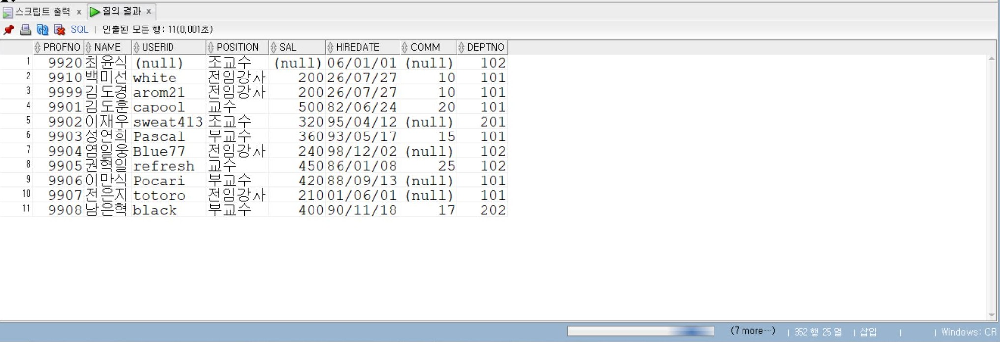
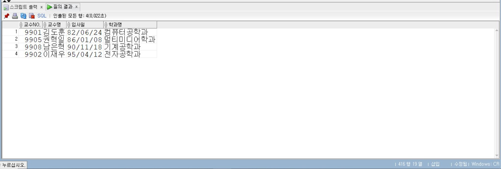

# 6일차
  
## Oracle 다중 행 서브쿼리 및 DML

📌 학습일: 2026.07.27

📌 학습 내용: IN, ANY, ALL, EXISTS, NOT EXISTS, 다중 행 서브쿼리, PAIRWISE, UNPAIRWISE, INSERT, INSERT ALL, INSERT FIRST, UPDATE, DELETE, COMMIT, ROLLBACK, CREATE TABLE AS SELECT, MERGE

---
  
#### 1. IN + 서브쿼리 - 여러 결과 중 일치하는 데이터 조회

```sql
SELECT 컬럼명 FROM 테이블명 WHERE 컬럼명 IN (SELECT 컬럼명 FROM 테이블명 WHERE 조건);
```

서브쿼리에서 반환된 여러 값 중 하나와 일치하는 데이터를 조회

#### 2. ANY - 여러 값 중 하나라도 조건을 만족

```sql
SELECT 컬럼명 FROM 테이블명 WHERE 컬럼명 > ANY (SELECT 컬럼명 FROM 테이블명 WHERE 조건);
```

서브쿼리 결과 중 하나라도 비교 조건을 만족하면 조회

`> ANY`는 서브쿼리에서 반환된 값 중 최솟값보다 크면 조건을 만족

```sql
SELECT 컬럼명 FROM 테이블명 WHERE 컬럼명 < ANY (SELECT 컬럼명 FROM 테이블명 WHERE 조건);
```

`< ANY`는 서브쿼리에서 반환된 값 중 최댓값보다 작으면 조건을 만족

#### 3. ALL - 모든 값에 대해 조건을 만족

```sql
SELECT 컬럼명 FROM 테이블명 WHERE 컬럼명 > ALL (SELECT 컬럼명 FROM 테이블명 WHERE 조건);
```

서브쿼리에서 반환된 모든 값보다 큰 데이터를 조회

`> ALL`은 서브쿼리 결과의 최댓값보다 큰 데이터를 의미

```sql
SELECT 컬럼명 FROM 테이블명 WHERE 컬럼명 < ALL (SELECT 컬럼명 FROM 테이블명 WHERE 조건);
```

`< ALL`은 서브쿼리 결과의 최솟값보다 작은 데이터를 의미

## 4. EXISTS - 서브쿼리 결과 존재 여부 확인

```sql
SELECT 컬럼명 FROM 테이블명 WHERE EXISTS (SELECT 컬럼명 FROM 테이블명 WHERE 조건);
```

서브쿼리의 결과가 하나 이상 존재하면 메인 쿼리를 실행

EXISTS는 서브쿼리에서 어떤 값이 반환되는지보다 결과 행의 존재 여부를 확인

#### 5. NOT EXISTS - 서브쿼리 결과가 없는지 확인

```sql
SELECT 값 FROM DUAL WHERE NOT EXISTS (SELECT 컬럼명 FROM 테이블명 WHERE 조건);
```

서브쿼리 조건을 만족하는 데이터가 하나도 없을 경우 결과를 반환

#### 6. NVL + EXISTS

```sql
SELECT 컬럼명1, 컬럼명2 + NVL(컬럼명3, 대체값) FROM 테이블명 WHERE EXISTS (SELECT 컬럼명 FROM 테이블명 WHERE 조건);
```

조건에 맞는 데이터가 존재하면 조회하고 NULL 값은 지정한 값으로 변환하여 계산

#### 7. 그룹별 평균의 최댓값 조회

```sql
SELECT 그룹컬럼, AVG(컬럼명) FROM 테이블명 GROUP BY 그룹컬럼 HAVING AVG(컬럼명) = (SELECT MAX(AVG(컬럼명)) FROM 테이블명 GROUP BY 그룹컬럼);
```

그룹별 평균을 계산한 후 그중 평균값이 가장 큰 그룹을 조회

서브쿼리에서 그룹별 평균 중 최댓값을 구하고 HAVING에서 해당 값과 같은 그룹만 선택

#### 8. JOIN + 그룹별 평균의 최댓값 조회

```sql
SELECT 테이블별칭1.그룹컬럼, 테이블별칭2.컬럼명, AVG(테이블별칭1.컬럼명) FROM 테이블명1 테이블별칭1, 테이블명2 테이블별칭2 WHERE 테이블별칭1.공통컬럼 = 테이블별칭2.공통컬럼 GROUP BY 테이블별칭1.그룹컬럼, 테이블별칭2.컬럼명 HAVING AVG(테이블별칭1.컬럼명) = (SELECT MAX(AVG(컬럼명)) FROM 테이블명1 GROUP BY 그룹컬럼);
```

두 테이블을 조인하여 그룹 정보까지 출력하면서 평균값이 가장 큰 그룹을 조회

#### 9. INNER JOIN + 그룹별 평균의 최댓값 조회

```sql
SELECT 테이블별칭1.그룹컬럼, 테이블별칭2.컬럼명, AVG(테이블별칭1.컬럼명) FROM 테이블명1 테이블별칭1 INNER JOIN 테이블명2 테이블별칭2 ON 테이블별칭1.공통컬럼 = 테이블별칭2.공통컬럼 GROUP BY 테이블별칭1.그룹컬럼, 테이블별칭2.컬럼명 HAVING AVG(테이블별칭1.컬럼명) = (SELECT MAX(AVG(컬럼명)) FROM 테이블명1 GROUP BY 그룹컬럼);
```

ANSI INNER JOIN 방식으로 테이블을 연결한 후 그룹별 최댓값을 조회

## 10. PAIRWISE - 여러 컬럼을 한 쌍으로 비교

```sql
SELECT 컬럼명1, 컬럼명2, 컬럼명3 FROM 테이블명 WHERE (컬럼명2, 컬럼명3) IN (SELECT 컬럼명2, MIN(컬럼명3) FROM 테이블명 GROUP BY 컬럼명2);
```

서브쿼리에서 반환된 여러 컬럼의 값을 하나의 쌍으로 묶어서 비교

#### 11. UNPAIRWISE - 여러 컬럼을 각각 비교

```sql
SELECT 컬럼명1, 컬럼명2, 컬럼명3 FROM 테이블명 WHERE 컬럼명2 IN (SELECT 컬럼명2 FROM 테이블명 GROUP BY 컬럼명2) AND 컬럼명3 IN (SELECT MIN(컬럼명3) FROM 테이블명 GROUP BY 컬럼명2);
```

여러 컬럼의 값을 하나의 쌍으로 비교하지 않고 각각 독립적으로 비교

PAIRWISE와 달리 서로 다른 그룹의 값이 조합되어 조회될 수 있음

#### 12. INSERT - 단일 행 입력

```sql
INSERT INTO 테이블명 VALUES (값1, 값2, 값3);
```

테이블의 모든 컬럼 순서에 맞춰 새로운 행을 입력

#### 13. INSERT - 특정 컬럼에 값 입력

```sql
INSERT INTO 테이블명(컬럼명1, 컬럼명2) VALUES (값1, 값2);
```

값을 입력할 컬럼을 지정하여 새로운 행을 추가

지정하지 않은 컬럼은 기본적으로 NULL 또는 DEFAULT 값이 입력

#### 14. INSERT - NULL 입력

```sql
INSERT INTO 테이블명 VALUES (값1, 값2, NULL, NULL);
```

특정 컬럼에 명시적으로 NULL 값을 입력

Oracle에서는 문자형 컬럼에 빈 문자열 `''`을 입력하면 NULL로 처리됨

#### 15. INSERT + TO_DATE

```sql
INSERT INTO 테이블명(컬럼명1, 날짜컬럼) VALUES (값, TO_DATE('날짜문자열', '날짜형식'));
```

문자 형태의 날짜를 DATE 자료형으로 변환하여 입력

```sql
INSERT INTO 테이블명(컬럼명1, 날짜컬럼) VALUES (값, TO_DATE('날짜문자열', 'YYYY/MM/DD'));
```

지정한 날짜 형식에 맞춰 날짜 데이터를 입력

#### 16. INSERT + SYSDATE

```sql
INSERT INTO 테이블명 VALUES (값1, 값2, SYSDATE);
```

현재 시스템 날짜와 시간을 새로운 행에 입력

#### 17. COMMIT - 변경사항 저장

```sql
COMMIT;
```

INSERT, UPDATE, DELETE로 변경한 내용을 데이터베이스에 최종 저장

COMMIT 이후에는 일반적인 ROLLBACK으로 이전 상태로 되돌릴 수 없음

#### 18. ROLLBACK - 변경사항 취소

```sql
ROLLBACK;
```

마지막 COMMIT 이후에 수행한 INSERT, UPDATE, DELETE 작업을 취소

#### 19. CREATE TABLE AS SELECT - 테이블과 데이터 복사

```sql
CREATE TABLE 새테이블명 AS SELECT * FROM 기존테이블명;
```

기존 테이블의 구조와 조회된 데이터를 이용하여 새로운 테이블 생성

#### 20. 데이터 없이 테이블 구조만 복사

```sql
CREATE TABLE 새테이블명 AS SELECT * FROM 기존테이블명 WHERE 1=0;
```

항상 거짓인 조건을 사용하여 데이터는 제외하고 테이블 구조만 복사

```sql
CREATE TABLE 새테이블명 AS SELECT 컬럼명1, 컬럼명2 FROM 기존테이블명 WHERE 1=0;
```

필요한 컬럼의 구조만 선택하여 새로운 빈 테이블 생성

#### 21. INSERT INTO SELECT - 조회 결과를 다른 테이블에 입력

```sql
INSERT INTO 새테이블명 SELECT * FROM 기존테이블명;
```

SELECT로 조회한 여러 행을 다른 테이블에 한 번에 입력

```sql
INSERT INTO 새테이블명(컬럼명1, 컬럼명2) SELECT 컬럼명1, 컬럼명2 FROM 기존테이블명 WHERE 조건;
```

조건에 맞는 여러 행을 조회하여 다른 테이블에 입력

#### 22. INSERT ALL - 여러 테이블에 동시에 입력

```sql
INSERT ALL INTO 테이블명1 VALUES (컬럼명1, 컬럼명2) INTO 테이블명2 VALUES (컬럼명1, 컬럼명3) SELECT 컬럼명1, 컬럼명2, 컬럼명3 FROM 기존테이블명 WHERE 조건;
```

SELECT 결과 한 행을 여러 테이블에 동시에 입력

각 행에 대해 모든 INTO 절이 실행됨

#### 23. 조건부 INSERT ALL

```sql
INSERT ALL WHEN 조건1 THEN INTO 테이블명1 VALUES (컬럼명1, 컬럼명2) WHEN 조건2 THEN INTO 테이블명2 VALUES (컬럼명1, 컬럼명3) SELECT 컬럼명1, 컬럼명2, 컬럼명3 FROM 기존테이블명;
```

각 WHEN 조건을 검사하여 조건을 만족하는 테이블에 데이터를 입력

여러 조건을 동시에 만족하면 여러 테이블에 모두 입력될 수 있음

#### 24. BETWEEN을 이용한 조건부 INSERT ALL

```sql
INSERT ALL WHEN 컬럼명 BETWEEN 값1 AND 값2 THEN INTO 테이블명1 VALUES (컬럼명1, 컬럼명2) WHEN 컬럼명 BETWEEN 값3 AND 값4 THEN INTO 테이블명2 VALUES (컬럼명1, 컬럼명2) SELECT 컬럼명1, 컬럼명2 FROM 기존테이블명;
```

값의 범위에 따라 서로 다른 테이블에 데이터를 입력

#### 25. INSERT FIRST - 첫 번째 조건만 적용

```sql
INSERT FIRST WHEN 조건1 THEN INTO 테이블명1 VALUES (컬럼명1, 컬럼명2) WHEN 조건2 THEN INTO 테이블명2 VALUES (컬럼명1, 컬럼명3) SELECT 컬럼명1, 컬럼명2, 컬럼명3 FROM 기존테이블명;
```

여러 WHEN 조건 중 가장 먼저 만족하는 조건 하나만 실행하여 데이터를 입력

#### 26. INSERT ALL과 INSERT FIRST 차이

```sql
INSERT ALL WHEN 조건1 THEN INTO 테이블명1 VALUES (...) WHEN 조건2 THEN INTO 테이블명2 VALUES (...) SELECT ... FROM 기존테이블명;
```

조건을 여러 개 만족하면 해당하는 모든 테이블에 입력

```sql
INSERT FIRST WHEN 조건1 THEN INTO 테이블명1 VALUES (...) WHEN 조건2 THEN INTO 테이블명2 VALUES (...) SELECT ... FROM 기존테이블명;
```

조건을 여러 개 만족해도 가장 먼저 만족한 하나의 조건만 실행

#### 27. DELETE - 전체 데이터 삭제

```sql
DELETE FROM 테이블명;
```

테이블의 모든 행을 삭제

테이블 구조 자체는 유지됨

#### 28. DELETE + WHERE

```sql
DELETE FROM 테이블명 WHERE 조건;
```

조건을 만족하는 행만 삭제

WHERE 절을 생략하면 모든 데이터가 삭제되므로 주의

#### 29. DELETE + BETWEEN

```sql
DELETE FROM 테이블명 WHERE 컬럼명 BETWEEN 값1 AND 값2;
```

지정한 범위에 해당하는 데이터만 삭제

## 30. DELETE + 서브쿼리

```sql
DELETE FROM 테이블명 WHERE 컬럼명 = (SELECT 컬럼명 FROM 다른테이블명 WHERE 조건);
```

서브쿼리에서 조회한 값을 기준으로 삭제할 데이터를 결정

#### 31. UPDATE - 전체 데이터 수정

```sql
UPDATE 테이블명 SET 컬럼명 = 값;
```

테이블의 모든 행에서 해당 컬럼 값을 변경

WHERE 절이 없으면 모든 행이 변경되므로 주의

#### 32. UPDATE + WHERE

```sql
UPDATE 테이블명 SET 컬럼명 = 값 WHERE 조건;
```

WHERE 조건을 만족하는 특정 데이터만 수정

## 33. UPDATE - 여러 컬럼 수정

```sql
UPDATE 테이블명 SET 컬럼명1 = 값1, 컬럼명2 = 값2 WHERE 조건;
```

한 번의 UPDATE문에서 여러 컬럼 값을 동시에 변경

#### 34. UPDATE + 서브쿼리

```sql
UPDATE 테이블명 SET 컬럼명 = (SELECT 컬럼명 FROM 테이블명 WHERE 조건1) WHERE 조건2;
```

서브쿼리에서 조회한 값을 이용하여 다른 행의 값을 수정

#### 35. 여러 컬럼 UPDATE + 서브쿼리

```sql
UPDATE 테이블명 SET (컬럼명1, 컬럼명2) = (SELECT 컬럼명1, 컬럼명2 FROM 테이블명 WHERE 조건1) WHERE 조건2;
```

서브쿼리에서 조회한 여러 컬럼 값을 한 번에 다른 행에 적용

#### 36. UPDATE 시 WHERE 절의 중요성

```sql
UPDATE 테이블명 SET 컬럼명 = 값;
```

WHERE 절이 없으면 테이블의 모든 행이 수정됨

```sql
UPDATE 테이블명 SET 컬럼명 = 값 WHERE 고유컬럼 = 특정값;
```

특정 행만 수정하려면 반드시 적절한 WHERE 조건을 지정

#### 37. DELETE 시 WHERE 절의 중요성

```sql
DELETE FROM 테이블명;
```

WHERE 절을 생략하면 테이블의 모든 행을 삭제

```sql
DELETE FROM 테이블명 WHERE 조건;
```

필요한 데이터만 삭제하려면 반드시 삭제 조건을 지정

#### 38. MERGE - 기존 데이터 수정 및 신규 데이터 입력

```sql
MERGE INTO 대상테이블명 대상별칭 USING 원본테이블명 원본별칭 ON (대상별칭.공통컬럼 = 원본별칭.공통컬럼) WHEN MATCHED THEN UPDATE SET 대상별칭.컬럼명 = 원본별칭.컬럼명 WHEN NOT MATCHED THEN INSERT VALUES (원본별칭.컬럼명1, 원본별칭.컬럼명2);
```

두 테이블을 비교하여 일치하는 데이터는 UPDATE하고 존재하지 않는 데이터는 INSERT

#### 39. MERGE - MATCHED

```sql
WHEN MATCHED THEN UPDATE SET 대상별칭.컬럼명 = 원본별칭.컬럼명
```

ON 조건이 일치하는 기존 데이터가 있으면 해당 행을 수정

#### 40. MERGE - NOT MATCHED

```sql
WHEN NOT MATCHED THEN INSERT (컬럼명1, 컬럼명2) VALUES (원본별칭.컬럼명1, 원본별칭.컬럼명2)
```

ON 조건과 일치하는 데이터가 없으면 새로운 행을 입력

#### 41. MERGE + 특정 컬럼 INSERT

```sql
MERGE INTO 대상테이블명 대상별칭 USING 원본테이블명 원본별칭 ON (대상별칭.공통컬럼 = 원본별칭.공통컬럼) WHEN MATCHED THEN UPDATE SET 대상별칭.컬럼명 = 원본별칭.컬럼명 WHEN NOT MATCHED THEN INSERT (컬럼명1, 컬럼명2, 컬럼명3) VALUES (원본별칭.컬럼명1, 원본별칭.컬럼명2, 원본별칭.컬럼명3);
```

일치하지 않는 데이터를 입력할 때 대상 컬럼을 직접 지정

#### 42. 같은 값을 가진 데이터 조회 - 단일 행 서브쿼리

```sql
SELECT 컬럼명1, 컬럼명2 FROM 테이블명 WHERE 컬럼명2 = (SELECT 컬럼명2 FROM 테이블명 WHERE 조건);
```

특정 데이터와 같은 값을 가진 다른 데이터를 조회

#### 43. 평균값과 서브쿼리 비교

```sql
SELECT 컬럼명1, 컬럼명2 FROM 테이블명 WHERE 컬럼명2 > (SELECT AVG(컬럼명2) FROM 테이블명);
```

전체 평균보다 큰 값을 가진 데이터만 조회

```sql
SELECT 컬럼명1, 컬럼명2 FROM 테이블명 WHERE 컬럼명2 >= (SELECT AVG(컬럼명2) FROM 테이블명);
```

전체 평균 이상인 데이터를 조회

#### 44. 서브쿼리 + ORDER BY

```sql
SELECT 컬럼명1, 컬럼명2 FROM 테이블명 WHERE 컬럼명2 > (SELECT AVG(컬럼명2) FROM 테이블명) ORDER BY 컬럼명2 DESC;
```

서브쿼리 조건에 맞는 데이터를 조회하고 지정한 컬럼을 기준으로 정렬

#### 45. 여러 컬럼을 이용한 서브쿼리 비교

```sql
SELECT 컬럼명1, 컬럼명2, 컬럼명3 FROM 테이블명 WHERE (컬럼명2, 컬럼명3) IN (SELECT 컬럼명2, 컬럼명3 FROM 테이블명 WHERE 조건);
```

두 개 이상의 컬럼 값을 하나의 조합으로 묶어 서브쿼리 결과와 비교

#### 46. 그룹별 최솟값 조회

```sql
SELECT 그룹컬럼, MIN(컬럼명) FROM 테이블명 GROUP BY 그룹컬럼;
```

각 그룹별로 가장 작은 값을 계산

#### 47. 그룹별 최솟값을 가진 데이터 조회

```sql
SELECT 컬럼명1, 컬럼명2, 컬럼명3 FROM 테이블명 WHERE (컬럼명2, 컬럼명3) IN (SELECT 컬럼명2, MIN(컬럼명3) FROM 테이블명 GROUP BY 컬럼명2);
```

각 그룹에서 최솟값을 가진 실제 데이터를 조회

#### 48. JOIN + 그룹별 최솟값 조회

```sql
SELECT 테이블별칭1.컬럼명1, 테이블별칭1.컬럼명2, 테이블별칭2.컬럼명 FROM 테이블명1 테이블별칭1, 테이블명2 테이블별칭2 WHERE 테이블별칭1.공통컬럼 = 테이블별칭2.공통컬럼 AND 테이블별칭1.컬럼명2 IN (SELECT MIN(컬럼명2) FROM 테이블명1 GROUP BY 그룹컬럼) ORDER BY 테이블별칭1.컬럼명2;
```

두 테이블을 연결하면서 그룹별 최솟값에 해당하는 데이터를 조회

#### 49. CREATE TABLE AS SELECT - 일부 컬럼 구조 복사

```sql
CREATE TABLE 새테이블명 AS SELECT 컬럼명1, 컬럼명2, 컬럼명3 FROM 기존테이블명 WHERE 1=0;
```

기존 테이블에서 필요한 컬럼의 구조만 가져와 새로운 빈 테이블 생성

#### 50. SELECT 결과에 컬럼 별칭 지정

```sql
SELECT 컬럼명 AS 컬럼별칭 FROM 테이블명;
```

조회 결과의 컬럼 이름을 원하는 이름으로 변경

```sql
SELECT 컬럼명 "컬럼 별칭" FROM 테이블명;
```

공백이나 한글 등을 포함한 컬럼 별칭을 지정

#### 51. OR 조건을 이용한 DELETE

```sql
DELETE FROM 테이블명 WHERE 컬럼명 = 값1 OR 컬럼명 = 값2;
```

여러 조건 중 하나를 만족하는 데이터를 삭제

```sql
DELETE FROM 테이블명 WHERE 컬럼명 IN (값1, 값2);
```

IN을 이용하면 같은 조건을 더 간단하게 작성할 수 있음

#### 52. 그룹별 최대 평균값 조회 흐름

```sql
SELECT 그룹컬럼, AVG(컬럼명) FROM 테이블명 GROUP BY 그룹컬럼 HAVING AVG(컬럼명) = (SELECT MAX(AVG(컬럼명)) FROM 테이블명 GROUP BY 그룹컬럼);
```

먼저 그룹별 평균을 계산하고 서브쿼리에서 그 평균 중 최댓값을 구한 다음 HAVING으로 최댓값과 같은 그룹만 조회

#### 53. 각 그룹에서 가장 오래된 날짜 조회

```sql
SELECT 그룹컬럼, MIN(날짜컬럼) FROM 테이블명 GROUP BY 그룹컬럼;
```

각 그룹별 가장 오래된 날짜를 조회

#### 54. 그룹별 가장 오래된 데이터를 다른 테이블과 JOIN

```sql
SELECT 테이블별칭1.컬럼명1, 테이블별칭1.날짜컬럼, 테이블별칭2.컬럼명 FROM 테이블명1 테이블별칭1, 테이블명2 테이블별칭2 WHERE 테이블별칭1.공통컬럼 = 테이블별칭2.공통컬럼 AND 테이블별칭1.날짜컬럼 IN (SELECT MIN(날짜컬럼) FROM 테이블명1 GROUP BY 그룹컬럼) ORDER BY 테이블별칭1.날짜컬럼;
```

그룹별 가장 오래된 날짜를 서브쿼리로 구한 뒤 다른 테이블과 연결하여 상세 정보를 조회

#### 55. 특정 데이터와 같은 그룹의 데이터 조회

```sql
SELECT 컬럼명1, 컬럼명2 FROM 테이블명 WHERE 그룹컬럼 = (SELECT 그룹컬럼 FROM 테이블명 WHERE 조건);
```

특정 데이터가 속한 그룹과 같은 그룹에 있는 모든 데이터를 조회

#### 56. NULL이 아닌 데이터를 서브쿼리에서 조회

```sql
SELECT 컬럼명1, 컬럼명2 FROM 테이블명 WHERE (컬럼명2, 컬럼명3) IN (SELECT 컬럼명2, 컬럼명3 FROM 테이블명 WHERE 컬럼명4 IS NOT NULL);
```

특정 컬럼이 NULL이 아닌 행의 여러 값을 서브쿼리로 가져와 메인 쿼리와 비교

---

MERGE 사용
```sql
MERGE INTO professor p
USING professor_temp f
on (p.profno = f.profno)
WHEN matched THEN
UPDATE SET p.position = f.position
WHEN not MATCHED THEN
INSERT VALUES(f.profno, f.name, f.userid, f.position, f.sal, f.hiredate, 
              f.comm, f.deptno);
```
```text
3개 행 이(가) 병합되었습니다.
```
<p align="center">
  
</p>
MERGE를 사용 할때는 뒤에 on이 와야하고 동등한 비교 조건을 입력 해야하고 그 뒤에 WHEN matched THEN가 와야한다.

INSERT VALUES()에는 필요한 열을 입력해야 한다.

여기에서 가장 헷갈렸던게 on 뒤에 오는 동등한 비교 조건과 UPDATE SET 뒤에 오는 동등한 비교 조건이였다.

아직 좀 더 연습이 필요 할 것 같다.
<br/><br/><br/>
각 학과별로 입사일이 가장 오래된 교수의 교수번호와 이름, 입사일, 학과명을 출력 (아래처럼 입사일 순으로 정렬하세요.)

```text
교수 NO. 교수명 입사일 학과
===== ===== ===== ===========
9901 김도훈 82/06/24 컴퓨터공학과
9905 권혁일 86/01/08 멀티미디어학과
9908 남은혁 90/11/18 기계공학과
9902 이재우 95/04/12 전자공학과
```

```sql
SELECT p.profno "교수NO.", p.name "교수명", p.hiredate "입사일", d.dname "학과명"
FROM professor p, department d
WHERE p.deptno=d.deptno
GROUP BY p.deptno, p.profno, p.name, p.hiredate, d.dname
HAVING p.hiredate IN (SELECT MIN(hiredate)
                        FROM professor
                        GROUP BY deptno)
ORDER BY hiredate;
```
<p align="center">
  
</p>
별칭이 들어가는 경우 GROUP BY 뒤에 출력할 값을 다 적어야 제대로 결과값이 나온다.

hiredate 기준으로 결과값을 출력할때는 IN을 사용해야하며 학과별로 가장 오래된 날짜를 출력하기 위해서는 MAX가 아닌 MIN을 사용해야 한다.
