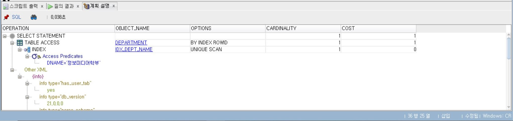
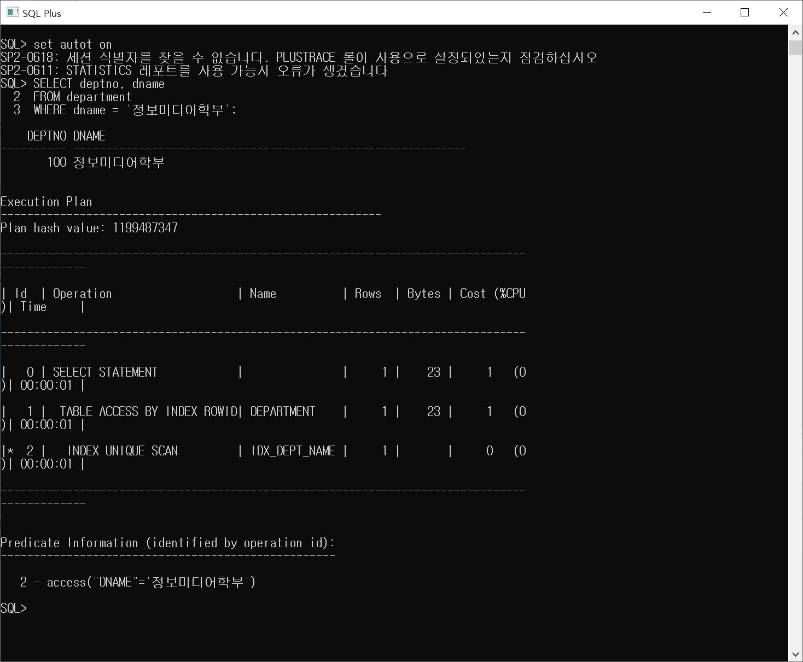
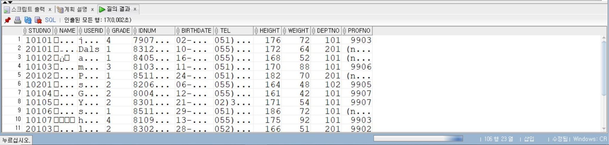
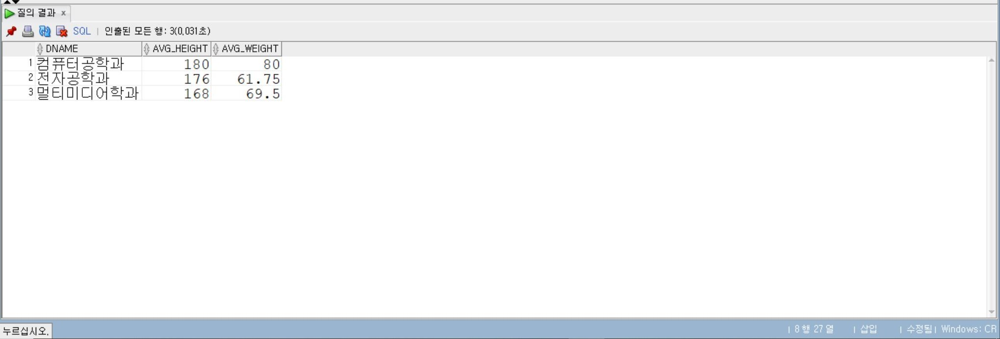

# 8일차

## Oracle INDEX, VIEW, 권한 관리 및 동의어

📌 학습일: 2026.07.29

📌 학습 내용 : INDEX, VIEW, INLINE VIEW, GRANT, REVOKE, ROLE, SYNONYM

---

#### 1. 고유 인덱스 생성

```sql
CREATE UNIQUE INDEX 인덱스명
ON 테이블명(컬럼명);
```

중복을 허용하지 않는 인덱스를 생성한다.

#### 2. 일반 인덱스 생성

```sql
CREATE INDEX 인덱스명
ON 테이블명(컬럼명);
```

검색 속도를 향상시키기 위한 일반 인덱스를 생성한다.

#### 3. 결합 인덱스 생성

```sql
CREATE INDEX 인덱스명
ON 테이블명(컬럼명1, 컬럼명2);
```

여러 컬럼을 하나의 인덱스로 생성한다.

#### 4. 정렬 인덱스 생성

```sql
CREATE INDEX 인덱스명
ON 테이블명(컬럼명1 DESC, 컬럼명2 ASC);
```

컬럼별 오름차순 또는 내림차순으로 인덱스를 생성한다.

#### 5. 함수 기반 인덱스 생성

```sql
CREATE INDEX 인덱스명
ON 테이블명(함수(컬럼명));
```

함수 결과를 기준으로 인덱스를 생성한다.

#### 6. 인덱스 삭제

```sql
DROP INDEX 인덱스명;
```

생성된 인덱스를 삭제한다.

#### 7. 생성된 인덱스 조회

```sql
SELECT INDEX_NAME, UNIQUENESS
FROM USER_INDEXES
WHERE TABLE_NAME = '테이블명';
```

특정 테이블에 생성된 인덱스 목록을 조회한다.

#### 8. 인덱스 컬럼 조회

```sql
SELECT INDEX_NAME, COLUMN_NAME
FROM USER_IND_COLUMNS
WHERE TABLE_NAME = '테이블명';
```

인덱스가 적용된 컬럼을 조회한다.

#### 9. 인덱스 재구성

```sql
ALTER INDEX 인덱스명
REBUILD;
```

인덱스를 다시 생성하여 성능을 최적화한다.

#### 10. 단순 VIEW 생성

```sql
CREATE VIEW 뷰명
AS
SELECT 컬럼명
FROM 테이블명
WHERE 조건;
```

하나의 테이블을 이용한 뷰를 생성한다.

#### 11. 복합 VIEW 생성

```sql
CREATE VIEW 뷰명
AS
SELECT 컬럼명
FROM 테이블1, 테이블2
WHERE 조인조건;
```

여러 테이블을 조인하여 뷰를 생성한다.

#### 12. INLINE VIEW

```sql
SELECT 컬럼명
FROM (
    SELECT 컬럼명
    FROM 테이블명
    GROUP BY 컬럼명
) 별칭;
```

FROM 절 안에서 사용하는 서브쿼리이다.

#### 13. VIEW 조회

```sql
SELECT *
FROM 뷰명;
```

생성된 뷰의 데이터를 조회한다.

#### 14. VIEW 정의 조회

```sql
SELECT VIEW_NAME, TEXT
FROM USER_VIEWS;
```

사용자가 생성한 뷰의 정의를 조회한다.

#### 15. VIEW 수정

```sql
CREATE OR REPLACE VIEW 뷰명
AS
SELECT ...
```

기존 뷰를 수정하거나 다시 생성한다.

#### 16. VIEW 삭제

```sql
DROP VIEW 뷰명;
```

생성된 뷰를 삭제한다.

#### 17. 시스템 권한 조회

```sql
SELECT *
FROM USER_SYS_PRIVS;
```

사용자에게 부여된 시스템 권한을 조회한다.

#### 18. 현재 세션 권한 조회

```sql
SELECT *
FROM SESSION_PRIVS;
```

현재 세션에서 사용할 수 있는 권한을 조회한다.

#### 19. 객체 권한 부여

```sql
GRANT 권한
ON 테이블명
TO 사용자명;
```

특정 테이블에 대한 권한을 부여한다.

#### 20. 특정 컬럼 UPDATE 권한 부여

```sql
GRANT UPDATE(컬럼명)
ON 테이블명
TO 사용자명;
```

특정 컬럼만 수정할 수 있는 권한을 부여한다.

#### 21. 객체 권한 조회

```sql
SELECT *
FROM USER_TAB_PRIVS_MADE;
```

사용자가 다른 사용자에게 부여한 권한을 조회한다.

#### 22. 부여받은 객체 권한 조회

```sql
SELECT *
FROM USER_TAB_PRIVS_RECD;
```

사용자가 부여받은 권한을 조회한다.

#### 23. 권한 회수

```sql
REVOKE 권한
ON 테이블명
FROM 사용자명;
```

부여한 권한을 회수한다.

#### 24. ROLE 생성

```sql
CREATE ROLE 롤명;
```

새로운 역할(Role)을 생성한다.

#### 25. 비밀번호가 있는 ROLE 생성

```sql
CREATE ROLE 롤명
IDENTIFIED BY 비밀번호;
```

비밀번호가 있는 Role을 생성한다.

#### 26. ROLE에 권한 부여

```sql
GRANT 권한
TO 롤명;
```

Role에 시스템 권한 또는 객체 권한을 부여한다.

#### 27. 사용자에게 ROLE 부여

```sql
GRANT 롤명
TO 사용자명;
```

생성한 Role을 사용자에게 부여한다.

#### 28. ROLE 권한 조회

```sql
SELECT *
FROM ROLE_SYS_PRIVS;
```

Role에 부여된 시스템 권한을 조회한다.

#### 29. 사용자 ROLE 조회

```sql
SELECT *
FROM USER_ROLE_PRIVS;
```

사용자에게 부여된 Role을 조회한다.

#### 30. 개인 동의어 생성

```sql
CREATE SYNONYM 동의어명
FOR 스키마명.테이블명;
```

특정 객체에 대한 개인 동의어를 생성한다.

#### 31. 공용 동의어 생성

```sql
CREATE PUBLIC SYNONYM 동의어명
FOR 테이블명;
```

모든 사용자가 사용할 수 있는 공용 동의어를 생성한다.

#### 32. 동의어 삭제

```sql
DROP SYNONYM 동의어명;
```

개인 동의어를 삭제한다.

#### 33. 공용 동의어 삭제

```sql
DROP PUBLIC SYNONYM 동의어명;
```

공용 동의어를 삭제한다.

---
학과 테이블에서 학과이름이 ‘정보미디어학부’인 학과번호를 검색한 결과에 대한 실행경로를 분석, dname 컬럼에 고유 인덱스가 생성
```sql
SELECT deptno, dname
FROM department
WHERE dname = '정보미디어학부';
```
<p align="center">
  
</p>
<p align="center">
  
</p>
sqlplus에서 실행시 set autot on/off/trace하고 실행해야하고 sqldeveloper에서 실행시 F10을 눌러야 위에와 같이 결과가 나온다.

sqlplus에서 실행히면 아래와 같이 나오는데 sqldeveloper에서 더 간편하게 확인할 수 있다.
<p align="center">
  
</p>
<br/><br/><br/>
인라인 뷰를 사용하여 학과별로 학생들의 평균 키와 평균 몸무게, 학과이름을 출력

```sql
SELECT dname, avg_height, avg_weight
FROM (SELECT deptno, avg(height) avg_height, avg(weight) avg_weight
      FROM student
      GROUP BY deptno) s, department d
WHERE s.deptno = d.deptno;
```

hr 제약조건으로 인해 @C:\Users\kosa\Documents\오라클\table.sql 했더니 아래와 같이 오류가 발생했다.
<p align="center">
  
</p>

그래서 scott에서 테이블 다시 불러와서 실행했더니 아래와 같이 결과값이 정상적으로 출력되었다.

이미 앞에서 제약조건이 걸려있을 경우에는 동일한 테이블을 다시 불러오면 글자가 깨진다는 점을 잘 기억하고 있어야 겠다.

<p align="center">
  
</p>
