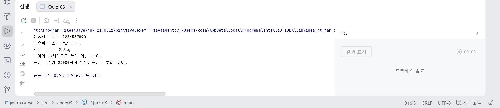

# 10일차

## Java 변수, 자료형, 형변환, 연산자

📌 학습일 : 2026.07.31

📌 학습 내용 : 변수 명명 규칙, 자료형(Data Type), 상수(Constant), 형변환(Type Casting), 연산자(Operation), 삼항 연산자

---

### 변수(Variable)

#### 1. 변수 명명 규칙

- 저장할 값을 쉽게 알 수 있는 이름을 사용한다.
- 영문자, 숫자, 밑줄(`_`)을 사용할 수 있다.
- 숫자로 시작할 수 없다.
- 공백은 사용할 수 없다.
- 예약어(`public`, `class`, `int` 등)는 사용할 수 없다.
- 여러 단어를 사용할 경우 **Camel Case**를 사용한다.
  - 예) `studentName`, `courseName`

#### 2. 변수 선언

```java
String studentName = "문자열";
int studentCount = 정수;
```

데이터를 저장하기 위해 변수와 자료형을 함께 선언한다.


### 자료형(Data Type)

#### 정수형

```java
int age = 일반적인 정수;
long money = 큰 범위의 정수 (`L` 사용 권장);
```

### 실수형

```java
double score = 실수(기본형, 정밀도 높음);
float pi = 실수(`F` 사용);
```

### 문자 및 문자열

```java
char grade = '문자(한글자)';
String name = "문자열";
```

### 논리형

```java
boolean pass = true;
```

- `true`, `false` 두 가지 값만 저장한다.


### 상수(Constant)

```java
final int MAX_NUM = 숫자;
```

- `final` 키워드를 사용한다.
- 한 번 값을 저장하면 변경할 수 없다.
- 일반적으로 모두 대문자로 작성한다.


### 형변환(Type Casting)

#### 자동 형변환

작은 자료형에서 큰 자료형으로 변환된다.

```java
int num = 100;
double result = num;
```

```
int → long → float → double
```

#### 명시적 형변환

큰 자료형에서 작은 자료형으로 변환할 때는 직접 형 변환해야 한다.

```java
double score = 소수점이 포함된 숫자;
int result = (int) score;
```

소수점 이하가 제거된다.

#### 문자열 ↔ 숫자 변환

숫자를 문자열로 변환

```java
String.valueOf(숫자);
Integer.toString(숫자);
```

문자열을 숫자로 변환

```java
Integer.parseInt("숫자");
Double.parseDouble("숫자(소수점)");
```


### 연산자(Operation)

#### 산술 연산자

```java
+
-
*
/
%
```

- `%` : 나머지 연산

#### 복합 대입 연산자

```java
+=
-=
*=
/=
%=
```

기존 변수의 값을 계산한 후 다시 저장한다.

#### 증감 연산자

```java
++
--
```

- `++num` : 먼저 증가 후 사용
- `num++` : 먼저 사용 후 증가
- `--num` : 먼저 감소 후 사용
- `num--` : 먼저 사용 후 감소

#### 관계 연산자

```java
>
<
>=
<=
==
!=
```

비교 결과는 `true` 또는 `false`를 반환한다.

#### 논리 연산자

```java
&&
||
!
```

- `&&` : AND (모두 참)
- `||` : OR (하나라도 참)
- `!` : NOT (반대)

#### 삼항 연산자

```java
int 변수명 = 정수
System.out.println(조건 ? True : False)
```
간단한 조건문을 한 줄로 표현할 때 사용한다.

---

##### 핵심 정리

- 변수는 의미 있는 이름과 Camel Case를 사용한다.
- 자료형은 저장할 데이터의 종류에 맞게 선택한다.
- `final`은 값을 변경할 수 없는 상수를 선언할 때 사용한다.
- 작은 자료형에서 큰 자료형으로는 자동 형변환이 가능하며, 반대의 경우에는 명시적 형변환이 필요하다.
- 연산자는 데이터 계산과 조건 비교를 수행하며, 삼항 연산자는 간단한 조건문을 한 줄로 표현할 수 있다.

---

나이가 15세 이상이면 “관람 가능합니다”를, 그렇지 않으면 “관람 불가능합니다”를 출력하는 프로그램을 작성 (아래 실행결과처럼 출력)
```taxt
실행 결과
나이가 17세이므로 관람 가능합니다.
```
```java
int age = 17;
        System.out.println("나이가 " + age + "세이므로 " + (age >= 15 ? "관람 가능합니다." : "관람 불가능합니다."));
```
<p align="center">
  
</p>
헷갈렸던게 ()안에 면수명과 조건이 들어갔기 때문에 따로 변수명이 들어가지 않아도 된다고 생각했는데 오류가 났었다.

그래서 고민을 하다가 조건이 나이가 15세 이상일때 "관람 가능합니다"를 표시하기 위해서는 변수명 다음에 (변수가 포함된 조건 ? t:F)가 와야 제대로 표시된다는 것을 알게 되었다.

아직은 초반이라 적응 중이라 좀 더 연습해야겠다.

