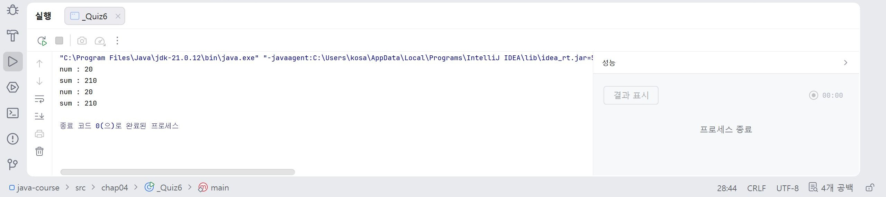
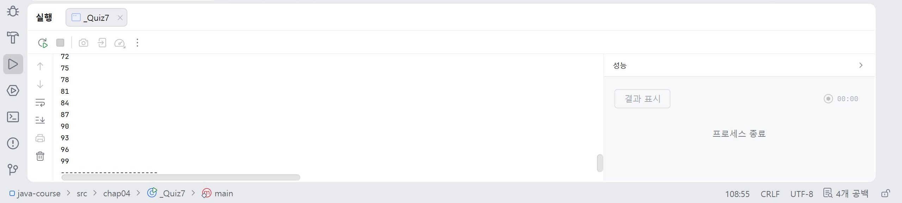

# 11일차

## Java 조건문과 반복문

📌 학습일 : 2026.08.03

📌 학습 내용 : if문, if-else문, switch문, for문, while문, break, continue

---

#### 1. if문

조건식이 `true`일 때만 실행되는 가장 기본적인 조건문이다.

```java
if (조건식) {
    실행문;
}
```

#### 2. if-else문

조건이 참이면 `if`를, 거짓이면 `else`를 실행한다.

```java
if (조건식) {
    실행문;
} else {
    실행문;
}
```

#### 3. if-else if-else문

여러 조건을 순서대로 검사하며 처음으로 참인 조건만 실행한다.

```java
if (조건식1) {

} else if (조건식2) {

} else {

}
```

#### 4. switch문

하나의 값을 여러 경우(case)와 비교하여 실행하는 조건문이다.

```java
switch (변수) {
    case 값:
        실행문;
        break;
    default:
        실행문;
}
```

#### 5. switch 표현식

Java의 새로운 switch 문법으로 실행 결과를 변수에 저장할 수 있다.

```java
String message = switch (medal) {
    case "Gold" -> "금메달입니다.";
    default -> "메달이 없습니다.";
};
```

여러 줄을 실행해야 하는 경우에는 `yield`를 사용하여 값을 반환한다.

#### 6. for문

반복 횟수가 정해져 있을 때 사용하는 반복문이다.

```java
for (초기식; 조건식; 증감식) {

}
```

#### 7. while문

조건이 참인 동안 반복을 수행한다.

```java
while (조건식) {

}
```

#### 8. break

반복문이나 switch문을 즉시 종료한다.

```java
break;
```

#### 9. continue

현재 반복만 건너뛰고 다음 반복을 수행한다.

```java
continue;
```

---

#### 핵심 정리

- `if`는 조건이 참일 때만 실행된다.
- `if-else if`는 여러 조건 중 처음으로 참인 조건만 실행한다.
- `switch`는 하나의 값을 여러 경우와 비교하며 `break`가 없으면 다음 case까지 실행된다.
- `switch` 표현식(`->`)을 사용하면 실행 결과를 변수에 저장할 수 있으며, 여러 줄을 실행할 경우 `yield`를 사용한다.
- `for`문은 반복 횟수가 정해져 있을 때, `while`문은 조건에 따라 반복할 때 사용한다.
- `break`는 반복을 종료하고, `continue`는 현재 반복만 건너뛰고 다음 반복을 수행한다.

---

누적 합이 200을 넘는 최종 합계와 마지막 숫자를 출력
for문과 while문을 각각 사용하여 출력
```java
public class _Quiz6 {
    public static void main(String[] args) {
        int sum = 0;
        int num = 0;

        for (num = 0; ; num++) {
            sum += num;
            if (sum >= 200)
                break;
        }
        System.out.println("num : " + num);
        System.out.println("sum : " + sum);

        sum = 0;
        num = 0;

        while (true) {
            sum += num;
            if (sum >= 200)
                break;
            num++;
        }
        System.out.println("num : " + num);
        System.out.println("sum : " + sum);
    }
}
```
<p align="center">
  
</p>
for문을 사용하여 입력할 때는 무난하게 입력했는데 while문은 뒤에 (조건) 부분을 뭐로 해야 할지 모르겠어서 한참을 고민하고 시도했었다.

true를 넣어야 참일 경우로 해서 제대로 출력이 가능하다는 사실을 알게 되었고 둘 다 같은 결과값을 출력할 수 있었다.
</br></br></br>

1부터 100까지 수중에서 3의 배수만 출력하는 코드를 완성
```java
        int num;

        for (num = 1; num < 100; num++) {
            if (num % 3 != 0)
                continue;
            System.out.println(num);
        }
        System.out.println("-----------------------");
```
<p align="center">
  
</p>
3의 배수만 출력하기 위해서 여러 방법을 시도해서 오랜 시간이 걸렸는데 !=을 사용하면 부정으로 3으로 나눈 나머지가 0이면 건너뛰라는 의미이기 때문에 3의 배수만 출력된다.

아직은 초반이라 그런지 좀 더 연습을 해야 짧은 시간 안에 코드를 입력 할 수 있을 것 같다.
