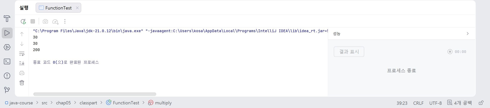
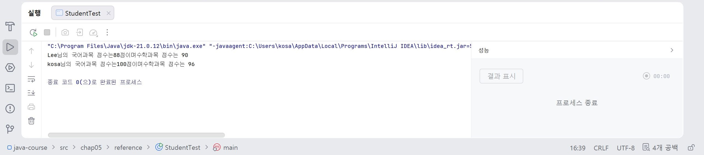

# 12일차

## Java 메서드, 클래스, 생성자, 캡슐화

📌 학습일 : 2026.08.04

📌 학습 내용 : 메서드(Method), 클래스(Class), 객체(Object), 생성자(Constructor), 접근 제어자, Getter/Setter, 참조 자료형

---

#### 1. 메서드(Method)

메서드는 특정 기능을 수행하는 코드의 묶음으로, 필요할 때 여러 번 호출하여 사용할 수 있다.

```java
public static int 변수명(int 변수명1, int 변수명2) {
    return 변수명1 +변수명2;
}
```

#### 2. 클래스(Class)

클래스는 객체를 만들기 위한 설계도이며, 변수(속성)와 메서드(기능)를 포함한다.

```java
public class 클래스명 {

    int 변수명;
    String 변수명;
}
```

#### 3. 객체(Object)

객체는 클래스를 이용하여 생성한 실제 데이터이다.

```java
클래스명 객체명 = new 클래스명();
```

객체마다 서로 다른 데이터를 저장할 수 있다.

#### 4. 메서드 호출

객체가 가지고 있는 기능은 메서드를 호출하여 사용할 수 있다.

```java
객체명.get객체명();
클래스명.show클래스명Info();
```

#### 5. 생성자(Constructor)

생성자는 객체가 생성될 때 자동으로 호출되는 특별한 메서드이다.

```java
public 클래스명() {

}

public 클래스명(String 변수명1, 변수명2, 변수명3) {

}
```

#### 6. 접근 제어자(Access Modifier)

데이터를 보호하기 위해 접근 범위를 제한하는 기능이다.

```java
private int 변수명;
```

#### 7. Getter와 Setter

`private` 변수는 직접 접근할 수 없기 때문에 Getter와 Setter를 사용한다.

```java
public int get변수명() {
    return 변수명;
}

public void set변수명(int 변수명) {
    this.변수명 = 변수명;
}
```

#### 8. 캡슐화(Encapsulation)

객체의 데이터를 외부에서 직접 수정하지 못하도록 보호하고, Getter와 Setter를 통해 접근하도록 하는 객체지향 개념이다.

#### 9. 참조 자료형(Reference Type)

객체를 참조하는 자료형으로, 하나의 객체 안에 다른 객체를 포함할 수 있다.

```java
객체명1 객체명2;
객체명1 객체명3;

#### 10. 객체 간 관계

객체는 다른 객체를 참조하여 보다 복잡한 구조를 만들 수 있다.

---

#### 핵심 정리

- 메서드는 특정 기능을 수행하는 코드의 묶음이며, 필요할 때 호출하여 사용할 수 있다.
- 클래스는 객체를 생성하기 위한 설계도이며, 객체는 클래스에서 생성된 실제 데이터이다.
- 생성자는 객체 생성과 동시에 필요한 값을 초기화할 수 있다.
- `private` 변수는 외부에서 직접 접근할 수 없으며, Getter와 Setter를 통해 접근한다.
- 캡슐화는 객체의 데이터를 보호하기 위한 객체지향 프로그래밍의 핵심 개념이다.
- 참조 자료형을 사용하면 객체 안에서 다른 객체를 사용할 수 있어 프로그램을 구조적으로 설계할 수 있다.

---

메서드: 함수를 구현하고 호출하는 부분을 구현
```java
package chap05.classpart;

public class FunctionTest {
    public static void main(String[] args) {
        int num1 = 10;
        int num2 = 20;

        int sum = addNum(num1, num2);
        System.out.println(sum);

        int sub = add(num1, num2);
        System.out.println(sub);

        int mul = multiply(num1, num2);
        System.out.println(mul);
    }

    public static int addNum(int n1, int n2){
        int result = n1 + n2;
        return result;
    }

    public static int add(int n1, int n2) {
        int result;
        result = n1 + n2;
        return result; //결과값 반환
        //위에와 결과값 같음
    }

    public static int subtract(int n1, int n2){
        int result = n1 - n2;
        return result;
    }

    public static int multiply(int n1, int n2){
        int result = n1 * n2;
        return result;
    }
}
```
<p align="center">
  
</p>
메서드 함수를 사용하고 구현할 때는 public static int 함수명 다음에 ()에 int가 꼭 들어가야 한다.

그 다음에는 반드시 int result가 와야 한다.
</br></br></br>
```java
package chap05.reference;

public class Student4 {
    int studentID;
    String studentName;
    Subject2 korean;
    Subject2 math;

    public Student4(int studentID, String studentName) {
        this.studentID = studentID;
        this.studentName = studentName;

        korean = new Subject2();
        math = new Subject2();
    }

    public void showStudentinfo() {
        System.out.println(studentName + "님의 " + korean.getSubjectName() + "과목 점수는"
                + korean.getScorePoint() + "점이며" + math.getSubjectName() + "과목 점수는 " + math.getScorePoint());
    }

    public void setKoreanSubject(String subjectName, int score) {
        korean.setSubjectName(subjectName);
        korean.setScorePoint(score);
    }

    public void setMathSubject(String subjectName, int score) {
        math.setSubjectName(subjectName);
        math.setScorePoint(score);
    }
}
```
```java
package chap05.reference;

import chap05.classpart.Student;

public class StudentTest {
    public static void main(String[] args) {
        Student4 studentLee = new Student4(100, "Lee");
        studentLee.setKoreanSubject("국어", 88);
        studentLee.setMathSubject("수학", 90);

        Student4 studentkosa = new Student4(102, "kosa");
        studentkosa.setKoreanSubject("국어", 100);
        studentkosa.setMathSubject("수학", 96);

        studentLee.showStudentinfo();
        studentkosa.showStudentinfo();
    }
}
```
<p align="center">
  
</p>
Student와 Subject 클래스를 활용하여 객체 간의 관계를 구현해 보았는데 생성자와 객체 생성 과정이 다소 어려웠다.

특히 클래스와 객체 파일을 분리해서 정의하고 불러오는 과정에서 오류가 있어서 해결하는 과정에 시행착오도 있었고 마지막에 위에 사진처럼 결과값이 나오기 위해서

studentLee.showStudentinfo();까지 입력하는 과정에서 미리 생성한 걸 불러와서 객체 생성을 하고 변수명과 객체 사이를 왔다갔다 하다보니 헷갈려서 몇번의 시행착오를 겪었다.

아직도 눈으로 봤을 때는 이해가 가는데 막상 실습하다보면 막막한 감이 있다.

좀 더 연습이 필요할 것 같다.

