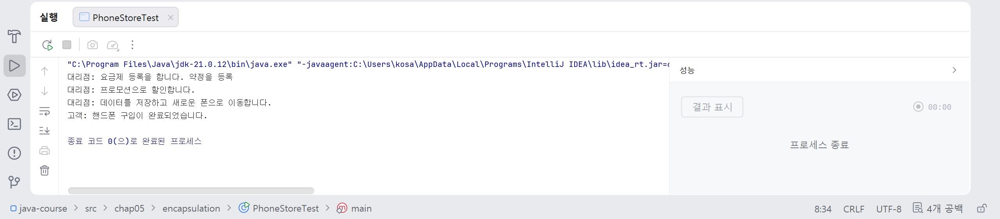
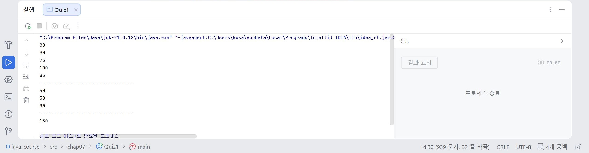

# 13일차

## Java static, Singleton, this, 배열(Array), 객체 협력

📌 학습일 : 2026.08.05

📌 학습 내용 : static, Singleton Pattern, this, 객체 간 협력, 캡슐화, 배열(Array), 2차원 배열

---

#### 1. 캡슐화(Encapsulation)

객체의 내부 데이터를 외부에서 직접 접근하지 못하도록 보호하고, 필요한 기능만 외부에 제공하는 객체지향 개념이다.

```java
private 자료형 변수명;

public 자료형 get변수명() {
    return 변수명;
}

public void set변수명(자료형 변수명) {
    this.변수명 = 변수명;
}
```


#### 2. 객체 간 협력(Cooperation)

객체는 서로 메서드를 호출하고 데이터를 전달하면서 하나의 기능을 수행한다.

```java
객체명1.메서드명(객체명2);
```


#### 3. static 변수와 static 메서드

`static`은 객체를 생성하지 않아도 사용할 수 있는 클래스 구성 요소이며, 모든 객체가 하나의 값을 공유한다.

```java
public class 클래스명 {

    static int 공유변수 = 0;

    public static int get공유변수() {
        return 공유변수;
    }
}
```

클래스 이름으로 직접 접근할 수 있다.

```java
클래스명.공유변수;
클래스명.get공유변수();
```


#### 4. 싱글톤 패턴(Singleton Pattern)

프로그램에서 객체를 하나만 생성하고 공유하기 위한 디자인 패턴이다.

```java
public class 클래스명 {

    private static 클래스명 instance = new 클래스명();

    private 클래스명() {
    }

    public static 클래스명 getInstance() {
        return instance;
    }
}
```

생성자를 `private`으로 선언하여 외부에서 객체를 생성하지 못하도록 한다.

#### 5. this 키워드

`this`는 현재 객체 자기 자신을 가리키는 참조 변수이다.

멤버 변수와 매개변수의 이름이 같을 때 구분하기 위해 사용한다.

```java
public void set변수명(int 변수명) {
    this.변수명 = 변수명;
}
```

같은 클래스의 다른 생성자를 호출할 수도 있다.

```java
public 클래스명() {
    this("기본값", 0);
}

public 클래스명(String 변수명1, int 변수명2) {
    this.변수명1 = 변수명1;
    this.변수명2 = 변수명2;
}
```


#### 6. 배열(Array)

배열은 같은 자료형의 여러 데이터를 하나의 변수로 관리하는 자료구조이다.

```java
int[] 배열명 = {1, 2, 3, 4, 5};
```

배열의 크기를 먼저 지정하여 생성할 수도 있다.

```java
int[] 배열명 = new int[5];

배열명[0] = 10;
배열명[1] = 20;
```

#### 7. 배열과 반복문

배열은 반복문과 함께 사용하여 모든 데이터를 순차적으로 처리할 수 있다.

```java
for (int i = 0; i < 배열명.length; i++) {
    System.out.println(배열명[i]);
}
```

`length`는 배열의 전체 길이를 반환한다.


#### 8. 배열 복사(Array Copy)

`System.arraycopy()`를 사용하면 배열의 데이터를 다른 배열로 복사할 수 있다.

```java
System.arraycopy(배열명1, 0, 배열명2, 0, 배열명1.length);
```

또는 원하는 범위만 복사할 수도 있다.

```java
System.arraycopy(배열명1, 0, 배열명2, 1, 4);
```

#### 9. 2차원 배열(Two-Dimensional Array)

2차원 배열은 행과 열 구조의 데이터를 저장하는 배열이다.

```java
int[][] 배열명 = {
    {1, 2, 3},
    {4, 5, 6}
};
```

중첩 반복문을 사용하여 모든 데이터를 출력할 수 있다.

```java
for (int i = 0; i < 배열명.length; i++) {
    for (int j = 0; j < 배열명[i].length; j++) {
        System.out.println(배열명[i][j]);
    }
}
```

#### 10. 클래스와 static 활용

인스턴스 변수는 객체마다 서로 다른 값을 저장하고, static 변수는 모든 객체가 공유하는 값을 저장한다.

```java
public class 클래스명 {

    private String 변수명1;
    private int 변수명2;

    static int 객체수 = 0;

    public 클래스명(String 변수명1, int 변수명2) {
        this.변수명1 = 변수명1;
        this.변수명2 = 변수명2;
        객체수++;
    }
}
```
---

#### 핵심 정리

* 캡슐화는 객체의 데이터를 보호하고 필요한 기능만 외부에 제공하는 객체지향 개념이다.
* 객체는 서로 메서드를 호출하고 데이터를 전달하면서 하나의 기능을 수행한다.
* `static` 변수와 메서드는 클래스에 소속되며, 모든 객체가 하나의 값을 공유한다.
* 싱글톤 패턴은 프로그램에서 하나의 객체만 생성하여 공유하는 디자인 패턴이다.
* `this`는 현재 객체를 참조하며, 멤버 변수와 매개변수를 구분하거나 다른 생성자를 호출할 때 사용한다.
* 배열은 같은 자료형의 여러 데이터를 저장하는 자료구조이며, 반복문과 함께 자주 사용된다.
* `System.arraycopy()`를 이용하면 배열을 효율적으로 복사할 수 있다.
* 2차원 배열은 행과 열 구조의 데이터를 저장하며, 중첩 반복문으로 처리한다.
* 객체마다 개별적으로 관리해야 하는 값은 인스턴스 변수로, 모든 객체가 공유해야 하는 값은 static 변수로 선언한다.

---
```java
package chap05.encapsulation;

public class Customer {
    private String name;
    private double buget;

    public Customer(String name, double buget) {
        this.name = name;
        this.buget = buget;
    }

    public String getName() {
        return name;
    }

    public void buyphone(PhoneStore store){
        Phone phone = store.sellPhone("아이폰", buget);
        if (phone != null){
            System.out.println("고객: 핸드폰 구입이 완료되었습니다.");
        }
        else {
            System.out.println("고객: 핻드폰을 구입하지 못했습니다.");
        }
    }
}
```
```java
package chap05.encapsulation;

public class Phone {
    private String model;
    private double price;

    public Phone(String model, double price) {
        this.model = model;
        this.price = price;
    }

    public String getModel() {
        return model;
    }

    public double getPrice() {
        return price;
    }
}
```
```java
package chap05.encapsulation;

public class PhoneStore {
    private Phone phone; //참조 변수형

    public PhoneStore(Phone phone) {
        this.phone = phone;
    }

    public Phone sellPhone(String model, double buget){
        String phoneModel = phone.getModel();

        if (model.equals(phoneModel) && buget >= phone.getPrice()){
            registerPayment();
            discountPromotion();
            saveDate();
            return phone;
        }
        else return null;
    }
    private void registerPayment(){
        System.out.println("대리점: 요금제 등록을 합니다. 약정을 등록");
    }
    private void discountPromotion(){
        System.out.println("대리점: 프로모션으로 할인합니다.");
    }
    private void saveDate(){
        System.out.println("대리점: 데이터를 저장하고 새로운 폰으로 이동합니다.");
    }
}
```
```java
package chap05.encapsulation;

public class PhoneStoreTest {
    public static void main(String[] args) {
        Phone phone = new Phone("아이폰", 100000);
        PhoneStore store = new PhoneStore(phone);
        Customer customer = new Customer("김코사", 1000000);
        customer.buyphone(store);
    }
}
```
<p align="center">
  
</p>

private를 사용하여 클래스를 만들면 반드시 클래스 있는 곳에 생성자를 만들어야 다른 클래스에서 호출할 수 있다.

여러 클래스가 서로 호출하여 입력할때는 클래스명을 정확하게 입력하고 변수명을 지정해야 사용할 수 있다.

헷갈리지 않게 클래스명은 앞을 대문자로 지정해야하고 지정한 공유변수에 따라 int 또는 String 등이 오고 그 다음에 get공유변수명과 return을 입력해야 한다.

</br></br></br>
1.학생 5명의 점수를 저장할 수 있는 int형 배열

배열에 다음 점수를 저장한 후 for문을 이용하여 모든 점수를 출력

80, 90, 75, 100, 85

2.아래 정수 배열에서 30이상인 값만 출력

int[] data = {10, 40, 20, 50, 30};

3.위의 배열에 저장된 모든 숫자의 합계를 출력
```java
package chap07;

public class Quiz1 {
    public static void main(String[] args) {
        int[] score = new int[]{80, 90, 75, 100, 85};
        for (int i = 0; i < score.length; i++) {
            System.out.println(score[i]);
        }
        System.out.println("----------------------------------");

        int[] data = {10, 40, 20, 50, 30};
        for (int i = 0; i < data.length; i++) {
            if (data[i] >= 30) {
                System.out.println(data[i]);
            }
        }
        System.out.println("----------------------------------");

        int sum = 0;
        for (int i = 0; i <data.length; i++) {
            sum += data[i];
        }
        System.out.println(sum);
    }
}
```
<p align="center">
  
</p>
숫자 배열을 저장할 때는  int[] 변수명을 입력해야 한다.
그다음에 for문을 이용하여 i로 조건을 지정하는데, ;으로 ()안을 구분하고 이 때 변수명.length해야 한다.

그리고 마지막에 출력 할때는 변수명[i]로 해야 제대로 출력값이 나온다.

if문을 사용할때도 for문과 동일하게 조건을  변수명[i]로 지정해야 한다.
