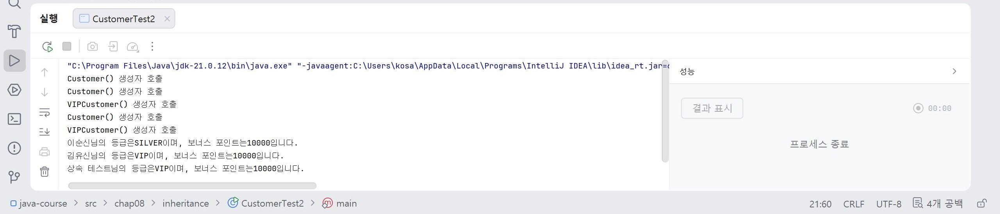
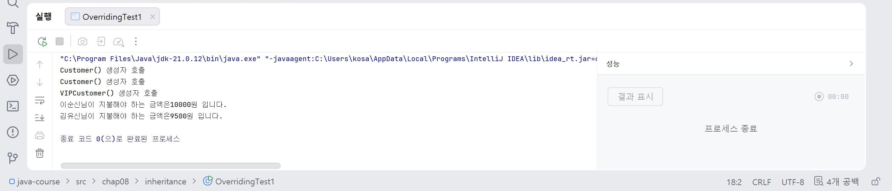

# 14일차

## Java 배열, 상속과 다형성

📌 학습일 : 2026.08.06

📌 학습 내용 : 객체 배열, 배열 복사, 얕은 복사, 깊은 복사, 향상된 for문, ArrayList, 상속(Inheritance), super, 메서드 오버라이딩(Overriding), 다형성(Polymorphism)

---

#### 1. 객체 배열(Object Array)

객체 배열은 같은 클래스의 여러 객체를 하나의 배열에 저장하여 관리하는 자료구조이다.

```java
클래스명[] 배열명 = new 클래스명[3];

배열명[0] = new 클래스명();
배열명[1] = new 클래스명();
배열명[2] = new 클래스명();
```

#### 2. 객체 배열과 반복문

객체 배열은 반복문을 이용하여 모든 객체를 한 번에 처리할 수 있다.

```java
for (int i = 0; i < 배열명.length; i++) {
    배열명[i].메서드명();
}
```


#### 3. 향상된 for문(Enhanced for)

배열이나 컬렉션의 모든 요소를 순서대로 사용할 때 사용하는 반복문이다.

```java
for (자료형 변수명 : 배열명) {
    System.out.println(변수명);
}
```

객체 배열에서도 사용할 수 있다.

```java
for (클래스명 객체명 : 배열명) {
    객체명.메서드명();
}
```

#### 4. 배열 복사(Array Copy)

배열의 데이터를 다른 배열로 복사할 수 있다.

```java
System.arraycopy(배열명1, 0, 배열명2, 0, 배열명1.length);
```

#### 5. 얕은 복사(Shallow Copy)

배열의 주소값만 복사하여 하나의 객체를 함께 참조하는 방식이다.

```java
자료형[] 배열명2 = 배열명1;
```

한 배열의 값을 변경하면 다른 배열에도 동일하게 반영된다.

#### 6. 깊은 복사(Deep Copy)

새로운 배열을 생성한 뒤 데이터를 하나씩 복사하는 방식이다.

```java
자료형[] 배열명2 = new 자료형[배열명1.length];

for (int i = 0; i < 배열명1.length; i++) {
    배열명2[i] = 배열명1[i];
}
```

또는

```java
System.arraycopy(배열명1, 0, 배열명2, 0, 배열명1.length);
```

깊은 복사 후에는 서로 독립적으로 데이터를 관리할 수 있다.

#### 7. ArrayList

ArrayList는 크기를 자유롭게 늘리거나 줄일 수 있는 자료구조이다.

```java
ArrayList<자료형> 리스트명 = new ArrayList<>();
```

#### 8. ArrayList 주요 메서드

ArrayList는 다양한 메서드를 이용하여 데이터를 관리한다.

```java
리스트명.add(값);
리스트명.get(0);
리스트명.set(0, 값);
리스트명.remove(0);
리스트명.size();
```

#### 9. ArrayList와 반복문

ArrayList도 반복문을 이용하여 모든 데이터를 처리할 수 있다.

```java
for (int i = 0; i < 리스트명.size(); i++) {
    System.out.println(리스트명.get(i));
}
```

향상된 for문도 사용할 수 있다.

```java
for (자료형 변수명 : 리스트명) {
    System.out.println(변수명);
}
```

#### 10. 상속(Inheritance)

상속은 기존 클래스의 속성과 기능을 새로운 클래스에서 재사용하는 객체지향 프로그래밍의 핵심 개념이다.

```java
public class 자식클래스명 extends 부모클래스명 {

}
```

상속을 사용하면 부모 클래스의 변수와 메서드를 그대로 사용할 수 있으며, 필요한 기능만 추가하거나 변경할 수 있다.

#### 11. super 키워드

`super`는 부모 클래스의 변수, 메서드 또는 생성자를 호출할 때 사용하는 키워드이다.

부모 생성자를 호출하는 경우

```java
public 클래스명() {
    super();
}
```

부모 메서드를 호출하는 경우

```java
super.메서드명();
```


#### 12. 메서드 오버라이딩(Method Overriding)

오버라이딩은 부모 클래스의 메서드를 자식 클래스에서 재정의하여 사용하는 기능이다.

```java
@Override
public void 메서드명() {

}
```

부모와 동일한 메서드 이름과 매개변수를 사용하며, 자식 클래스에서 새로운 기능을 구현할 수 있다.


#### 13. 다형성(Polymorphism)

다형성은 하나의 부모 클래스 참조 변수로 여러 자식 객체를 참조할 수 있는 객체지향 개념이다.

```java
부모클래스명 객체명 = new 자식클래스명();
```

실행되는 메서드는 참조 변수의 타입이 아니라 실제 생성된 객체의 메서드가 호출된다.

#### 14. 형 변환(Up Casting / Down Casting)

상속 관계에서는 부모 타입과 자식 타입 사이의 형 변환이 가능하다.

업 캐스팅

```java
부모클래스명 객체명 = new 자식클래스명();
```

다운 캐스팅

```java
자식클래스명 객체명 = (자식클래스명) 부모객체;
```

다운 캐스팅은 실제 객체가 자식 객체인 경우에만 사용할 수 있다.


#### 15. 상속을 이용한 기능 확장

자식 클래스는 부모 클래스의 기능을 그대로 사용하면서 새로운 변수와 메서드를 추가할 수 있다.

```java
public class 자식클래스명 extends 부모클래스명 {

    private int 변수명;

}
```

#### 16. 메서드 오버라이딩 활용

부모 클래스의 기능을 유지하면서 자식 클래스마다 서로 다른 기능을 구현할 수 있다.

```java
@Override
public 반환형 메서드명(자료형 변수명) {

    return 변수명;
}
```


#### 17. 객체 생성과 상속 관계

부모 클래스와 자식 클래스는 각각 생성자를 가지며, 객체 생성 시 부모 생성자가 먼저 실행된다.

```java
자식클래스명 객체명 = new 자식클래스명();
```

객체 생성 과정에서 부모 클래스가 먼저 초기화되고 이후 자식 클래스가 초기화된다.


#### 18. 객체지향 설계

상속을 이용하면 공통 기능은 부모 클래스에서 관리하고, 자식 클래스에서는 필요한 기능만 추가하거나 수정할 수 있다.

---

#### 핵심 정리

* 객체 배열과 ArrayList는 여러 데이터를 효율적으로 관리할 수 있으며, 반복문과 함께 자주 사용된다.
* 향상된 for문은 배열과 컬렉션의 모든 요소를 간편하게 순회할 때 사용한다.
* 얕은 복사는 참조 주소를 공유하고, 깊은 복사는 새로운 객체를 생성하여 독립적으로 데이터를 관리한다.
* ArrayList는 크기를 자유롭게 변경할 수 있으며 `add()`, `get()`, `set()`, `remove()`, `size()` 등의 메서드를 사용하여 데이터를 관리한다.
* 상속은 `extends`를 사용하여 부모 클래스의 기능을 재사용하고, 코드의 재사용성과 유지보수성을 높이는 객체지향 개념이다.
* `super`는 부모 클래스의 생성자나 메서드를 호출할 때 사용하며, `this`와 구분하여 사용한다.
* 메서드 오버라이딩은 부모 클래스의 메서드를 자식 클래스에서 재정의하여 객체마다 다른 기능을 구현하는 방법이다.
* 다형성은 부모 타입으로 여러 자식 객체를 참조할 수 있는 객체지향의 특징이며, 업 캐스팅과 다운 캐스팅을 통해 형 변환을 수행할 수 있다.

---
```java
package chap08.inheritance;

public class Customer {
    protected int customerID;
    protected String customerName;
    protected String customerGrade;
    int bonusPoint;
    double bonusRatio;

    public Customer(int customerID, String customerName){
        this.customerID = customerID;
        this.customerName = customerName;
        customerGrade = "SILVER";
        bonusRatio = 0.01;

        System.out.println("Customer() 생성자 호출");
    }

    public  int calcPrice(int price) {
        bonusPoint += price * bonusRatio;
        return price;
    }
    public String showCustomerInfo(){
        return customerName + "님의 등급은" + customerGrade + "이며, 보너스 포인트는" + bonusPoint + "입니다.";
    }

    public int getCustomerID() {
        return customerID;
    }

    public void setCustomerID(int customerID) {
        this.customerID = customerID;
    }

    public String getCustomerName() {
        return customerName;
    }

    public void setCustomerName(String customerName) {
        this.customerName = customerName;
    }

    public String getCustomerGrade() {
        return customerGrade;
    }

    public void setCustomerGrade(String customerGrade) {
        this.customerGrade = customerGrade;
    }
}
```
```java
package chap08.inheritance;

public class VIPCustomer extends Customer {
    private int agentID;
    double salerRatio;

    public VIPCustomer(int customerID, String customerName, int agentID){
        super(customerID, customerName);
        customerGrade = "VIP";
        salerRatio = 0.05;
        bonusRatio = 0.1;
        this.agentID = agentID;
        System.out.println("VIPCustomer() 생성자 호출");
    }

    public  int calcPrice(int price) {
        bonusPoint += price * bonusRatio;
        return price - (int)(price * salerRatio);
    }

    public int getAgentID() {
        return agentID;
    }
}
```
매개 변수를 이용해서 Customer클래스와 Customer클래스에 상속된 VIPCustomer클래스를 만들었다.

그런데 매개변수를 이용해서 생성자를 만들었더니 기본 생성자가 Customer클래스와 VIPCustomer클래스에 없어서 오류가 났었다.
```java
package chap08.inheritance;

public class CustomerTest2 {
    public static void main(String[] args) {

        Customer customerLee = new Customer();
        customerLee.setCustomerID(1000);
        customerLee.setCustomerName("이순신");
        customerLee.bonusPoint = 10000;

        VIPCustomer customerKim = new VIPCustomer();
        customerKim.setCustomerID(1001);
        customerKim.setCustomerName("김유신");
        customerKim.bonusPoint = 10000;

        Customer vc = new VIPCustomer();
        vc.setCustomerID(1001);
        vc.setCustomerName("상속 테스트");
        vc.bonusPoint = 10000;

        System.out.println(customerLee.showCustomerInfo());
        System.out.println(customerKim.showCustomerInfo());
        System.out.println(vc.showCustomerInfo());
    }
}
```
그래서 기본 생성자를 Customer클래스와 VIPCustomer클래스에 생성하는 것보다는 조금 더 간단하게 표시하기 위해 아래와 같이 입력하여 정상적으로 결과값이 출력되었다.

그리고 참조 변수형을 이용하여 업캐스팅해 상속테스트를 출력해보았고 정상적으로 아래와 같이 출력되었다.
```java
package chap08.inheritance;

public class CustomerTest2 {
    public static void main(String[] args) {

        Customer customerLee = new Customer(1010,"이순신");
        customerLee.bonusPoint = 10000;

        VIPCustomer customerKim = new VIPCustomer(1020,"김유신",1001);
        customerKim.bonusPoint = 10000;

        Customer vc = new VIPCustomer(1001, "상속 테스트",10000);
        vc.bonusPoint = 10000;

        System.out.println(customerLee.showCustomerInfo());
        System.out.println(customerKim.showCustomerInfo());
        System.out.println(vc.showCustomerInfo());
    }
}
```
<p align="center">
  
</p>
기본 생성자 오류로 인해 한참을 해결하려고 고민했는데 다음에는 좀 더 연습해서 이와 같은 오류가 나지 않게 조심해야겠다.
</br></br></br>
```java
package chap08.inheritance;

public class OverridingTest1 {
    public static void main(String[] args) {
        Customer customerLee = new Customer(1010,"이순신");
        customerLee.bonusPoint = 1000;

        VIPCustomer customerKim = new VIPCustomer(1020, "김유신",1000);
        customerKim.bonusPoint = 1000;

        int price = 10000;
        System.out.println(customerLee.getCustomerName() + "님이 지불해야 하는 금액은" +
                customerLee.calcPrice(price) + "원 입니다.");

        System.out.println(customerKim.getCustomerName() + "님이 지불해야 하는 금액은" +
                customerKim.calcPrice(price) + "원 입니다.");
    }
}
```
<p align="center">
  
</p>
Overriding을 활용하여 입력을 하였는데 여기서 반드시 calcPrice값을 출력하기 위해서는 다음에 (price)가 와야하고 price 조건값을 입력해야 제대로 값이 출력된다.

연습으로 한거라 @Override이 생략하고 했지만 실전에서는 생략하면 컴파일러가 오류가 날 수 있어 가급적이면 넣는 것이 좋다.

다음에는 꼭 넣어서 연습을 해봐야겠다.
