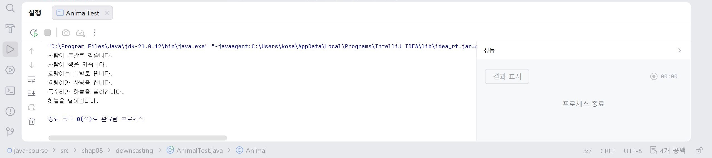

# 15일차

## Java 다운캐스팅(Down Casting), 추상 클래스(Abstract Class), 템플릿 메서드, 인터페이스(Interface)

📌 학습일 : 2026.08.07

📌 학습 내용 : 다운캐스팅, instanceof, 추상 클래스(Abstract Class), 템플릿 메서드(Template Method), 인터페이스(Interface), 다형성 활용

---

#### 1. 다운캐스팅(Down Casting)

다운캐스팅은 부모 클래스 타입을 자식 클래스 타입으로 변환하여 자식 클래스의 기능을 사용하는 방법이다.

```java
부모클래스명 객체명 = new 자식클래스명();

자식클래스명 자식객체 = (자식클래스명) 객체명;
```

다운캐스팅은 실제 생성된 객체가 자식 클래스인 경우에만 사용할 수 있다.

#### 2. instanceof 연산자

`instanceof`는 객체가 특정 클래스의 인스턴스인지 확인하는 연산자이다.

```java
if (객체명 instanceof 자식클래스명) {
    자식클래스명 변수명 = (자식클래스명) 객체명;
}
```

다운캐스팅 전에 객체의 타입을 확인하여 오류를 방지할 수 있다.

#### 3. 다형성과 다운캐스팅 활용

부모 타입으로 여러 자식 객체를 관리하고, 필요한 경우 다운캐스팅하여 자식 클래스의 기능을 사용할 수 있다.

```java
부모클래스명 객체명 = new 자식클래스명();

객체명.메서드명();
```

실행 시 실제 생성된 객체의 메서드가 호출된다.

#### 4. 추상 클래스(Abstract Class)

추상 클래스는 객체를 직접 생성할 수 없는 클래스이며, 공통 기능을 제공하기 위한 클래스이다.

```java
public abstract class 클래스명 {

    public abstract void 메서드명();

}
```

추상 메서드를 포함한 클래스는 반드시 `abstract`로 선언해야 한다.

#### 5. 추상 메서드(Abstract Method)

추상 메서드는 선언만 있고 구현이 없는 메서드이다.

```java
public abstract void 메서드명();
```

추상 클래스를 상속받는 자식 클래스는 추상 메서드를 반드시 구현해야 한다.

#### 6. 추상 클래스 상속

추상 클래스를 상속받은 클래스는 추상 메서드를 구현하여 사용할 수 있다.

```java
public class 자식클래스명 extends 부모클래스명 {

    @Override
    public void 메서드명() {

    }

}
```

#### 7. final 메서드

`final` 메서드는 자식 클래스에서 오버라이딩할 수 없는 메서드이다.

```java
public final void 메서드명() {

}
```

프로그램의 실행 순서를 변경하지 못하도록 할 때 사용한다.

#### 8. 템플릿 메서드(Template Method)

템플릿 메서드는 전체 실행 순서를 부모 클래스에서 정의하고, 세부 기능은 자식 클래스에서 구현하는 디자인 패턴이다.

```java
public final void 실행메서드() {

    기능1();
    기능2();
    기능3();

}
```

공통적인 실행 흐름은 유지하면서 세부 기능만 변경할 수 있다.

#### 9. 인터페이스(Interface)

인터페이스는 클래스가 반드시 구현해야 하는 기능의 규칙을 정의한다.

```java
public interface 인터페이스명 {

    반환형 메서드명();

}
```

인터페이스의 메서드는 구현 없이 선언만 작성한다.

#### 10. 인터페이스 구현

클래스는 `implements`를 사용하여 인터페이스를 구현한다.

```java
public class 클래스명 implements 인터페이스명 {

    @Override
    public 반환형 메서드명() {

        return 값;

    }

}
```

인터페이스의 모든 추상 메서드를 반드시 구현해야 한다.

#### 11. 인터페이스를 이용한 다형성

인터페이스 타입으로 여러 구현 클래스를 사용할 수 있다.

```java
인터페이스명 객체명 = new 구현클래스명();
```

실행되는 메서드는 실제 생성된 구현 클래스의 메서드이다.

#### 12. 인터페이스 상수

인터페이스의 변수는 자동으로 상수(`public static final`)가 된다.

```java
public interface 인터페이스명 {

    double 상수명 = 3.14;

}
```

상수는 프로그램 전체에서 공통된 값을 사용할 때 활용한다.

#### 13. 객체지향 설계

추상 클래스와 인터페이스를 활용하면 공통 기능과 세부 기능을 분리하여 프로그램을 유연하게 설계할 수 있다.

---

#### 핵심 정리

* 다운캐스팅은 부모 타입을 자식 타입으로 변환하여 자식 클래스의 기능을 사용할 때 활용하며, `instanceof`로 타입을 먼저 확인하는 것이 안전하다.
* 추상 클래스는 객체를 직접 생성할 수 없으며, 공통 기능을 정의하고 자식 클래스에서 기능을 구현하도록 한다.
* 추상 메서드는 구현부가 없는 메서드이며, 자식 클래스에서 반드시 오버라이딩해야 한다.
* 템플릿 메서드는 부모 클래스에서 전체 실행 순서를 정의하고, 세부 기능은 자식 클래스에서 구현하는 디자인 패턴이다.
* 인터페이스는 클래스가 구현해야 하는 기능의 규칙을 정의하며, `implements`를 사용하여 구현한다.
* 인터페이스를 활용하면 다형성을 구현할 수 있으며, 구현 클래스가 변경되어도 동일한 방식으로 사용할 수 있다.
* `final` 메서드는 오버라이딩이 불가능하여 프로그램의 실행 순서를 고정할 때 사용한다.
* 추상 클래스와 인터페이스를 함께 활용하면 유지보수성과 확장성이 높은 객체지향 프로그램을 설계할 수 있다.

---
```java
package chap08.downcasting;

class Animal {
    public void move() {
        System.out.println("동물이 움직입니다.");
    }
}

class Huamn extends Animal {
    public void move() {
        System.out.println("사람이 두발로 걷습니다.");
    }
    public void reBook() {
        System.out.println("사람이 책을 읽습니다.");
    }
}

class Tiger extends Animal {
    public void move() {
        System.out.println("호랑이는 네발로 뜁니다.");
    }
    public void hunting(){
        System.out.println("호랑이가 사냥을 합니다.");
    }
}

class Eegle extends Animal {
    public void move() {
        System.out.println("독수리가 하늘을 날아갑니다.");
    }
    public void flying(){
        System.out.println("하늘을 날아갑니다.");
    }
}

public class AnimalTest {
    public static void main(String[] args) {
        AnimalTest test = new AnimalTest();
        test.moveAnimal(new Huamn());
        test.moveAnimal(new Tiger());
        test.moveAnimal(new Eegle());
    }

    public void moveAnimal(Animal animal) {
        animal.move(); 
  
       /* Huamn huamn = (Huamn) animal;
        huamn.reBook(); */

        //instanceof은 다운캐스팅에 사용함
        if (animal instanceof Huamn){
            Huamn human = (Huamn) animal;
            human.reBook();
        } else if (animal instanceof Tiger){
            Tiger tiger = (Tiger) animal;
            tiger.hunting();
        } else if (animal instanceof Eegle) {
            Eegle eegle = (Eegle) animal;
            eegle.flying();;
        } else {
            System.out.println("기능이 없습니다.");
        }
    }

}
```
<p align="center">
  
</p>
다운 캐스팅을 사용하여 실습을 해보았는데
상속 전인 Animal animal = new Human()과 다운 캐스팅한 (Animal animal)은 같은 것으로 부모클래스명과 자식클래스명 순으로 입력해야한다.

그리고 Huamn huamn = (Huamn) animal;과 huamn.reBook();을 입력하면 결과값이 출력되긴 하지만 잘못하면 프로그램 실행중 예외가 발생하여 자바가 다운될 수 있어 배제시켰다.

</br></br></br>
