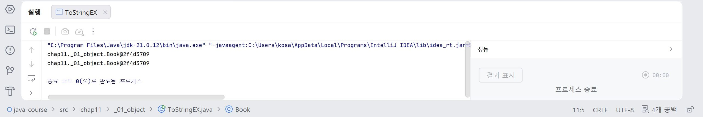
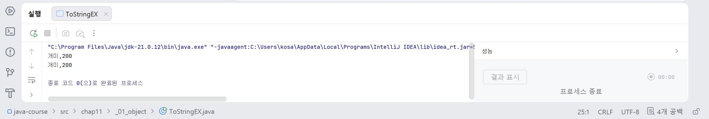
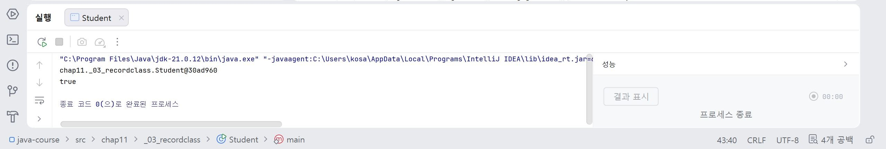
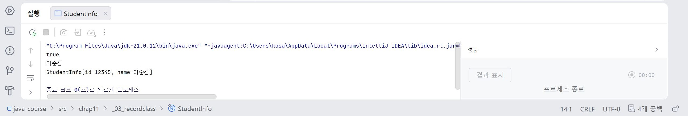

# 17일차

## Java Object, String, Record, Generic, Collection

📌 학습일 : 2026.08.11

📌 학습 내용 : Object class, equals(), hashCode(), toString(), String, StringBuffer, Record, Generic, ArrayList, Queue, Stack, LinkedList, HashSet

---

#### 1. Object class

`Object` 클래스는 Java의 모든 클래스가 기본적으로 상속받는 최상위 클래스이다.

따라서 별도로 `extends Object`를 작성하지 않아도 `Object` 클래스의 메서드를 사용할 수 있다.

대표적인 메서드는 다음과 같다.

```java
객체명.equals(비교객체);
객체명.hashCode();
객체명.toString();
```

#### 2. == 연산자와 equals()

객체를 비교할 때 `==`와 `equals()`는 서로 다른 기준을 사용한다.

```java
객체1 == 객체2
```

`==`는 두 참조 변수가 같은 객체를 가리키는지 비교한다.

```java
객체1.equals(객체2)
```

`equals()`는 객체의 논리적인 동일성을 비교할 때 사용한다.

```java
String 문자열1 = new String("abc");
String 문자열2 = new String("abc");

System.out.println(문자열1 == 문자열2);       // false
System.out.println(문자열1.equals(문자열2));  // true
```

`String` 클래스는 `equals()`가 문자열의 내용을 비교하도록 이미 재정의되어 있다.

#### 3. equals() 메서드 재정의

사용자가 만든 클래스에서도 `equals()`를 재정의하여 객체를 비교하는 기준을 직접 만들 수 있다.

```java
@Override
public boolean equals(Object 객체명) {

    if (객체명 instanceof 클래스명) {

        클래스명 비교객체 = (클래스명) 객체명;

        if (번호 == 비교객체.번호) {
            return true;
        }
    }

    return false;
}
```

객체의 주소가 달라도 특정 값이 같으면 논리적으로 같은 객체로 판단하도록 만들 수 있다.

#### 4. hashCode()

`hashCode()`는 객체에 대한 정수 형태의 해시 코드를 반환하는 메서드이다.

`equals()`를 재정의할 경우 논리적으로 같은 객체가 같은 `hashCode()` 값을 가지도록 함께 재정의할 수 있다.

```java
@Override
public int hashCode() {
    return 번호;
}
```

객체 자체를 기준으로 한 식별값은 `System.identityHashCode()`를 이용하여 확인할 수 있다.

```java
System.identityHashCode(객체명);
```

#### 5. toString()

`toString()`은 객체의 정보를 문자열로 반환하는 메서드이다.

```java
@Override
public String toString() {
    return 번호 + ", " + 이름;
}
```

객체를 직접 출력하면 내부적으로 `toString()`이 호출된다.

```java
System.out.println(객체명);
```

`toString()`을 재정의하면 객체가 가지고 있는 값을 원하는 형식으로 출력할 수 있다.

#### 6. String 객체 생성

문자열은 `new String()`을 사용하거나 문자열 리터럴을 사용하여 생성할 수 있다.

```java
String 문자열1 = new String("abc");
String 문자열2 = new String("abc");
```

`new String()`을 이용하면 각각 별도의 객체가 생성된다.

```java
String 문자열1 = "abc";
String 문자열2 = "abc";
```

문자열 리터럴은 같은 문자열을 상수 풀에서 공유할 수 있다.

문자열의 내용을 비교할 때는 `==`보다 `equals()`를 사용하는 것이 적절하다.

#### 7. String의 불변성

`String`은 생성된 후 객체 내부의 문자열 값을 직접 변경할 수 없는 불변 객체이다.

```java
String 문자열1 = new String("문자열1");
String 문자열2 = new String("문자열2");

문자열1 = 문자열1.concat(문자열2);
```

`concat()`을 이용하면 기존 문자열이 변경되는 것이 아니라 새로운 문자열 객체가 생성된다.

#### 8. StringBuffer

`StringBuffer`는 하나의 객체에서 문자열을 계속 추가하거나 변경할 수 있다.

```java
StringBuffer 버퍼 = new StringBuffer("문자열");

버퍼.append(" 값1");
버퍼.append(" 값2");
```

`String`과 달리 문자열을 추가해도 같은 `StringBuffer` 객체를 사용한다.

작업이 끝난 후에는 `toString()`을 이용해 `String`으로 변환할 수 있다.

```java
String 문자열 = 버퍼.toString();
```

#### 9. Record 클래스

Record는 데이터를 저장하기 위한 클래스를 간결하게 선언할 수 있는 기능이다.

```java
public record 클래스명(int 번호, String 이름) {

}
```

객체는 다음과 같이 생성할 수 있다.

```java
클래스명 객체1 = new 클래스명(1, "이름");
클래스명 객체2 = new 클래스명(1, "이름");
```

Record에서는 다음과 같이 값에 접근한다.

```java
객체1.번호();
객체1.이름();
```

`equals()`, `hashCode()`, `toString()` 등의 기능도 기본적으로 제공된다.

#### 10. Generic

Generic은 클래스에서 사용할 자료형을 미리 고정하지 않고 객체를 생성할 때 지정하는 방법이다.

```java
public class 클래스명<T> {

    private T 값;

    public T get값() {
        return 값;
    }

    public void set값(T 값) {
        this.값 = 값;
    }
}
```

`T`는 실제 사용할 자료형을 대신하는 타입 매개변수이다.

```java
클래스명<String> 객체명 =
        new 클래스명<String>();
```

제네릭을 사용하면 값을 가져올 때 불필요한 다운캐스팅을 줄일 수 있다.

#### 11. 제한된 Generic

Generic에서 사용할 수 있는 자료형을 특정 클래스와 그 자식 클래스로 제한할 수 있다.

```java
public class 클래스명<T extends 부모클래스명> {

    private T 값;

}
```

`T extends 부모클래스명`은 부모 클래스 또는 부모 클래스를 상속받은 클래스만 자료형으로 사용할 수 있다는 의미이다.

```java
class 자식클래스명 extends 부모클래스명 {

}
```

부모 클래스를 상속받지 않은 클래스는 해당 제네릭의 자료형으로 사용할 수 없다.

#### 12. ArrayList

`ArrayList`는 여러 데이터를 순서대로 저장할 수 있는 컬렉션이다.

```java
ArrayList<String> 목록 = new ArrayList<String>();

목록.add("A");
목록.add("B");
목록.add("C");
```

배열과 달리 크기를 미리 지정하지 않아도 데이터를 추가하거나 삭제할 수 있다.

```java
목록.size();
목록.remove(0);
```

#### 13. Queue

Queue는 먼저 들어온 데이터가 먼저 나오는 **FIFO(First In First Out)** 구조이다.

```text
입력 : A → B → C → D
출력 : A → B → C → D
```

`ArrayList`를 이용하면 다음과 같이 구현할 수 있다.

```java
public void enQueue(String 값) {
    목록.add(값);
}

public String deQueue() {
    return 목록.remove(0);
}
```

`add()`로 마지막에 값을 추가하고 `remove(0)`으로 가장 먼저 들어온 값을 제거한다.

#### 14. Stack

Stack은 가장 나중에 들어온 데이터가 가장 먼저 나오는 **LIFO(Last In First Out)** 구조이다.

```text
입력 : A → B → C
출력 : C → B → A
```

```java
public void push(String 값) {
    목록.add(값);
}

public String pop() {

    int 크기 = 목록.size();

    return 목록.remove(크기 - 1);
}
```

가장 마지막 위치의 데이터를 제거하여 반환한다.

#### 15. LinkedList

`LinkedList`는 각 데이터가 서로 연결된 구조로 관리되는 컬렉션이다.

```java
LinkedList<String> 목록 =
        new LinkedList<String>();

목록.add("A");
목록.add("B");
목록.add("C");
```

특정 위치나 가장 앞에 데이터를 추가할 수도 있다.

```java
목록.add(1, "D");

목록.addFirst("E");
```

데이터 제거에는 `remove()`를 사용할 수 있다.

```java
목록.remove();
```

#### 16. HashSet

`HashSet`은 중복되지 않는 데이터를 저장할 때 사용하는 컬렉션이다.

```java
HashSet<String> 집합 =
        new HashSet<String>();

집합.add("A");
집합.add("B");
집합.add("C");
집합.add("C");
```

같은 값을 여러 번 추가하더라도 중복된 값은 하나만 저장된다.

또한 `HashSet`은 저장 순서를 보장하지 않는다.

---

#### 핵심 정리

* Java의 모든 클래스는 최상위 클래스인 `Object`를 기본적으로 상속받는다.
* `==`는 객체의 참조값을 비교하고 `equals()`는 객체의 논리적인 동일성을 비교할 때 사용한다.
* 사용자 정의 클래스에서도 `equals()`와 `hashCode()`를 재정의하여 객체 비교 기준을 설정할 수 있다.
* `toString()`을 재정의하면 객체가 가지고 있는 정보를 원하는 문자열 형태로 출력할 수 있다.
* `String`은 불변 객체이므로 문자열을 연결하거나 변경하면 새로운 문자열 객체가 생성될 수 있다.
* `StringBuffer`는 같은 객체에서 문자열을 계속 추가하거나 변경할 수 있다.
* Record는 데이터를 저장하기 위한 클래스를 간단하게 선언할 수 있으며 `equals()`, `hashCode()`, `toString()` 등의 기능을 기본 제공한다.
* 제네릭은 클래스에서 사용할 자료형을 객체 생성 시 지정하며 불필요한 다운캐스팅을 줄일 수 있다.
* `<T extends 클래스명>`을 사용하면 제네릭에 사용할 수 있는 자료형을 특정 클래스와 자식 클래스로 제한할 수 있다.
* `ArrayList`는 크기가 고정되지 않은 컬렉션으로 데이터를 추가하거나 삭제할 수 있다.
* Queue는 먼저 들어온 데이터가 먼저 나오는 FIFO 구조이고, Stack은 가장 나중에 들어온 데이터가 먼저 나오는 LIFO 구조이다.
* `LinkedList`는 연결된 구조로 데이터를 관리하며 데이터의 추가와 삭제 기능을 제공한다.
* `HashSet`은 중복된 데이터를 허용하지 않으며 저장 순서를 보장하지 않는다.

---

```java
package chap11._01_object;

class Book{
    int bookNumber;
    String bookTitle;

    public Book(int bookNumber, String bookTitle) {
        this.bookNumber = bookNumber;
        this.bookTitle = bookTitle;
    }

    @Override
    public String toString() {
        return bookTitle + "," + bookNumber;
    }
}
public class ToStringEX {
    public static void main(String[] args) {
        Book book1 = new Book(200,"개미");
        System.out.println(book1);
        System.out.println(book1.toString());
        //16진수 주소값 출력 -> 재정의하여 주소값 변겅됨
    }
}
```
**재정의 전**
<p align="center">
  
</p>

**재정의 후**
<p align="center">
  
</p>
주소값을 재정의 하는 것을 실습했는데 재정의 전에는 클래스명@해시코드(16진수)로 주소값이 출력되고 재정의 후에는 개발자가 지정한 객체 정보를 문자열로 출력된다.

그리고 toString()의 반환형은 반드시 String이 와야하니 주의해야겠다.
</br></br></br>
```java
package chap11._03_recordclass;

import java.util.Objects;

public class Student {
    private int id;
    private String name;

    public Student(int id, String name) {
        this.id = id;
        this.name = name;
    }

    public int getId() {
        return id;
    }

    public String getName() {
        return name;
    }

    public void setId(int id) {
        this.id = id;
    }

    @Override
    public boolean equals(Object obj) {
        if (this == obj) return true;
        if (obj == null || getClass() != obj.getClass()) return false;
        Student student = (Student) obj;
        return id == student.id && Objects.equals(name, student.name);
    }

    @Override
    public int hashCode() {
        return Objects.hash(id, name);
    }

    public static void main(String[] args) {
        Student studentLee = new Student(12345, "이순신");
        Student studentLee2 = new Student(12345, "이순신");

        System.out.println(studentLee);
        System.out.println(studentLee.equals(studentLee2));


    }
}

package chap11._03_recordclass;

public record StudentInfo(int id, String name) {
    public static void main(String[] args) {

        StudentInfo studentInfo = new StudentInfo(12345, "이순신");
        StudentInfo studentInfo2 = new StudentInfo(12345, "이순신");

        System.out.println(studentInfo.equals(studentInfo2));
        System.out.println(studentInfo.name());
        System.out.println(studentInfo);
    }
}
```
**Student**
<p align="center">
  
</p>

**StudentInfo**
<p align="center">
  
</p>
Record의 데이터는 생성된 이후 변경할 수 없도록 설계되어 있어 일반 클래스처럼 Setter를 만들어 값을 변경하는 용도가 아니라 값을 저장하고 전달하는 용도의 데이터 객체를 간단하게 만들 때 사용한다.

이름과 아이디가 같아도 같은 객체로 인식하지 못하기 때문에 이름과 id가 같으면 같은 객체로 인식하게 하기 위해 재정의가 필요하다.

이때 조건을 2개를 적용해야하기 때문에 ||와 !=을 사용해서 넣어야 한다.

그리고 Object 타입이기 때문에 Student타입으로 변경하려면 다운캐스팅을 이용해야 하며, name이 null이면 NullPointerException이 발생할 수 있기 때문에 Objects.equals(name, student.name)으로 해야한다.

이렇게 다 입력하고 오류가 나서 이것저것 확인해보니 Object가 import가 안되어 있었다.

보통은 자동으로 되지만 안되어 있을 때는 Object에서 alt + enter하면 된다.
