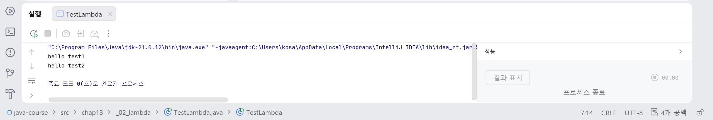
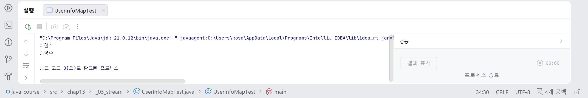
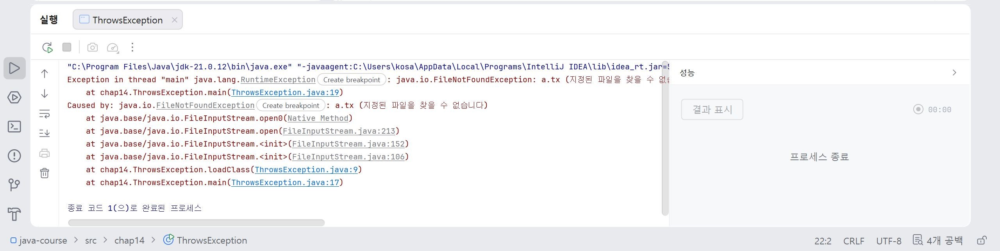

# 18일차

## Java 컬렉션 활용, Stream, Exception Handling

📌 학습일 : 2026.08.12

📌 학습 내용 : ArrayList, HashSet, Stream, Lambda, filter(), map(), sorted(), limit(), reduce(), sum(), count(), 메서드 참조, Exception Handling, try-catch, finally, throws

---

#### 1. ArrayList를 이용한 객체 관리

`ArrayList`는 여러 객체를 순서대로 저장하고 추가, 조회, 삭제할 수 있는 컬렉션이다.

```java
ArrayList<클래스명> 목록 =
        new ArrayList<클래스명>();

목록.add(객체명);
```

특정 객체를 삭제하려면 반복문으로 목록을 조회하면서 원하는 값을 찾은 후 `remove()`를 사용할 수 있다.

```java
for (int i = 0; i < 목록.size(); i++) {

    클래스명 객체명 = 목록.get(i);

    if (객체명.get번호() == 번호) {
        목록.remove(i);
        return true;
    }
}
```

`get()`을 이용하여 특정 위치의 객체를 가져오고, 조건이 일치하면 `remove()`를 이용하여 삭제할 수 있다.

#### 2. 향상된 for문을 이용한 객체 출력

컬렉션에 저장된 모든 객체를 순서대로 출력할 때 향상된 `for`문을 사용할 수 있다.

```java
for (클래스명 객체명 : 목록) {
    System.out.println(객체명);
}
```

인덱스를 직접 사용하지 않아도 목록에 저장된 객체를 처음부터 끝까지 순서대로 조회할 수 있다.

#### 3. HashSet을 이용한 객체 관리

`HashSet`은 중복되지 않는 데이터를 관리하는 컬렉션이다.

```java
HashSet<클래스명> 집합 =
        new HashSet<클래스명>();

집합.add(객체명);
```

모든 객체를 출력할 때도 향상된 `for`문을 사용할 수 있다.

```java
for (클래스명 객체명 : 집합) {
    System.out.println(객체명);
}
```

`HashSet`은 데이터를 추가한 순서를 보장하지 않으며 중복 데이터 관리에 적합하다.

#### 4. Stream

Stream은 배열이나 컬렉션의 데이터를 반복문 대신 연속적인 연산으로 처리할 수 있도록 하는 기능이다.

```java
목록.stream()
        .중간연산()
        .최종연산();
```

Stream 연산은 크게 **중간 연산**과 **최종 연산**으로 구분할 수 있다.

```text
중간 연산
filter()
map()
sorted()
distinct()
limit()

최종 연산
forEach()
count()
min()
max()
sum()
reduce()
```

중간 연산은 데이터를 가공하고, 최종 연산은 가공된 데이터를 이용하여 실제 결과를 만든다.

#### 5. filter()

`filter()`는 조건에 맞는 데이터만 선택하는 중간 연산이다.

```java
목록.stream()
        .filter(값 -> 값 > 0)
        .forEach(값 -> System.out.println(값));
```

조건식의 결과가 `true`인 데이터만 다음 연산으로 전달된다.

#### 6. Predicate

`Predicate<T>`는 하나의 값을 전달받아 조건을 검사하고 `boolean` 값을 반환하는 함수형 인터페이스이다.

```java
Predicate<Integer> 조건 =
        값 -> 값 > 0;
```

Stream의 `filter()`와 함께 사용할 수 있다.

```java
목록.stream()
        .filter(조건)
        .forEach(값 -> System.out.println(값));
```

#### 7. sum()과 count()

숫자 배열을 Stream으로 변환하면 합계와 개수를 구할 수 있다.

```java
int 합계 = Arrays.stream(배열).sum();

long 개수 = Arrays.stream(배열).count();
```

`sum()`은 모든 숫자의 합을 계산하고, `count()`는 Stream에 포함된 데이터의 개수를 반환한다.

#### 8. reduce()

`reduce()`는 여러 데이터를 하나의 결과값으로 만드는 최종 연산이다.

```java
String 결과 = Arrays.stream(배열)
        .reduce("", (값1, 값2) -> {

            if (값1.length() >= 값2.length())
                return 값1;
            else
                return 값2;
        });
```

두 값을 차례대로 비교하면서 하나의 결과값으로 줄여나간다.

별도의 클래스로 연산 방식을 구현하여 사용할 수도 있다.

```java
class 비교 implements BinaryOperator<String> {

    @Override
    public String apply(String 값1, String 값2) {

        if (값1.length() >= 값2.length())
            return 값1;
        else
            return 값2;
    }
}
```

#### 9. sorted()

`sorted()`는 Stream의 데이터를 정렬하는 중간 연산이다.

```java
목록.stream()
        .sorted()
        .forEach(값 -> System.out.println(값));
```

기본 정렬 기준에 따라 오름차순으로 정렬된다.

정렬 기준을 직접 지정할 수도 있다.

```java
목록.stream()
        .sorted((값1, 값2) ->
                Integer.compare(
                        값1.length(),
                        값2.length()
                )
        )
        .forEach(값 -> System.out.println(값));
```

#### 10. limit()

`limit()`은 Stream에서 원하는 개수만큼의 데이터만 가져오는 중간 연산이다.

```java
목록.stream()
        .sorted()
        .limit(2)
        .forEach(값 -> System.out.println(값));
```

위 코드는 데이터를 정렬한 후 앞에서부터 2개의 데이터만 처리한다.

#### 11. map()

`map()`은 Stream에 저장된 데이터를 다른 형태의 데이터로 변환하는 중간 연산이다.

```java
목록.stream()
        .map(객체명 -> 객체명.get이름())
        .forEach(값 -> System.out.println(값));
```

객체 전체가 아닌 객체가 가지고 있는 특정 값만 추출하여 사용할 수 있다.

#### 12. mapToInt()

`mapToInt()`는 객체의 특정 값을 `int` 형태의 Stream으로 변환할 때 사용한다.

```java
int 합계 = 목록.stream()
        .mapToInt(객체명 -> 객체명.get값())
        .sum();
```

객체의 숫자 데이터를 꺼내 합계와 같은 숫자 연산을 수행할 수 있다.

#### 13. Stream 연산 연결

Stream은 여러 중간 연산과 최종 연산을 연결하여 사용할 수 있다.

```java
목록.stream()
        .filter(객체명 -> 객체명.get값() >= 기준값)
        .map(객체명 -> 객체명.get이름())
        .sorted()
        .forEach(값 -> System.out.println(값));
```

위 코드는 다음 순서로 실행된다.

```text
전체 데이터
↓
조건에 맞는 데이터 선택
↓
필요한 값 추출
↓
정렬
↓
출력
```

여러 반복문을 작성하지 않고 하나의 흐름으로 데이터를 처리할 수 있다.

#### 14. 메서드 참조(Method Reference)

람다식에서 기존 메서드를 그대로 호출하는 경우 `::`를 이용하여 간단하게 표현할 수 있다.

```java
목록.stream()
        .map(클래스명::get이름)
        .forEach(System.out::println);
```

다음과 같은 람다식을

```java
객체명 -> 객체명.get이름()
```

메서드 참조를 이용하면 다음처럼 표현할 수 있다.

```java
클래스명::get이름
```

#### 15. 예외(Exception)

예외는 프로그램 실행 중 발생할 수 있는 비정상적인 상황이다.

예외를 처리하지 않으면 프로그램이 해당 위치에서 종료될 수 있기 때문에 `try-catch`를 이용하여 처리할 수 있다.

#### 16. try-catch

예외가 발생할 가능성이 있는 코드를 `try` 블록에 작성하고, 발생한 예외를 `catch`에서 처리한다.

```java
try {

    예외발생가능코드;

} catch (예외클래스명 변수명) {

    예외처리코드;

}
```

예외가 발생하지 않으면 `try` 블록이 정상적으로 실행되고, 예외가 발생하면 해당 예외와 일치하는 `catch` 블록이 실행된다.

#### 17. ArrayIndexOutOfBoundsException

배열의 존재하지 않는 인덱스에 접근하면 `ArrayIndexOutOfBoundsException`이 발생한다.

```java
int[] 배열 = {1, 2, 3, 4, 5};

try {

    for (int i = 0; i <= 5; i++) {
        System.out.println(배열[i]);
    }

} catch (ArrayIndexOutOfBoundsException e) {

    System.out.println(e);
    System.out.println("예외 처리");

}
```

배열의 인덱스는 `0`부터 `배열.length - 1`까지 존재하므로 범위를 벗어나면 예외가 발생한다.

하지만 `catch`에서 예외를 처리하면 프로그램 전체가 즉시 종료되지 않고 다음 코드를 계속 실행할 수 있다.

#### 18. FileNotFoundException

존재하지 않는 파일을 읽으려고 하면 `FileNotFoundException`이 발생할 수 있다.

```java
try {

    FileInputStream 입력 =
            new FileInputStream("파일명");

} catch (FileNotFoundException e) {

    System.out.println(e);

}
```

파일 입출력처럼 예외가 발생할 가능성이 있는 작업은 예외 처리가 필요하다.

#### 19. finally

`finally` 블록은 예외 발생 여부와 관계없이 항상 실행되는 영역이다.

```java
try {

    실행코드;

} catch (예외클래스명 e) {

    예외처리코드;

} finally {

    항상실행할코드;

}
```

파일이나 네트워크와 같은 자원을 사용한 후 정리하는 작업에 활용할 수 있다.

```java
finally {

    if (입력 != null) {
        입력.close();
    }
}
```

#### 20. throws

`throws`는 메서드 내부에서 예외를 직접 처리하지 않고 메서드를 호출한 쪽으로 예외 처리를 넘기는 방법이다.

```java
public 반환형 메서드명()
        throws 예외클래스명 {

    실행코드;

}
```

여러 예외를 전달할 수도 있다.

```java
public 반환형 메서드명()
        throws 예외클래스명1,
               예외클래스명2 {

}
```

메서드를 호출하는 쪽에서는 전달된 예외를 `try-catch`로 처리해야 한다.

#### 21. 다중 catch

여러 예외를 동일한 방식으로 처리하는 경우 `|`를 이용하여 하나의 `catch`에서 처리할 수 있다.

```java
try {

    메서드명();

} catch (예외클래스명1 | 예외클래스명2 e) {

    예외처리코드;

}
```

여러 예외에 동일한 처리가 필요한 경우 코드를 간결하게 작성할 수 있다.

---

#### 핵심 정리

* `ArrayList`는 객체를 순서대로 저장하고 `add()`, `get()`, `remove()` 등을 이용하여 데이터를 관리할 수 있다.
* `HashSet`은 중복 데이터를 허용하지 않으며 데이터 저장 순서를 보장하지 않는다.
* Stream은 배열이나 컬렉션의 데이터를 연속적인 연산으로 처리할 수 있도록 한다.
* `filter()`는 조건에 맞는 데이터를 선택하고 `map()`은 데이터를 다른 형태로 변환한다.
* `sorted()`는 데이터를 정렬하고 `limit()`은 처리할 데이터의 개수를 제한한다.
* `sum()`은 숫자의 합계를 구하고 `count()`는 데이터의 개수를 반환한다.
* `reduce()`는 여러 데이터를 하나의 결과값으로 만드는 최종 연산이다.
* `Predicate`와 `BinaryOperator` 같은 함수형 인터페이스를 람다식과 함께 사용할 수 있다.
* `클래스명::메서드명` 형태의 메서드 참조를 사용하면 일부 람다식을 간결하게 표현할 수 있다.
* 예외는 프로그램 실행 중 발생할 수 있는 비정상적인 상황이며 `try-catch`를 이용하여 처리할 수 있다.
* `finally`는 예외 발생 여부와 관계없이 실행되며 자원을 정리할 때 활용할 수 있다.
* `throws`는 메서드에서 발생할 수 있는 예외를 호출한 쪽으로 전달한다.
* 여러 예외를 같은 방식으로 처리할 경우 `|`를 이용하여 하나의 `catch`에서 처리할 수 있다.

---

```java
package chap13._02_lambda;

interface PrintString{
    void showString(String string);
}

public class TestLambda {
    public static void main(String[] args) {
        PrintString lambdaStr = s -> System.out.println(s);
        lambdaStr.showString("hello test1");

        showMyString(lambdaStr);
    }

    public static void showMyString(PrintString p){p.showString("hello test2");}

    public static PrintString returnString(){return s -> System.out.println(s + "world");

    }
}
```
<p align="center">
  
</p>

PrintString 함수형 인터페이스를 만들고 s -> System.out.println(s) 형태의 람다식을 PrintString 타입 변수에 저장하여 showString() 메서드를 실행했다.

또한 저장한 람다식을 showMyString() 메서드의 매개변수로 전달하여 다른 메서드에서도 동일한 기능을 실행할 수 있다는 것을 확인했다.

처음에는 람다식을 변수에 저장하고 다른 메서드로 전달한다는 개념이 조금 생소했지만, 하나의 기능을 변수처럼 저장하고 전달하거나 반환하는 것으로 이해하고 연습해보았다.

</br></br></br>

```java
package chap13._03_stream;

import java.util.ArrayList;
import java.util.List;

class UserInfo{
    private String name;
    private int age;

    public UserInfo(String name, int age) {
        this.name = name;
        this.age = age;
    }

    public String getName() {
        return name;
    }

    public int getAge() {
        return age;
    }
}
public class UserInfoMapTest {
    public static void main(String[] args) {
        UserInfo userKim = new UserInfo("김영희", 30);
        UserInfo userLee = new UserInfo("이철수", 40);
        UserInfo userSong = new UserInfo("송영수", 55);

        List<UserInfo> userInfoList = new ArrayList<>();
        userInfoList.add(userKim);
        userInfoList.add(userLee);
        userInfoList.add(userSong);

        userInfoList.stream()
                .filter(user -> user.getAge() >= 40)
                .map(UserInfo::getName)
                .forEach(s -> System.out.println(s));
    }
}
```
<p align="center">
  
</p>
UserInfo 객체를 ArrayList에 저장한 뒤 stream()을 사용하여 데이터를 순차적으로 하고 filter()는 조건에 맞는 나이가 40세 이상인 사용자만 선택했다.

map()은 데이터를 다른 형태로 변환하거나 필요한 값만 추출할 때 사용하고 forEach()를 사용하여 남아 있는 이름을 하나씩 출력하였다.

여기서는 클래스명 :: 인스턴스메서드는 UserInfo 객체 전체에서 사용자의 name만 가져오는 메서드 참조 방식이다.

아직 람다나 메거드 참조 방식 처음이라 실수를 좀 해서 오류가 나긴 했지만 금방 수정하였고 앞으로 좀 더 연습이 필요할 것 같다.

package chap14;

```java
import java.io.FileInputStream;
import java.io.FileNotFoundException;

public class ThrowsException {
    public Class loadClass(String fileName, String className) throws FileNotFoundException,
    ClassNotFoundException {
        FileInputStream fis = new FileInputStream(fileName);
        Class c = Class.forName(className);
        return c;
    }

    public static void main(String[] args) {
        ThrowsException test = new ThrowsException();
        try {
            test.loadClass("a.tx", "java.lang.String");
        } catch (FileNotFoundException | ClassNotFoundException e) {
            throw new RuntimeException(e);
        }
    }
}
```
<p align="center">
  
</p>
throws를 사용하여 메서드를 호출한 곳으로 예외 처리를 넘기는 방법을 실습했는데 new FileInputStream(fileName)은 지정한 파일을 찾을 수 없는 경우 FileNotFoundException이 발생할 수 있고, Class.forName(className)은 지정한 클래스를 찾을 수 없는 경우 ClassNotFoundException이 발생할 수 있다.

loadClass()에서는 예외를 직접 처리하지 않고 throws를 사용하여 호출한 쪽에서 처리하도록 넘겼고, catch에서 |를 사용하면 여러 종류의 예외를 하나의 catch문에서 함께 처리할 수 있다는 것도 실습해 보았다.

이번 실습에서 class와 Class의 차이도 헷갈려서 잘못 입력해서 오류 찾는데 시간이 좀 걸렸는데 소문자 class는 클래스를 선언할 때 사용하는 Java 예약어이고, 대문자 Class는 클래스의 정보를 다루기 위해 Java에서 제공하는 실제 클래스라는 차이를 알게 되었다.

그래서 반드시 loadClass 앞에는 대문자인 Class가 와야하니 조심해야 겠다.
