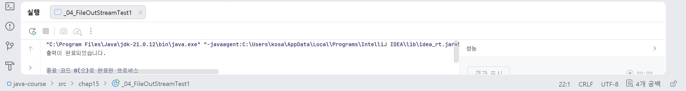
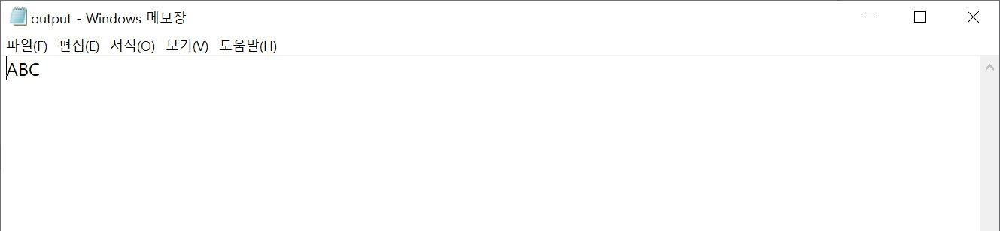
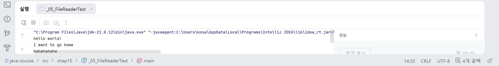
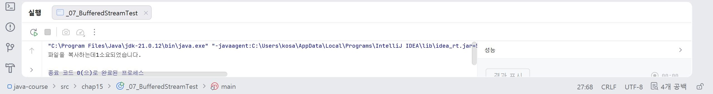
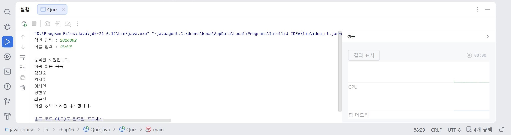
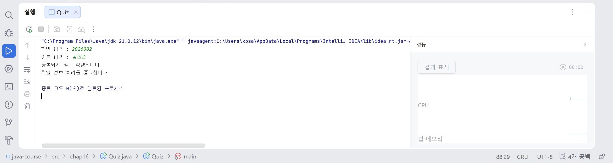

# 19일차

## Java 예외 처리, 입출력(I/O), 스레드(Thread), 동기화(Synchronization)

📌 학습일 : 2026.08.13

📌 학습 내용 : 예외 처리, try-catch, System.in, FileInputStream, FileOutputStream, FileReader, FileWriter, Buffered Stream, Thread, sleep(), synchronized, Stream 활용

---

#### 1. 오류와 예외

Java 프로그램에서 발생하는 문제는 컴파일 오류, 실행 오류, 예외 등으로 구분할 수 있다.

예외(Exception)는 프로그램 실행 중 발생할 수 있는 문제이며 `try-catch`를 이용하여 처리할 수 있다.

```java
try {

    예외발생가능코드;

} catch (Exception 변수명) {

    예외처리코드;

}
```

예외를 처리하면 문제가 발생하더라도 프로그램 전체가 즉시 종료되는 것을 방지할 수 있다.

#### 2. Exception을 이용한 예외 처리

`Exception`은 여러 예외 클래스의 상위 클래스이므로 다양한 예외를 한 번에 처리할 수 있다.

```java
try {

    실행코드;

} catch (Exception 변수명) {

    System.out.println(변수명.getMessage());

}
```

`getMessage()`를 이용하면 발생한 예외에 대한 메시지를 확인할 수 있다.

```java
변수명.printStackTrace();
```

`printStackTrace()`를 이용하면 예외가 발생한 위치와 호출 정보를 자세하게 확인할 수 있다.

#### 3. System.in.read()

`System.in.read()`는 키보드에서 입력한 값을 읽어오는 메서드이다.

```java
int 값 = System.in.read();
```

입력된 문자는 정수값으로 반환된다.

문자로 출력하려면 `char`형으로 변환할 수 있다.

```java
System.out.println((char) 값);
```

#### 4. 반복 입력 처리

`System.in.read()`를 반복문과 함께 사용하면 여러 문자를 입력받을 수 있다.

```java
int 값;

while ((값 = System.in.read()) != '\n') {

    System.out.print((char) 값);

}
```

Enter가 입력될 때까지 문자를 계속 읽어 출력할 수 있다.

#### 5. FileInputStream

`FileInputStream`은 파일의 데이터를 바이트 단위로 읽을 때 사용하는 입력 스트림이다.

```java
FileInputStream 입력 =
        new FileInputStream("파일명");

System.out.println(입력.read());
```

`read()`는 파일의 데이터를 하나씩 읽어 정수값으로 반환한다.

파일이 존재하지 않으면 `FileNotFoundException`이 발생할 수 있다.

#### 6. FileOutputStream

`FileOutputStream`은 파일에 데이터를 바이트 단위로 출력할 때 사용하는 스트림이다.

```java
FileOutputStream 출력 =
        new FileOutputStream("파일명");

출력.write(65);
출력.write(66);
출력.write(67);
```

숫자 `65`, `66`, `67`은 각각 문자 `A`, `B`, `C`에 해당하는 값으로 저장된다.

#### 7. try-with-resources

파일 입출력 객체는 사용이 끝난 후 닫아야 한다.

`try-with-resources`를 이용하면 `try`가 종료될 때 객체를 자동으로 닫을 수 있다.

```java
try (
    FileInputStream 입력 =
            new FileInputStream("파일명")
) {

    실행코드;

} catch (IOException 변수명) {

    변수명.printStackTrace();

}
```

별도로 `close()`를 작성하지 않아도 자원이 자동으로 해제된다.

#### 8. FileReader

`FileReader`는 문자 데이터를 읽을 때 사용하는 입력 클래스이다.

```java
FileReader 입력 =
        new FileReader("파일명");

int 값;

while ((값 = 입력.read()) != -1) {

    System.out.print((char) 값);

}
```

`read()`의 결과가 `-1`이면 파일의 끝까지 읽었다는 의미이다.

#### 9. FileWriter

`FileWriter`는 문자 데이터를 파일에 저장할 때 사용한다.

```java
FileWriter 출력 =
        new FileWriter("파일명");

출력.write('A');
출력.write("문자열");
```

문자 하나뿐만 아니라 문자 배열과 문자열도 출력할 수 있다.

```java
char 배열[] = {'A', 'B', 'C'};

출력.write(배열);
```

#### 10. Buffered Stream

Buffered Stream은 데이터를 버퍼에 모아 한 번에 처리하여 입출력 성능을 향상시키는 스트림이다.

```java
BufferedInputStream 버퍼입력 =
        new BufferedInputStream(입력);

BufferedOutputStream 버퍼출력 =
        new BufferedOutputStream(출력);
```

파일을 읽고 복사하는 작업에서는 다음과 같이 사용할 수 있다.

```java
int 값;

while ((값 = 버퍼입력.read()) != -1) {

    버퍼출력.write(값);

}
```

#### 11. 파일 처리 시간 측정

`System.currentTimeMillis()`를 이용하면 작업 전후의 시간을 비교하여 처리 시간을 확인할 수 있다.

```java
long 시간 =
        System.currentTimeMillis();

실행코드;

시간 =
        System.currentTimeMillis() - 시간;
```

파일 복사처럼 처리 시간이 필요한 작업에서 사용할 수 있다.

#### 12. Thread

Thread는 하나의 프로그램 안에서 여러 작업을 동시에 실행하기 위한 실행 흐름이다.

`Thread` 클래스를 상속받아 사용할 수 있다.

```java
class 클래스명 extends Thread {

    @Override
    public void run() {

        실행코드;

    }

}
```

Thread 객체를 생성한 후 `start()`를 호출하면 새로운 실행 흐름이 시작된다.

```java
클래스명 객체명 =
        new 클래스명();

객체명.start();
```

#### 13. run()과 start()

Thread에서 실제 실행할 코드는 `run()`에 작성한다.

```java
@Override
public void run() {

    실행코드;

}
```

Thread 실행은 `run()`을 직접 호출하는 것이 아니라 `start()`를 이용한다.

```java
객체명.start();
```

`start()`가 새로운 Thread를 생성하고 그 안에서 `run()`을 실행한다.

#### 14. Thread.sleep()

`sleep()`은 현재 실행 중인 Thread를 일정 시간 동안 일시 정지시키는 메서드이다.

```java
Thread.sleep(1000);
```

시간은 밀리초 단위이므로 `1000`은 약 1초를 의미한다.

`sleep()`은 `InterruptedException`이 발생할 수 있기 때문에 예외 처리가 필요하다.

```java
try {

    Thread.sleep(1000);

} catch (InterruptedException 변수명) {

    변수명.printStackTrace();

}
```

#### 15. 여러 Thread 실행

여러 Thread 객체를 생성하고 각각 `start()`를 호출하면 여러 작업을 함께 실행할 수 있다.

```java
클래스명 객체1 = new 클래스명();
클래스명 객체2 = new 클래스명();

객체1.start();
객체2.start();
```

각 Thread의 실행 순서는 항상 동일하게 유지되는 것이 아니라 실행 환경에 따라 달라질 수 있다.

#### 16. 현재 Thread 확인

현재 실행 중인 Thread는 다음과 같이 확인할 수 있다.

```java
Thread.currentThread();
```

Thread 이름은 다음과 같이 가져올 수 있다.

```java
Thread.currentThread().getName();
```

여러 Thread가 동작할 때 어떤 Thread가 실행되고 있는지 확인할 수 있다.

#### 17. 동기화(Synchronization)

여러 Thread가 하나의 객체나 데이터를 동시에 사용하면 값이 예상과 다르게 변경될 수 있다.

이러한 문제를 방지하기 위해 동기화를 사용할 수 있다.

```java
synchronized (공유객체) {

    실행코드;

}
```

`synchronized` 영역에서는 하나의 Thread가 작업을 수행하는 동안 다른 Thread가 같은 공유 객체에 접근하지 못하도록 제한한다.

#### 18. synchronized를 이용한 공유 데이터 관리

여러 Thread가 하나의 값을 동시에 변경할 경우 동기화를 사용하여 작업 순서를 보호할 수 있다.

```java
synchronized (공유객체) {

    공유객체.메서드명();

}
```

하나의 Thread가 작업을 끝낸 후 다른 Thread가 접근하도록 하여 공유 데이터가 잘못 변경되는 것을 방지한다.

#### 19. ArrayList와 Stream 활용

`ArrayList`에 객체를 저장하고 Stream을 이용하여 필요한 데이터만 추출하고 정렬할 수 있다.

```java
목록.stream()
        .map(클래스명::get이름)
        .sorted()
        .forEach(이름 ->
                System.out.println(이름));
```

`map()`으로 객체에서 이름만 가져오고 `sorted()`로 정렬한 후 `forEach()`로 출력할 수 있다.

#### 20. Stream과 try-catch-finally

Stream 처리 중 발생할 수 있는 예외도 `try-catch-finally`를 이용하여 처리할 수 있다.

```java
try {

    목록.stream()
            .map(클래스명::get이름)
            .sorted()
            .forEach(이름 ->
                    System.out.println(이름));

} catch (Exception 변수명) {

    System.out.println("오류가 발생했습니다.");

} finally {

    System.out.println("처리를 종료합니다.");

}
```

`finally`는 예외 발생 여부와 관계없이 항상 실행된다.

#### 21. anyMatch()

`anyMatch()`는 Stream 내부에 조건을 만족하는 데이터가 하나라도 존재하는지 확인하는 최종 연산이다.

```java
boolean 결과 =
        목록.stream()
                .anyMatch(객체명 ->
                        객체명.get번호() == 입력번호
                        && 객체명.get이름()
                                .equals(입력이름));
```

조건을 만족하는 객체가 하나라도 존재하면 `true`, 없으면 `false`를 반환한다.

회원 정보나 로그인 정보처럼 여러 조건을 동시에 확인할 때 사용할 수 있다.

#### 22. Scanner와 Stream 활용

`Scanner`로 사용자의 입력을 받은 후 Stream을 이용하여 입력한 정보와 일치하는 객체가 있는지 확인할 수 있다.

```java
Scanner 입력 =
        new Scanner(System.in);

int 번호 = 입력.nextInt();
String 이름 = 입력.next();

boolean 결과 =
        목록.stream()
                .anyMatch(객체명 ->
                        객체명.get번호() == 번호
                        && 객체명.get이름()
                                .equals(이름));
```

입력한 번호와 이름이 모두 일치해야 `true`가 반환된다.

---

#### 핵심 정리

* 예외는 프로그램 실행 중 발생할 수 있는 문제이며 `try-catch`를 이용하여 처리할 수 있다.
* `getMessage()`는 예외 메시지를 확인하고 `printStackTrace()`는 예외가 발생한 위치와 호출 정보를 확인할 때 사용한다.
* `System.in.read()`는 키보드 입력을 정수값으로 읽으며 `(char)`를 이용하여 문자로 변환할 수 있다.
* `FileInputStream`과 `FileOutputStream`은 데이터를 바이트 단위로 입력하고 출력한다.
* `FileReader`와 `FileWriter`는 문자 데이터를 입력하고 출력할 때 사용할 수 있다.
* `try-with-resources`를 사용하면 입출력 객체를 자동으로 닫을 수 있다.
* Buffered Stream은 버퍼를 이용하여 파일 입출력 효율을 높일 수 있다.
* `System.currentTimeMillis()`를 이용하면 작업에 걸린 시간을 측정할 수 있다.
* Thread는 하나의 프로그램에서 여러 작업 흐름을 실행할 수 있도록 한다.
* Thread를 실행할 때는 `run()`을 직접 호출하지 않고 `start()`를 사용한다.
* `Thread.sleep()`은 현재 Thread를 일정 시간 동안 일시 정지시킨다.
* 여러 Thread가 하나의 데이터를 동시에 사용하면 값이 예상과 다르게 변경될 수 있다.
* `synchronized`를 사용하면 하나의 Thread가 공유 데이터를 사용하는 동안 다른 Thread의 접근을 제한할 수 있다.
* Stream의 `map()`, `sorted()`, `forEach()`를 이용하면 객체의 데이터를 추출하고 정렬하여 출력할 수 있다.
* `anyMatch()`는 Stream에 조건을 만족하는 객체가 하나라도 존재하는지 확인한다.
* `Scanner`, Stream, 예외 처리를 함께 활용하여 사용자가 입력한 정보를 확인하는 프로그램을 만들 수 있다.

---
```java
package chap15;

import java.io.FileNotFoundException;
import java.io.FileOutputStream;
import java.io.IOException;

public class _04_FileOutStreamTest1 {
    public static void main(String[] args) {
        try (
            FileOutputStream fos = new FileOutputStream("output.txt")){
                fos.write (65);
                fos.write (66);
                fos.write (67);
        } catch (FileNotFoundException e) {
            e.printStackTrace();
        }  catch (IOException e) {
            throw new RuntimeException(e);
        }
        System.out.println("출력이 완료되었습니다.");
    }
}
```

<p align="center">
  
</p>
<p align="center">
  
</p>

FileInputStream.read()로 데이터를 읽으면 정수값으로 출력되었으며 FileOutputStream.write()에 `65`, `66`, `67`을 입력하면 자동으로 파일이 생성되었다.

그리고 파일에는 각각 `A`, `B`, `C`에 해당하는 값이 저장되었다.

처음으로 해봐서 그런지 아직 미숙하고 오류가 나고 그랬지만 금방 해결하였더.
</br></br></br>
```java
package chap15;

import java.io.FileNotFoundException;
import java.io.FileOutputStream;
import java.io.FileReader;
import java.io.IOException;

public class _05_FileReaderTest {
    public static void main(String[] args) {
        try (
            FileReader fr = new FileReader("reader.txt")){
            int i;
            while ((i = fr.read()) !=-1) {
                System.out.print((char)i);
            }
        } catch (FileNotFoundException e) {
            e.printStackTrace();
        } catch (IOException e) {
            e.printStackTrace();
        }
    }
}
```
<p align="center">
  
</p>
작성한 텍스트 파일 안에 있는 문자를 인식하고 출력되게 만드는 문제였는데 while 안에 출력 조건을 입력할때 (char)i 이렇게 입력해야 정상적으로 출력된다.

아직 파일을 자동 생성하게하거나 인식하게 할때 while문을 이용하는게 어렵게 느껴져서 조금 더 연습이 필요 할 것 같다.
</br></br></br>
```java
package chap15;

import java.io.*;

public class _07_BufferedStreamTest {
    public static void main(String[] args) {

        long millisecond = 0;
        try (FileInputStream fis = new FileInputStream("a.zip");
             FileOutputStream fos = new FileOutputStream("copy.zip");
             BufferedInputStream bis = new BufferedInputStream(fis);
             BufferedOutputStream bos = new BufferedOutputStream(fos)){

            millisecond = System.currentTimeMillis();

            int i;
            while((i = fis.read()) != -1){
                bos.write(i);
            }
            millisecond = System.currentTimeMillis() - millisecond;
        }
        catch (FileNotFoundException e) {
            throw new RuntimeException(e);
        } catch (IOException e) {
            throw new RuntimeException(e);
        }
        System.out.println("파일을 복사하는데" + millisecond + "소요되었습니다.");
    }
}
```
**i = fis.read()로 설정할 경우**
<p align="center">
  
</p>

```java
package chap15;

import java.io.*;

public class _07_BufferedStreamTest {
    public static void main(String[] args) {

        long millisecond = 0;
        try (FileInputStream fis = new FileInputStream("a.zip");
             FileOutputStream fos = new FileOutputStream("copy.zip");
             BufferedInputStream bis = new BufferedInputStream(fis);
             BufferedOutputStream bos = new BufferedOutputStream(fos)){

            millisecond = System.currentTimeMillis();

            int i;
            while((i = bis.read()) != -1){
                bos.write(i);
            }
            millisecond = System.currentTimeMillis() - millisecond;
        }
        catch (FileNotFoundException e) {
            throw new RuntimeException(e);
        } catch (IOException e) {
            throw new RuntimeException(e);
        }
        System.out.println("파일을 복사하는데" + millisecond + "소요되었습니다.");
    }
}
```
**i = bis.read()로 설정할 경우**
<p align="center">
  
</p>
BufferedInputStream과 BufferedOutputStream을 이용하여 파일을 복사하는 방법을 실습하였다.

Buffered Stream은 데이터를 바로 하나씩 처리하는 대신 버퍼를 이용하기 때문에 입출력 성능을 높일 수 있다.

System.currentTimeMillis()를 작업 시작 전과 종료 후에 사용하여 파일 복사에 걸린 시간도 확인하였는데 i = fis.read()을 할때보다 i = bis.read()를 할때가 소요시간이 더 걸렸고,

압축 파일 크기가 커질수록 소요시간 차이가 더 커진다는 것을 알게 되었다.
</br></br></br>
문제 1)
</br>회원 5명을 ArrayList에 저장하고, Stream을 이용하여 회원 이름을 가나다순으로 정렬하여 출력하세요.

또한 프로그램 실행 중 발생할 수 있는 예외를 try-catch-finally를 이용하여 처리하세요.

[조건]

1. ArrayList를 사용합니다.
</br>2. 회원은 다음 5명으로 합니다.
</br>- 김민준
</br>- 이서연
</br>- 박지훈
</br>- 최유진
</br>- 정현우
</br>3. map()을 이용하여 Member 객체에서 이름만 가져옵니다.
</br>4. sorted()를 이용하여 이름을 정렬합니다.
</br>5. forEach()와 람다식을 이용하여 출력합니다.
</br>6. try 블록 안에서 Stream 연산을 수행합니다.
</br>7. catch 블록에서 예외가 발생한 경우 “회원 정보를 처리하는 중 오류가 발생했습니다.”를 출력합니다.
</br>8. finally 블록에서 “회원 정보 처리를 종료합니다.”를 출력합니다.

[실행 결과 예]

회원 이름 목록 김민준 박지훈 이서연 정현우 최유진 회원 정보 처리를
종료합니다.
```java
package chap16;

import java.util.ArrayList;

class Member{
    private String name;

    public Member(String name) {
        this.name = name;
    }

    public String getName() {
        return name;
    }
}
public class Quiz {
    public static void main(String[] args) {
        ArrayList<Member> memberList = new ArrayList<>();

        memberList.add(new Member("김민준"));
        memberList.add(new Member("이서연"));
        memberList.add(new Member("박지훈"));
        memberList.add(new Member("최유진"));
        memberList.add(new Member("정현우"));

        try {
            System.out.println("회원 이름 목록");
            memberList.stream()
                    .map(Member::getName)
                    .sorted()
                    .forEach(name -> System.out.println(name));
        } catch (Exception e) {
            System.out.println("회원 정보를 처리하는 중 오류가\n" + "발생했습니다.");
        } finally {
            System.out.println("회원 정보 처리를 종료합니다.");
        }
    }
}
```
<p align="center">
  
</p>
 ArrayList을 사용하는 문제였는데 여기서 헷갈릴 만한 것은 없었지만 아래에 조건을 추가해서 수정 할때 오류가 나서 한참을 고민하면서 수정했었디.

문제 2)
</br>작성하신 프로그램을 아래와 같이 수정해 보세요. (입력 받을 때 Scanner이용 하시면 편리합니다. )

[실행 결과 예 1]

학번 입력 : 2026002 이름 입력 : 이서연

등록된 회원입니다. 회원 이름 목록 김민준 박지훈 이서연 정현우 최유진
회원 확인을 종료합니다.

[실행 결과 예 2]

학번 입력 : 2026002 이름 입력 : 김민준

등록되지 않은 회원입니다. 회원 확인을 종료합니다.
```java
package chap16;

import java.util.ArrayList;
import java.util.Scanner;

class Member{
    private String name;
    private int memberId;

    public Member(int memberId, String name) {
        this.memberId = memberId;
        this.name = name;
    }

    public String getName() {
        return name;
    }

    public int getMemberId() {
        return memberId;
    }
}
public class Quiz {
    public static void main(String[] args) {
        ArrayList<Member> memberList = new ArrayList<>();

        memberList.add(new Member(2026001,"김민준"));
        memberList.add(new Member(2026002,"이서연"));
        memberList.add(new Member(2026003,"박지훈"));
        memberList.add(new Member(2026004, "최유진"));
        memberList.add(new Member(2026005, "정현우"));

        Scanner scanner = new Scanner(System.in);
        try {
            System.out.print("학번 입력 : ");
            int memberId = scanner.nextInt();

            System.out.print("이름 입력 : ");
            String name = scanner.next();

            boolean isMember = memberList.stream()
                    .anyMatch(member -> member.getMemberId() == memberId && member.getName().equals(name));

            if (isMember){
                System.out.println();
                System.out.println("등록된 회원입니다.");
                System.out.println("회원 이름 목록");

                memberList.stream()
                        .map(Member::getName)
                        .sorted()
                        .forEach(Membername -> System.out.println(Membername));
            } else {
                System.out.println("등록되지 않은 학생입니다.");
            }
        } catch (Exception e) {
            System.out.println("회원 정보를 처리하는 중 오류가\n" + "발생했습니다.");
        } finally {
            System.out.println("회원 정보 처리를 종료합니다.");
            scanner.close();
        }
    }
}
```
<p align="center">
  
</p>
기존 회원 목록 정렬 프로그램에 Scanner를 추가하여 학번과 이름을 직접 입력받도록 수정하였다.

anyMatch()를 이용하여 입력한 학번과 이름을 모두 만족하는 회원이 존재하는지 확인하였으며 조건을 만족하면 `true`, 만족하지 않으면 `false`가 반환되었다.

여기 부분에서 가장 헷갈렸고 오류가 나서 한참을 고민했고 끝에 .equals(name)으로 끝나야 오류가 없다는 것을 잘 기억해야 겠다.

그리고 등록된 회원이면 전체 회원 이름을 다시 `map() → sorted() → forEach()` 순서로 처리하여 가나다순으로 출력하고, 등록되지 않은 경우에는 별도의 안내 문장을 출력하도록 작성하였다.

마지막 finally에서는 회원 확인 종료 문장을 출력하고 scanner.close()를 이용하여 입력 객체를 닫도록 하였다.

아직 좀 더 연습이 필요 할 것 같다.
