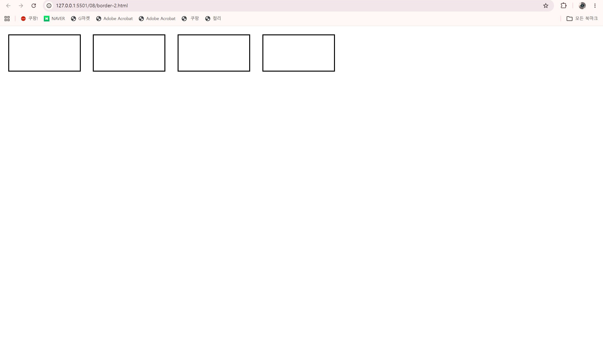
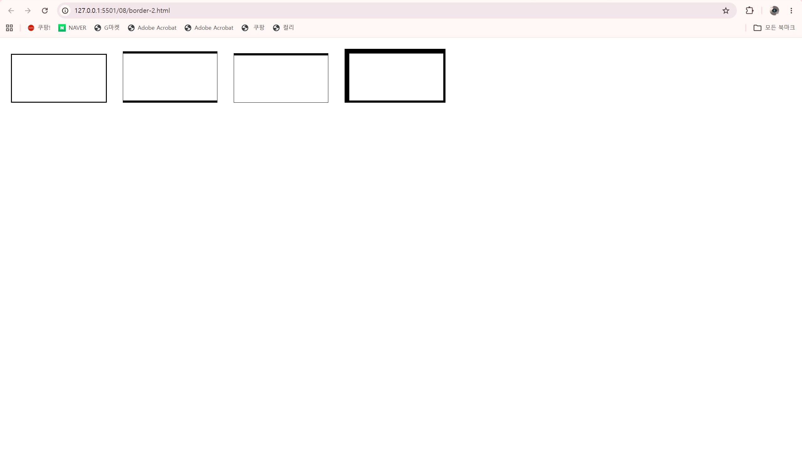

# 21일차

## HTML 스타일 적용과 박스 모델

📌 학습일 : 2026.08.17

📌 학습 내용 : style, id, class, span, 글꼴, 글자 크기, 글자 색상, 텍스트 정렬, 줄 높이, 목록 스타일, 표 스타일, 블록·인라인 요소, 박스 모델, 테두리, margin, padding, border-radius, box-shadow, display, float

#### 1. style 태그를 이용한 스타일 적용

HTML 문서의 `<head>` 안에 `<style>` 태그를 작성하여 페이지의 요소에 스타일을 적용할 수 있다.

```html
<!DOCTYPE html>
<html lang="ko">
<head>
  <meta charset="UTF-8">
  <title>스타일 적용</title>
  <style>
    p {
      color: blue;
      font-size: 20px;
    }
  </style>
</head>
<body>
  <p>내용</p>
</body>
</html>
```

`<style>` 안에서 HTML 요소를 선택하고 글자 크기, 색상, 여백 등 다양한 스타일을 지정할 수 있다.

#### 2. id를 이용한 요소 선택

HTML 요소에 `id`를 지정하고 `<style>`에서 `#아이디명`으로 선택할 수 있다.

```html
<!DOCTYPE html>
<html lang="ko">
<head>
  <meta charset="UTF-8">
  <title>id 사용</title>
  <style>
    #container {
      width: 600px;
      margin: 20px auto;
    }
  </style>
</head>
<body>
  <div id="container">
    내용
  </div>
</body>
</html>
```

`id`는 특정 요소 하나를 구분하여 스타일을 적용할 때 사용한다.

#### 3. class를 이용한 요소 선택

HTML 요소에 `class`를 지정하면 같은 클래스를 가진 여러 요소에 공통 스타일을 적용할 수 있다.

```html
<!DOCTYPE html>
<html lang="ko">
<head>
  <meta charset="UTF-8">
  <title>class 사용</title>
  <style>
    .accent {
      color: red;
      font-weight: bold;
    }
  </style>
</head>
<body>
  <p class="accent">강조 내용</p>
  <p>일반 내용</p>
</body>
</html>
```

`class`는 `<style>`에서 `.클래스명`으로 선택한다.

#### 4. span을 이용한 부분 스타일

`<span>`은 문장 안의 특정 부분만 묶어서 스타일을 적용할 때 사용한다.

```html
<!DOCTYPE html>
<html lang="ko">
<head>
  <meta charset="UTF-8">
  <title>부분 강조</title>
  <style>
    .accent {
      color: red;
      font-weight: bold;
    }
  </style>
</head>
<body>
  <p>
    일반 내용 중
    <span class="accent">강조할 내용</span>
    을 표시한다.
  </p>
</body>
</html>
```

#### 5. 글꼴과 글자 크기

글꼴과 글자 크기를 지정하여 텍스트의 형태를 변경할 수 있다.

```html
<!DOCTYPE html>
<html lang="ko">
<head>
  <meta charset="UTF-8">
  <title>글꼴 스타일</title>
  <style>
    h1 {
      font-family: Arial, sans-serif;
      font-size: 40px;
    }

    p {
      font-size: 20px;
    }

    .accent {
      font-size: 1.5em;
    }
  </style>
</head>
<body>
  <h1>제목</h1>
  <p>일반 내용</p>
  <p class="accent">강조 내용</p>
</body>
</html>
```

* `font-family` : 글꼴 지정
* `font-size` : 글자 크기 지정
* `px` : 고정된 크기 지정
* `em` : 부모 요소를 기준으로 상대적인 크기 지정

#### 6. 웹 글꼴 사용

외부 웹 글꼴을 불러와 HTML 페이지에 적용할 수 있다.

```html
<!DOCTYPE html>
<html lang="ko">
<head>
  <meta charset="UTF-8">
  <title>웹 글꼴</title>
  <style>
    @import url('웹폰트주소');

    h1 {
      font-family: "웹폰트명", sans-serif;
      font-size: 50px;
    }
  </style>
</head>
<body>
  <h1>제목</h1>
</body>
</html>
```

#### 7. 글자 굵기와 기울기

글자의 굵기와 기울기를 지정할 수 있다.

```html
<!DOCTYPE html>
<html lang="ko">
<head>
  <meta charset="UTF-8">
  <title>글자 스타일</title>
  <style>
    .bold {
      font-weight: bold;
    }

    .italic {
      font-style: italic;
    }

    .accent {
      font-weight: 900;
      font-style: italic;
    }
  </style>
</head>
<body>
  <p class="bold">굵은 글자</p>
  <p class="italic">기울어진 글자</p>
  <p class="accent">굵고 기울어진 글자</p>
</body>
</html>
```

#### 8. 글자 색상

글자의 색상은 색상명, RGB, RGBA 등의 방식으로 지정할 수 있다.

```html
<!DOCTYPE html>
<html lang="ko">
<head>
  <meta charset="UTF-8">
  <title>글자 색상</title>
  <style>
    .text1 {
      color: red;
    }

    .text2 {
      color: rgb(0, 0, 255);
    }

    .text3 {
      color: rgba(255, 0, 0, 0.5);
    }
  </style>
</head>
<body>
  <p class="text1">색상명</p>
  <p class="text2">RGB 색상</p>
  <p class="text3">투명도가 적용된 색상</p>
</body>
</html>
```

RGBA의 마지막 값은 투명도를 나타낸다.

#### 9. 배경 이미지

HTML 페이지의 배경에 이미지를 적용할 수 있다.

```html
<!DOCTYPE html>
<html lang="ko">
<head>
  <meta charset="UTF-8">
  <title>배경 이미지</title>
  <style>
    body {
      background: url('images/background.jpg') no-repeat fixed;
      background-size: cover;
      text-align: center;
    }
  </style>
</head>
<body>
  <h1>제목</h1>
</body>
</html>
```

* `no-repeat` : 이미지 반복 방지
* `fixed` : 배경 이미지 위치 고정
* `cover` : 화면 영역을 채우도록 이미지 크기 조절

#### 10. 텍스트 정렬

텍스트의 가로 정렬 방법을 지정할 수 있다.

```html
<!DOCTYPE html>
<html lang="ko">
<head>
  <meta charset="UTF-8">
  <title>텍스트 정렬</title>
  <style>
    .center {
      text-align: center;
    }

    .justify {
      text-align: justify;
    }
  </style>
</head>
<body>
  <p class="center">가운데 정렬</p>
  <p class="justify">양쪽 정렬할 내용입니다.</p>
</body>
</html>
```

* `left` : 왼쪽 정렬
* `right` : 오른쪽 정렬
* `center` : 가운데 정렬
* `justify` : 양쪽 정렬

#### 11. 줄 높이

`line-height`를 이용하여 문장의 줄 높이를 지정할 수 있다.

```html
<!DOCTYPE html>
<html lang="ko">
<head>
  <meta charset="UTF-8">
  <title>줄 높이</title>
  <style>
    .small-line {
      line-height: 0.7;
    }

    .big-line {
      line-height: 2.5;
    }
  </style>
</head>
<body>
  <p class="small-line">
    줄 간격이 좁은 내용입니다.<br>
    두 번째 줄입니다.
  </p>

  <p class="big-line">
    줄 간격이 넓은 내용입니다.<br>
    두 번째 줄입니다.
  </p>
</body>
</html>
```

#### 12. 텍스트 세로 가운데 정렬

요소의 `height`와 `line-height` 값을 같게 지정하면 한 줄의 텍스트를 세로 방향으로 가운데 정렬할 수 있다.

```html
<!DOCTYPE html>
<html lang="ko">
<head>
  <meta charset="UTF-8">
  <title>세로 가운데 정렬</title>
  <style>
    .heading {
      width: 100%;
      height: 100px;
      line-height: 100px;
      background: #222;
      color: white;
      text-align: center;
    }
  </style>
</head>
<body>
  <h1 class="heading">제목</h1>
</body>
</html>
```

#### 13. 텍스트 선 스타일

텍스트에 밑줄, 윗줄, 취소선 등을 적용할 수 있다.

```html
<!DOCTYPE html>
<html lang="ko">
<head>
  <meta charset="UTF-8">
  <title>텍스트 선 스타일</title>
</head>
<body>
  <p style="text-decoration: none;">선 없음</p>
  <p style="text-decoration: underline;">밑줄</p>
  <p style="text-decoration: overline;">윗줄</p>
  <p style="text-decoration: line-through;">취소선</p>
</body>
</html>
```

#### 14. 텍스트 그림자

글자에 그림자 효과를 적용할 수 있다.

```html
<!DOCTYPE html>
<html lang="ko">
<head>
  <meta charset="UTF-8">
  <title>텍스트 그림자</title>
  <style>
    .shadow1 {
      text-shadow: 1px 1px black;
    }

    .shadow2 {
      text-shadow: 5px 5px 3px #999;
    }

    .shadow3 {
      text-shadow: 7px -7px 20px #000;
    }
  </style>
</head>
<body>
  <h1 class="shadow1">텍스트 1</h1>
  <h1 class="shadow2">텍스트 2</h1>
  <h1 class="shadow3">텍스트 3</h1>
</body>
</html>
```

그림자는 `가로 거리 → 세로 거리 → 번짐 정도 → 색상` 순서로 지정한다.

#### 15. 영문 대소문자 변환

영문자의 대소문자 표시 방법을 변경할 수 있다.

```html
<!DOCTYPE html>
<html lang="ko">
<head>
  <meta charset="UTF-8">
  <title>영문 변환</title>
  <style>
    .trans1 {
      text-transform: capitalize;
    }

    .trans2 {
      text-transform: uppercase;
    }

    .trans3 {
      text-transform: lowercase;
    }
  </style>
</head>
<body>
  <p class="trans1">html document</p>
  <p class="trans2">html document</p>
  <p class="trans3">HTML DOCUMENT</p>
</body>
</html>
```

* `capitalize` : 단어의 첫 글자를 대문자로 표시
* `uppercase` : 모두 대문자로 표시
* `lowercase` : 모두 소문자로 표시

#### 16. 목록 스타일 변경

`<ul>`과 `<ol>`의 불릿이나 번호 표시 방식을 변경할 수 있다.

```html
<!DOCTYPE html>
<html lang="ko">
<head>
  <meta charset="UTF-8">
  <title>목록 스타일</title>
  <style>
    .list1 {
      list-style-type: none;
    }

    .list2 {
      list-style-type: upper-alpha;
    }
  </style>
</head>
<body>
  <ul class="list1">
    <li>항목 1</li>
    <li>항목 2</li>
  </ul>

  <ol class="list2">
    <li>항목 1</li>
    <li>항목 2</li>
  </ol>
</body>
</html>
```

#### 17. 목록 불릿에 이미지 사용

기본 불릿 대신 이미지를 사용할 수도 있다.

```html
<!DOCTYPE html>
<html lang="ko">
<head>
  <meta charset="UTF-8">
  <title>목록 이미지</title>
  <style>
    ul {
      list-style-image: url('images/icon.png');
    }
  </style>
</head>
<body>
  <ul>
    <li>항목 1</li>
    <li>항목 2</li>
    <li>항목 3</li>
  </ul>
</body>
</html>
```

#### 18. 표 스타일

HTML 표에 테두리, 내부 여백, 정렬 등을 적용할 수 있다.

```html
<!DOCTYPE html>
<html lang="ko">
<head>
  <meta charset="UTF-8">
  <title>표 스타일</title>
  <style>
    table {
      caption-side: bottom;
      border: 1px solid black;
      border-collapse: collapse;
    }

    th,
    td {
      border: 1px dotted black;
      padding: 10px;
      text-align: center;
    }
  </style>
</head>
<body>
  <table>
    <caption>표 제목</caption>
    <thead>
      <tr>
        <th>구분</th>
        <th>내용</th>
      </tr>
    </thead>
    <tbody>
      <tr>
        <td>항목 1</td>
        <td>내용 1</td>
      </tr>
      <tr>
        <td>항목 2</td>
        <td>내용 2</td>
      </tr>
    </tbody>
  </table>
</body>
</html>
```

* `caption-side: bottom` : 표 제목을 아래쪽에 배치
* `border` : 테두리 지정
* `border-collapse: collapse` : 셀 테두리를 하나로 합침
* `padding` : 셀 내부 여백
* `text-align` : 셀 내용 정렬

#### 19. 블록 레벨과 인라인 레벨

블록 레벨 요소는 기본적으로 한 줄 전체를 차지하고 인라인 요소는 필요한 공간만 차지한다.

```html
<!DOCTYPE html>
<html lang="ko">
<head>
  <meta charset="UTF-8">
  <title>블록과 인라인</title>
  <style>
    body * {
      border: 1px solid blue;
    }

    .accent {
      color: red;
      font-weight: bold;
    }
  </style>
</head>
<body>
  <div>블록 요소</div>

  <p>
    일반 내용
    <span class="accent">인라인 요소</span>
    일반 내용
  </p>
</body>
</html>
```

대표적인 블록 요소에는 `<div>`, `<p>`, `<h1>` 등이 있고 인라인 요소에는 `<span>`, `<a>` 등이 있다.

#### 20. 박스 모델

HTML 요소는 사각형 형태의 영역을 가지며 이를 박스 모델이라고 한다.

```html
<!DOCTYPE html>
<html lang="ko">
<head>
  <meta charset="UTF-8">
  <title>박스 모델</title>
  <style>
    .box {
      width: 200px;
      height: 100px;
      padding: 10px;
      border: 1px solid black;
      margin: 20px;
    }
  </style>
</head>
<body>
  <div class="box">내용</div>
</body>
</html>
```

박스 모델은 다음과 같이 구성된다.

* `content` : 실제 내용 영역
* `padding` : 내용과 테두리 사이의 안쪽 여백
* `border` : 요소의 테두리
* `margin` : 다른 요소와의 바깥쪽 여백

#### 21. 요소의 너비와 높이

`width`와 `height`를 이용하여 요소의 크기를 지정할 수 있다.

```html
<!DOCTYPE html>
<html lang="ko">
<head>
  <meta charset="UTF-8">
  <title>크기 지정</title>
  <style>
    .box1 {
      width: 400px;
      height: 100px;
    }

    .box2 {
      width: 50%;
      height: 100px;
    }
  </style>
</head>
<body>
  <div class="box1">고정 크기</div>
  <div class="box2">상대 크기</div>
</body>
</html>
```

`px`은 고정된 크기이고 `%`는 부모 요소를 기준으로 상대적인 크기를 지정한다.

#### 22. box-sizing

`box-sizing: border-box`를 사용하면 지정한 너비와 높이에 `padding`과 `border`를 포함하여 계산한다.

```html
<!DOCTYPE html>
<html lang="ko">
<head>
  <meta charset="UTF-8">
  <title>박스 크기</title>
  <style>
    * {
      box-sizing: border-box;
    }

    .box {
      width: 300px;
      height: 100px;
      padding: 20px;
      border: 5px solid black;
    }
  </style>
</head>
<body>
  <div class="box">내용</div>
</body>
</html>
```

#### 23. 테두리 스타일과 두께

테두리의 모양과 두께를 지정할 수 있다.

```html
<!DOCTYPE html>
<html lang="ko">
<head>
  <meta charset="UTF-8">
  <title>테두리</title>
  <style>
    div {
      width: 200px;
      height: 100px;
      display: inline-block;
      margin: 15px;
      border-style: solid;
    }

    #box1 {
      border-width: 2px;
    }

    #box2 {
      border-width: thick thin;
    }

    #box3 {
      border-width: thick thin thin;
    }

    #box4 {
      border-width: 10px 5px 5px 10px;
    }
  </style>
</head>
<body>
  <div id="box1"></div>
  <div id="box2"></div>
  <div id="box3"></div>
  <div id="box4"></div>
</body>
</html>
```

4개의 값을 지정하면 `위 → 오른쪽 → 아래 → 왼쪽` 순서로 적용된다.

#### 24. 테두리 색상

테두리 전체 또는 특정 방향에 다른 색상을 적용할 수 있다.

```html
<!DOCTYPE html>
<html lang="ko">
<head>
  <meta charset="UTF-8">
  <title>테두리 색상</title>
  <style>
    .box1 {
      width: 200px;
      height: 100px;
      border: 2px dashed red;
    }

    .box2 {
      width: 200px;
      height: 100px;
      border: 2px dashed black;
      border-top-color: blue;
      border-left-color: red;
    }
  </style>
</head>
<body>
  <div class="box1"></div>
  <div class="box2"></div>
</body>
</html>
```

#### 25. 테두리 속성 한 번에 지정

테두리의 두께, 모양, 색상을 한 번에 지정할 수 있다.

```html
<!DOCTYPE html>
<html lang="ko">
<head>
  <meta charset="UTF-8">
  <title>테두리 지정</title>
  <style>
    h1 {
      border-bottom: 3px solid black;
    }

    p {
      border: 3px dotted blue;
      padding: 10px;
    }
  </style>
</head>
<body>
  <h1>제목</h1>
  <p>내용</p>
</body>
</html>
```

#### 26. 둥근 모서리

`border-radius`를 사용하면 요소나 이미지의 모서리를 둥글게 만들 수 있다.

```html
<!DOCTYPE html>
<html lang="ko">
<head>
  <meta charset="UTF-8">
  <title>둥근 모서리</title>
  <style>
    .round {
      border-radius: 25px;
    }
  </style>
</head>
<body>
  
</body>
</html>
```

#### 27. 원형 이미지

`border-radius: 50%`를 사용하면 이미지를 원형으로 표시할 수 있다.

```html
<!DOCTYPE html>
<html lang="ko">
<head>
  <meta charset="UTF-8">
  <title>원형 이미지</title>
  <style>
    .circle {
      border-radius: 50%;
    }
  </style>
</head>
<body>
  
</body>
</html>
```

#### 28. 특정 모서리만 둥글게 만들기

각 모서리를 개별적으로 지정할 수도 있다.

```html
<!DOCTYPE html>
<html lang="ko">
<head>
  <meta charset="UTF-8">
  <title>모서리 지정</title>
  <style>
    .box {
      width: 200px;
      height: 150px;
      border: 2px solid blue;
      border-top-left-radius: 20px;
      border-top-right-radius: 20px;
    }
  </style>
</head>
<body>
  <div class="box"></div>
</body>
</html>
```

#### 29. margin

`margin`은 요소의 바깥쪽 여백을 지정한다.

```html
<!DOCTYPE html>
<html lang="ko">
<head>
  <meta charset="UTF-8">
  <title>바깥쪽 여백</title>
  <style>
    .box1 {
      margin: 50px;
    }

    .box2 {
      margin: 30px 50px;
    }

    .box3 {
      margin: 30px 20px 50px;
    }

    .box4 {
      margin: 30px 50px 30px 50px;
    }
  </style>
</head>
<body>
  <div class="box1">박스 1</div>
  <div class="box2">박스 2</div>
  <div class="box3">박스 3</div>
  <div class="box4">박스 4</div>
</body>
</html>
```

* 값 1개 : 모든 방향
* 값 2개 : 위·아래 / 왼쪽·오른쪽
* 값 3개 : 위 / 왼쪽·오른쪽 / 아래
* 값 4개 : 위 / 오른쪽 / 아래 / 왼쪽

#### 30. padding

`padding`은 내용과 테두리 사이의 안쪽 여백을 지정한다.

```html
<!DOCTYPE html>
<html lang="ko">
<head>
  <meta charset="UTF-8">
  <title>안쪽 여백</title>
  <style>
    .box {
      padding: 20px;
      border: 1px solid black;
    }
  </style>
</head>
<body>
  <div class="box">내용</div>
</body>
</html>
```

`margin`은 바깥쪽 여백이고 `padding`은 안쪽 여백이다.

#### 31. 박스 그림자

`box-shadow`를 사용하여 HTML 요소에 그림자를 적용할 수 있다.

```html
<!DOCTYPE html>
<html lang="ko">
<head>
  <meta charset="UTF-8">
  <title>박스 그림자</title>
  <style>
    button {
      font-size: 2em;
      padding: 15px 30px;
      margin: 15px;
      border: 1px solid #222;
      box-shadow: 5px 5px 10px #000;
    }
  </style>
</head>
<body>
  <button>버튼</button>
</body>
</html>
```

#### 32. display를 이용한 가로 배치

`display: inline-block`을 사용하면 요소를 가로로 배치하면서 여백과 크기를 지정할 수 있다.

```html
<!DOCTYPE html>
<html lang="ko">
<head>
  <meta charset="UTF-8">
  <title>가로 메뉴</title>
  <style>
    nav > ul {
      list-style: none;
    }

    a {
      text-decoration: none;
    }

    nav ul li {
      display: inline-block;
      padding: 20px;
      border: 1px solid #222;
    }
  </style>
</head>
<body>
  <nav>
    <ul>
      <li><a href="#">메뉴 1</a></li>
      <li><a href="#">메뉴 2</a></li>
      <li><a href="#">메뉴 3</a></li>
      <li><a href="#">메뉴 4</a></li>
    </ul>
  </nav>
</body>
</html>
```

#### 33. float를 이용한 요소 배치

`float`를 사용하면 이미지 등의 요소를 왼쪽이나 오른쪽에 배치하고 주변에 텍스트가 흐르도록 할 수 있다.

```html
<!DOCTYPE html>
<html lang="ko">
<head>
  <meta charset="UTF-8">
  <title>요소 배치</title>
  <style>
    img {
      float: right;
      margin-right: 40px;
    }
  </style>
</head>
<body>
  

  <p>
    이미지 주변에 배치되는 텍스트 내용입니다.
  </p>
</body>
</html>
```

* `left` : 왼쪽 배치
* `right` : 오른쪽 배치
* `none` : 적용하지 않음

#### 34. 폼 요소 스타일

`input`의 `type` 속성을 기준으로 특정 입력 요소에만 스타일을 적용할 수 있다.

```html
<!DOCTYPE html>
<html lang="ko">
<head>
  <meta charset="UTF-8">
  <title>폼 스타일</title>
  <style>
    input[type="text"],
    input[type="password"],
    input[type="email"] {
      width: 300px;
      height: 30px;
    }
  </style>
</head>
<body>
  <input type="text">
  <input type="password">
  <input type="email">
</body>
</html>
```

#### 35. 버튼 hover 효과

`:hover`를 이용하면 마우스 포인터를 요소 위에 올렸을 때 스타일을 변경할 수 있다.

```html
<!DOCTYPE html>
<html lang="ko">
<head>
  <meta charset="UTF-8">
  <title>버튼 효과</title>
  <style>
    button {
      width: 150px;
      height: 50px;
      font-size: 20px;
    }

    button:hover {
      background-color: #222;
      color: #fff;
    }
  </style>
</head>
<body>
  <button>버튼</button>
</body>
</html>
```

#### 핵심 정리

* HTML 문서의 `<style>` 태그를 이용하여 HTML 요소에 스타일을 적용할 수 있다.
* `id`는 `#아이디명`, `class`는 `.클래스명`으로 요소를 선택한다.
* `<span>`은 문장 안의 특정 부분만 묶어서 스타일을 적용할 때 사용한다.
* 글꼴, 글자 크기, 굵기, 기울기, 색상 등을 변경할 수 있다.
* 배경 이미지를 지정하고 크기와 반복 여부를 설정할 수 있다.
* 텍스트의 정렬, 줄 높이, 선, 그림자 등을 지정할 수 있다.
* 영문자의 대소문자 표시 방식을 변경할 수 있다.
* 목록의 불릿과 번호를 변경하거나 이미지를 불릿으로 사용할 수 있다.
* HTML 표에 테두리, 여백, 정렬 등의 스타일을 적용할 수 있다.
* 블록 요소는 한 줄 영역을 차지하고 인라인 요소는 필요한 영역만 차지한다.
* HTML 요소는 `content`, `padding`, `border`, `margin`으로 구성된 박스 모델을 가진다.
* `width`와 `height`를 이용하여 요소의 크기를 지정할 수 있다.
* `box-sizing: border-box`를 사용하면 요소의 전체 크기를 계산하기 편하다.
* 테두리의 모양, 두께, 색상을 각각 또는 한 번에 지정할 수 있다.
* `border-radius`를 이용하여 모서리를 둥글게 하거나 이미지를 원형으로 만들 수 있다.
* `margin`은 요소의 바깥쪽 여백이고 `padding`은 요소의 안쪽 여백이다.
* `box-shadow`를 이용하여 HTML 요소에 그림자를 적용할 수 있다.
* `display: inline-block`을 이용하여 여러 요소를 가로로 배치할 수 있다.
* `float`를 이용하여 이미지 등의 요소를 왼쪽이나 오른쪽에 배치할 수 있다.
* 속성 선택자를 이용하여 특정 `input` 요소에만 스타일을 적용할 수 있다.
* `:hover`를 이용하여 마우스를 올렸을 때 요소의 스타일을 변경할 수 있다.

---

```html
<!DOCTYPE html>
<html lang="ko">
<head>
	<meta charset="UTF-8">
	<title>박스모델</title>
	<style>
		div {
			width:200px;
			height:100px;
			display:inline-block;
			margin:15px;			
			border-style:solid;  /* 테두리 스타일 - 실선 */
		}
		/* Do it! 테두리 두께 지정하기 */
		#box1{
			border-width: 2px;
		}
		#box2{
			border-width: thick thin;
		}
		#box3{
			border-width: thick thin thin;
		}
		#box4{
			border-width: 10px 5px 5px 10px;
		}

	</style>
</head>
<body>
	<div id="box1"></div>
  <div id="box2"></div>	
	<div id="box3"></div>
	<div id="box4"></div>	  
</body>
</html>
```
|  |  |
| :---: | :---: | :---: |
| **이미지 삽입**<br>이미지를 화면에 출력 | **링크 연결**<br>다른 페이지로 이동 | **동영상 삽입**<br>동영상을 화면에 출력 |
