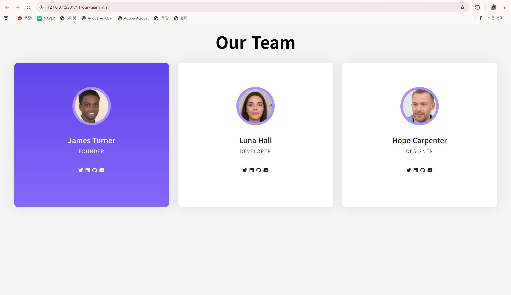
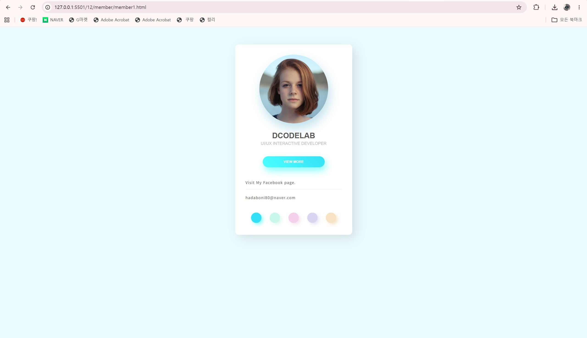
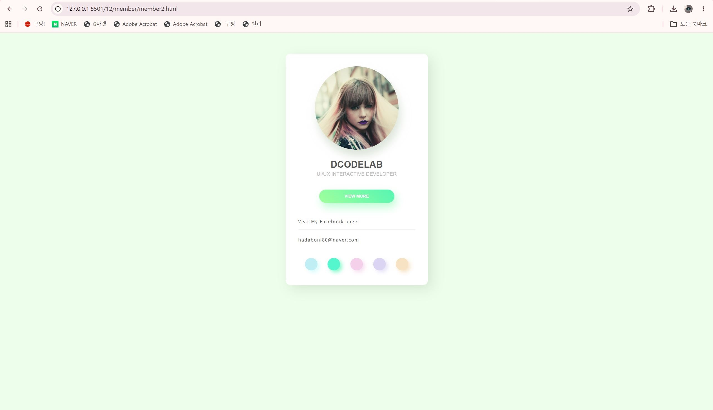
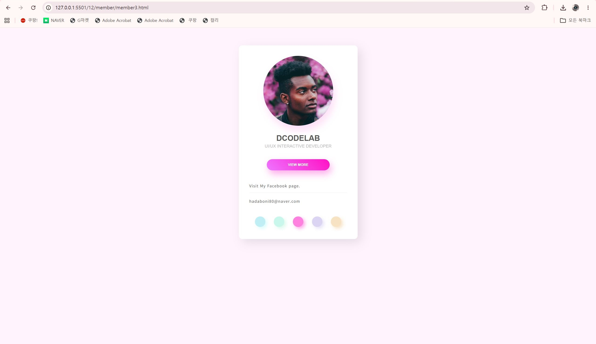
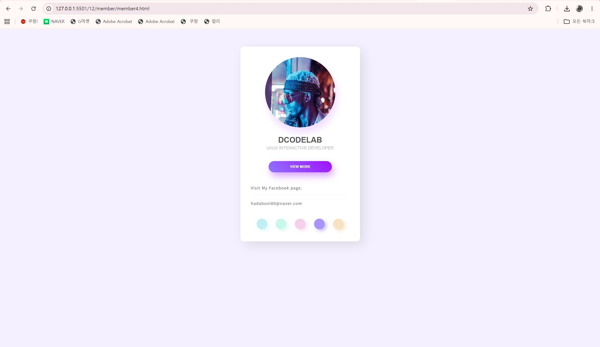
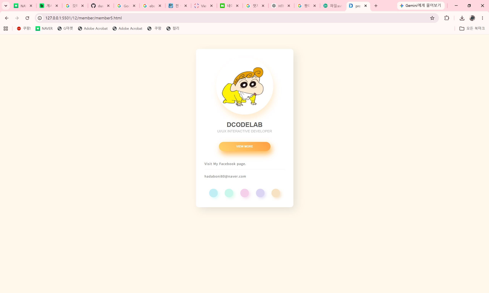

# 22일차

## HTML 배경 스타일, 반응형 웹과 레이아웃

📌 학습일 : 2026.08.18

📌 학습 내용 : background-clip, background-image, background-repeat, background-position, background-attachment, background-origin, background-size, linear-gradient, radial-gradient, 반응형 이미지, object-fit, 미디어 쿼리, Flexbox, Grid

---

#### 1. 배경색 적용 범위 지정

`background-clip`은 요소의 배경색이 어느 영역까지 적용될지 지정한다.

```html
<!DOCTYPE html>
<html lang="ko">
<head>
  <meta charset="UTF-8">
  <title>배경색 적용 범위</title>
  <style>
    .box {
      width: 300px;
      padding: 20px;
      border: 10px dotted #222;
      background-color: #ffd9a0;
    }

    .border {
      background-clip: border-box;
    }

    .padding {
      background-clip: padding-box;
    }

    .content {
      background-clip: content-box;
    }
  </style>
</head>
<body>
  <div class="box border">영역 1</div>
  <div class="box padding">영역 2</div>
  <div class="box content">영역 3</div>
</body>
</html>
```

* `border-box` : 테두리 영역까지 배경 적용
* `padding-box` : 패딩 영역까지 배경 적용
* `content-box` : 콘텐츠 영역에만 배경 적용

#### 2. 배경 이미지 삽입

`background-image`를 사용하면 HTML 요소의 배경에 이미지를 지정할 수 있다.

```html
<!DOCTYPE html>
<html lang="ko">
<head>
  <meta charset="UTF-8">
  <title>배경 이미지</title>
  <style>
    body {
      background-image: url('이미지 경로');
    }
  </style>
</head>
<body>
</body>
</html>
```

#### 3. 배경 이미지 반복

`background-repeat`을 사용하여 배경 이미지의 반복 방식을 지정한다.

```html
<!DOCTYPE html>
<html lang="ko">
<head>
  <meta charset="UTF-8">
  <title>배경 이미지 반복</title>
  <style>
    body {
      background-image: url('이미지 경로');
      background-repeat: no-repeat;
    }
  </style>
</head>
<body>
</body>
</html>
```

* `repeat` : 가로와 세로 반복
* `repeat-x` : 가로 반복
* `repeat-y` : 세로 반복
* `no-repeat` : 반복하지 않음

#### 4. 배경 이미지 위치 지정

`background-position`은 배경 이미지가 표시될 위치를 지정한다.

```html
<!DOCTYPE html>
<html lang="ko">
<head>
  <meta charset="UTF-8">
  <title>배경 이미지 위치</title>
  <style>
    body {
      background-image: url('이미지 경로');
      background-repeat: no-repeat;
      background-position: right top;
    }
  </style>
</head>
<body>
</body>
</html>
```

#### 5. 배경 이미지 고정

`background-attachment`를 사용하면 스크롤할 때 배경 이미지의 움직임을 지정할 수 있다.

```html
<!DOCTYPE html>
<html lang="ko">
<head>
  <meta charset="UTF-8">
  <title>배경 이미지 고정</title>
  <style>
    body {
      background-image: url('이미지 경로');
      background-repeat: no-repeat;
      background-position: right top;
      background-attachment: fixed;
    }
  </style>
</head>
<body>
</body>
</html>
```

`fixed`는 스크롤해도 배경 이미지를 같은 위치에 고정한다.

#### 6. 배경 이미지 시작 위치

`background-origin`은 배경 이미지가 시작되는 기준 영역을 지정한다.

```html
<!DOCTYPE html>
<html lang="ko">
<head>
  <meta charset="UTF-8">
  <title>배경 이미지 시작 위치</title>
  <style>
    .box {
      width: 300px;
      height: 200px;
      padding: 20px;
      border: 20px solid #ccc;
      background-image: url('이미지 경로');
      background-repeat: no-repeat;
    }

    .padding {
      background-origin: padding-box;
    }

    .border {
      background-origin: border-box;
    }

    .content {
      background-origin: content-box;
    }
  </style>
</head>
<body>
  <div class="box padding"></div>
  <div class="box border"></div>
  <div class="box content"></div>
</body>
</html>
```

#### 7. 배경 이미지 크기

`background-size`를 이용하여 배경 이미지의 크기를 조절할 수 있다.

```html
<!DOCTYPE html>
<html lang="ko">
<head>
  <meta charset="UTF-8">
  <title>배경 이미지 크기</title>
  <style>
    .box {
      width: 300px;
      height: 300px;
      background: url('이미지 경로') no-repeat;
    }

    .size1 {
      background-size: auto;
    }

    .size2 {
      background-size: 50%;
    }

    .size3 {
      background-size: contain;
    }

    .size4 {
      background-size: cover;
    }
  </style>
</head>
<body>
  <div class="box size1"></div>
  <div class="box size2"></div>
  <div class="box size3"></div>
  <div class="box size4"></div>
</body>
</html>
```

* `auto` : 원래 크기 유지
* `%` : 요소 크기를 기준으로 지정
* `contain` : 이미지 전체가 보이도록 조절
* `cover` : 영역 전체를 채우도록 조절

#### 8. 목록 불릿에 배경 이미지 사용

기본 불릿을 제거하고 배경 이미지를 이용하여 목록 앞에 이미지를 표시할 수 있다.

```html
<!DOCTYPE html>
<html lang="ko">
<head>
  <meta charset="UTF-8">
  <title>목록 이미지</title>
  <style>
    ul {
      list-style: none;
    }

    li {
      padding-left: 40px;
      line-height: 40px;
      background-image: url('이미지 아이콘 경로');
      background-repeat: no-repeat;
      background-position: left center;
    }
  </style>
</head>
<body>
  <ul>
    <li>메뉴 1</li>
    <li>메뉴 2</li>
    <li>메뉴 3</li>
  </ul>
</body>
</html>
```

#### 9. 선형 그라데이션

`linear-gradient()`를 이용하면 직선 방향으로 색상이 자연스럽게 변하는 배경을 만들 수 있다.

```html
<!DOCTYPE html>
<html lang="ko">
<head>
  <meta charset="UTF-8">
  <title>선형 그라데이션</title>
  <style>
    .gradient {
      width: 500px;
      height: 300px;
      background: linear-gradient(
        to right bottom,
        blue,
        white
      );
    }
  </style>
</head>
<body>
  <div class="gradient"></div>
</body>
</html>
```

각도를 직접 지정할 수도 있다.

```html
<!DOCTYPE html>
<html lang="ko">
<head>
  <meta charset="UTF-8">
  <title>각도 그라데이션</title>
  <style>
    .gradient {
      width: 500px;
      height: 300px;
      background: linear-gradient(45deg, red, white);
    }
  </style>
</head>
<body>
  <div class="gradient"></div>
</body>
</html>
```

#### 10. 원형 그라데이션

`radial-gradient()`를 이용하면 중심에서 바깥쪽으로 퍼지는 형태의 그라데이션을 만들 수 있다.

```html
<!DOCTYPE html>
<html lang="ko">
<head>
  <meta charset="UTF-8">
  <title>원형 그라데이션</title>
  <style>
    .gradient {
      width: 300px;
      height: 300px;
      background: radial-gradient(
        circle,
        white,
        yellow,
        red
      );
    }
  </style>
</head>
<body>
  <div class="gradient"></div>
</body>
</html>
```

시작 위치도 지정할 수 있다.

```html
<!DOCTYPE html>
<html lang="ko">
<head>
  <meta charset="UTF-8">
  <title>원형 그라데이션 위치</title>
  <style>
    .gradient {
      width: 300px;
      height: 300px;
      border-radius: 50%;
      background: radial-gradient(
        circle at 20% 20%,
        white,
        blue
      );
    }
  </style>
</head>
<body>
  <div class="gradient"></div>
</body>
</html>
```

#### 11. 반응형 이미지

이미지가 부모 영역보다 커지지 않도록 설정하면 브라우저 크기에 따라 자동으로 크기가 조절된다.

```html
<!DOCTYPE html>
<html lang="ko">
<head>
  <meta charset="UTF-8">
  <meta name="viewport"
        content="width=device-width, initial-scale=1.0">
  <title>반응형 이미지</title>
  <style>
    .responsive-image {
      max-width: 100%;
      height: auto;
    }
  </style>
</head>
<body>
  
</body>
</html>
```

#### 12. object-fit

`object-fit`은 지정된 영역 안에서 이미지가 표시되는 방식을 설정한다.

```html
<!DOCTYPE html>
<html lang="ko">
<head>
  <meta charset="UTF-8">
  <title>이미지 크기 조절</title>
  <style>
    .container {
      width: 200px;
      height: 300px;
    }

    img {
      width: 100%;
      height: 100%;
      object-fit: cover;
    }
  </style>
</head>
<body>
  <div class="container">
    
  </div>
</body>
</html>
```

주요 값은 다음과 같다.

* `fill` : 영역에 맞게 이미지 크기 변경
* `contain` : 이미지 전체 표시
* `cover` : 비율을 유지하며 영역 전체 채움
* `none` : 원래 크기 유지
* `scale-down` : 더 작은 크기로 표시

#### 13. 미디어 쿼리

미디어 쿼리를 사용하면 화면 크기에 따라 서로 다른 스타일을 적용할 수 있다.

```html
<!DOCTYPE html>
<html lang="ko">
<head>
  <meta charset="UTF-8">
  <meta name="viewport"
        content="width=device-width, initial-scale=1.0">
  <title>미디어 쿼리</title>
  <style>
    body {
      background: url('이미지 경로') no-repeat fixed;
      background-size: cover;
    }

    @media screen and (max-width: 767px) {
      body {
        background: url('이미지 경로') no-repeat fixed;
        background-size: cover;
      }
    }
  </style>
</head>
<body>
  <h1>반응형 페이지</h1>
</body>
</html>
```

#### 14. Flexbox 기본 구조

`display: flex`를 사용하면 내부 요소를 플렉스 항목으로 배치할 수 있다.

```html
<!DOCTYPE html>
<html lang="ko">
<head>
  <meta charset="UTF-8">
  <title>Flexbox</title>
  <style>
    .container {
      display: flex;
    }

    .item {
      width: 100px;
      padding: 20px;
      border: 1px solid #222;
    }
  </style>
</head>
<body>
  <div class="container">
    <div class="item">1</div>
    <div class="item">2</div>
    <div class="item">3</div>
  </div>
</body>
</html>
```

#### 15. flex-direction

`flex-direction`은 플렉스 항목의 배치 방향을 지정한다.

```html
<!DOCTYPE html>
<html lang="ko">
<head>
  <meta charset="UTF-8">
  <title>Flex 방향</title>
  <style>
    .container {
      display: flex;
      flex-direction: row;
    }
  </style>
</head>
<body>
  <div class="container">
    <div>1</div>
    <div>2</div>
    <div>3</div>
  </div>
</body>
</html>
```

* `row` : 왼쪽 → 오른쪽
* `row-reverse` : 오른쪽 → 왼쪽
* `column` : 위 → 아래
* `column-reverse` : 아래 → 위

#### 16. flex-wrap과 flex-flow

`flex-wrap`은 공간이 부족할 경우 플렉스 항목의 줄바꿈 여부를 지정한다.

```html
<!DOCTYPE html>
<html lang="ko">
<head>
  <meta charset="UTF-8">
  <title>Flex 줄바꿈</title>
  <style>
    .container {
      display: flex;
      flex-wrap: wrap;
    }
  </style>
</head>
<body>
  <div class="container">
    <div>1</div>
    <div>2</div>
    <div>3</div>
    <div>4</div>
  </div>
</body>
</html>
```

`flex-flow`를 사용하면 방향과 줄바꿈을 한 번에 지정할 수 있다.

```html
<!DOCTYPE html>
<html lang="ko">
<head>
  <meta charset="UTF-8">
  <title>flex-flow</title>
  <style>
    .container {
      display: flex;
      flex-flow: row wrap;
    }
  </style>
</head>
<body>
  <div class="container">
    <div>1</div>
    <div>2</div>
    <div>3</div>
  </div>
</body>
</html>
```

#### 17. justify-content

`justify-content`는 주축을 기준으로 플렉스 항목의 정렬 방법을 지정한다.

```html
<!DOCTYPE html>
<html lang="ko">
<head>
  <meta charset="UTF-8">
  <title>주축 정렬</title>
  <style>
    .container {
      display: flex;
      justify-content: space-between;
    }
  </style>
</head>
<body>
  <div class="container">
    <div>1</div>
    <div>2</div>
    <div>3</div>
  </div>
</body>
</html>
```

* `flex-start` : 시작점 정렬
* `flex-end` : 끝점 정렬
* `center` : 가운데 정렬
* `space-between` : 양 끝을 기준으로 일정 간격
* `space-around` : 각 항목 주변에 일정 간격

#### 18. align-items와 화면 중앙 배치

`align-items`는 교차축을 기준으로 플렉스 항목을 정렬한다.

`justify-content`와 함께 사용하면 요소를 화면 중앙에 배치할 수 있다.

```html
<!DOCTYPE html>
<html lang="ko">
<head>
  <meta charset="UTF-8">
  <title>화면 중앙 배치</title>
  <style>
    body {
      min-height: 100vh;
      display: flex;
      justify-content: center;
      align-items: center;
    }
  </style>
</head>
<body>
  <button>버튼</button>
</body>
</html>
```

#### 19. align-content

`align-content`는 여러 줄로 배치된 플렉스 항목을 교차축 방향으로 정렬한다.

```html
<!DOCTYPE html>
<html lang="ko">
<head>
  <meta charset="UTF-8">
  <title>여러 줄 정렬</title>
  <style>
    .container {
      width: 300px;
      height: 300px;
      display: flex;
      flex-flow: row wrap;
      align-content: center;
    }
  </style>
</head>
<body>
  <div class="container">
    <div>1</div>
    <div>2</div>
    <div>3</div>
    <div>4</div>
  </div>
</body>
</html>
```

#### 20. flex-basis와 flex-grow

`flex-basis`는 플렉스 항목의 기본 크기를 지정하고 `flex-grow`는 남는 공간을 차지할 비율을 지정한다.

```html
<!DOCTYPE html>
<html lang="ko">
<head>
  <meta charset="UTF-8">
  <title>Flex 항목 크기</title>
  <style>
    .container {
      display: flex;
    }

    .item {
      flex-basis: 100px;
    }

    .item1 {
      flex-grow: 1;
    }

    .item2 {
      flex-grow: 2;
    }
  </style>
</head>
<body>
  <div class="container">
    <div class="item item1">1</div>
    <div class="item item2">2</div>
  </div>
</body>
</html>
```

#### 21. gap

`gap`은 Flex 또는 Grid 항목 사이의 간격을 지정한다.

```html
<!DOCTYPE html>
<html lang="ko">
<head>
  <meta charset="UTF-8">
  <title>항목 간격</title>
  <style>
    .container {
      display: flex;
      gap: 30px;
    }
  </style>
</head>
<body>
  <div class="container">
    <div>1</div>
    <div>2</div>
    <div>3</div>
  </div>
</body>
</html>
```

#### 22. Grid 기본 구조

`display: grid`를 사용하면 행과 열을 기준으로 요소를 배치할 수 있다.

```html
<!DOCTYPE html>
<html lang="ko">
<head>
  <meta charset="UTF-8">
  <title>Grid</title>
  <style>
    .container {
      display: grid;
      grid-template-columns: 100px 200px 300px;
      grid-template-rows: 50px 100px;
    }

    .item {
      border: 1px solid #222;
    }
  </style>
</head>
<body>
  <div class="container">
    <div class="item">1</div>
    <div class="item">2</div>
    <div class="item">3</div>
    <div class="item">4</div>
    <div class="item">5</div>
    <div class="item">6</div>
  </div>
</body>
</html>
```

#### 23. repeat()와 fr 단위

`repeat()`를 사용하면 반복되는 값을 간단하게 작성할 수 있고 `fr`은 공간을 비율로 나누는 단위이다.

```html
<!DOCTYPE html>
<html lang="ko">
<head>
  <meta charset="UTF-8">
  <title>Grid 열</title>
  <style>
    .container {
      display: grid;
      grid-template-columns: repeat(3, 1fr);
    }
  </style>
</head>
<body>
  <div class="container">
    <div>1</div>
    <div>2</div>
    <div>3</div>
  </div>
</body>
</html>
```

`repeat(3, 1fr)`은 같은 너비의 열 3개를 만든다.

#### 24. minmax()

`minmax()`를 이용하여 Grid 행이나 열의 최소 크기와 최대 크기를 지정할 수 있다.

```html
<!DOCTYPE html>
<html lang="ko">
<head>
  <meta charset="UTF-8">
  <title>Grid 행 높이</title>
  <style>
    .container {
      display: grid;
      grid-template-columns: repeat(3, 1fr);
      grid-auto-rows: minmax(100px, auto);
    }
  </style>
</head>
<body>
  <div class="container">
    <div>내용 1</div>
    <div>내용 2</div>
    <div>내용 3</div>
  </div>
</body>
</html>
```

#### 25. Grid 항목 간격

Grid에서도 `gap`을 이용하여 행과 열 사이의 간격을 지정한다.

```html
<!DOCTYPE html>
<html lang="ko">
<head>
  <meta charset="UTF-8">
  <title>Grid 간격</title>
  <style>
    .container {
      display: grid;
      grid-template-columns: repeat(3, 1fr);
      gap: 20px 30px;
    }
  </style>
</head>
<body>
  <div class="container">
    <div>1</div>
    <div>2</div>
    <div>3</div>
    <div>4</div>
    <div>5</div>
    <div>6</div>
  </div>
</body>
</html>
```

#### 26. Grid 라인을 이용한 배치

`grid-column`과 `grid-row`를 이용하여 Grid 항목이 차지하는 영역을 지정한다.

```html
<!DOCTYPE html>
<html lang="ko">
<head>
  <meta charset="UTF-8">
  <title>Grid 영역</title>
  <style>
    .container {
      display: grid;
      grid-template-columns: repeat(3, 1fr);
      grid-template-rows: repeat(3, 100px);
    }

    .item1 {
      grid-column: 1 / -1;
      grid-row: 1;
    }

    .item2 {
      grid-column: 1;
      grid-row: 2 / -1;
    }
  </style>
</head>
<body>
  <div class="container">
    <div class="item1">영역 1</div>
    <div class="item2">영역 2</div>
  </div>
</body>
</html>
```

#### 27. grid-template-areas

Grid의 각 영역에 이름을 지정하여 레이아웃을 만들 수 있다.

```html
<!DOCTYPE html>
<html lang="ko">
<head>
  <meta charset="UTF-8">
  <title>Grid 영역 이름</title>
  <style>
    .container {
      display: grid;

      grid-template-areas:
        "item1 item1 item2"
        "item1 item1 item3"
        "item4 item5 item6";
    }

    .item1 {
      grid-area: item1;
    }

    .item2 {
      grid-area: item2;
    }

    .item3 {
      grid-area: item3;
    }
  </style>
</head>
<body>
  <div class="container">
    <div class="item1">1</div>
    <div class="item2">2</div>
    <div class="item3">3</div>
  </div>
</body>
</html>
```

#### 28. 외부 스타일 파일 연결

`<link>` 태그를 사용하여 HTML 문서와 외부 스타일 파일을 연결할 수 있다.

```html
<!DOCTYPE html>
<html lang="ko">
<head>
  <meta charset="UTF-8">
  <title>외부 스타일 연결</title>
  <link rel="stylesheet" href="css/style.css">
</head>
<body>
  <section>
    <h1>제목</h1>
  </section>
</body>
</html>
```

HTML 구조와 스타일을 서로 다른 파일로 관리할 수 있다.

#### 29. 프로필 페이지 구조

`section`, `nav`, `article`, `ul` 등을 조합하여 프로필 형태의 페이지를 구성할 수 있다.

```html
<!DOCTYPE html>
<html lang="ko">
<head>
  <meta charset="UTF-8">
  <meta name="viewport"
        content="width=device-width, initial-scale=1.0">

  <title>프로필 페이지</title>
  <link rel="stylesheet" href="css/style.css">
</head>
<body class="member">
  <section>
    <nav class="menu">
      <a href="#">메뉴</a>
    </nav>

    <article class="profile">
      

      <h1>사용자 이름</h1>
      <h2>사용자 소개</h2>

      <a href="#" class="btnView">
        자세히 보기
      </a>
    </article>

    <ul class="contact">
      <li>연락처 1</li>
      <li>연락처 2</li>
    </ul>
  </section>
</body>
</html>
```

#### 핵심 정리

* 배경 관련 속성을 이용하여 이미지의 **범위, 위치, 반복, 크기**를 조절할 수 있다.
* `linear-gradient()`와 `radial-gradient()`로 다양한 그라데이션 배경을 만들 수 있다.
* 반응형 이미지와 미디어 쿼리를 이용하여 **화면 크기에 대응하는 웹 페이지**를 만들 수 있다.
* Flexbox는 요소를 **한 방향으로 배치하고 정렬**할 때 사용한다.
* `justify-content`, `align-items`, `flex-wrap` 등으로 플렉스 항목의 위치와 배치를 조절할 수 있다.
* Grid는 요소를 **행과 열을 기준으로 배치**할 때 사용한다.
* `grid-template`, `grid-column`, `grid-row`, `grid-area` 등을 이용하여 다양한 Grid 레이아웃을 구성할 수 있다.
* `gap`을 이용하면 Flex와 Grid 항목 사이의 간격을 쉽게 지정할 수 있다.
* 외부 스타일 파일을 연결하여 HTML 구조와 스타일을 분리해서 관리할 수 있다.

---
문제2) 플렉스 박스를 이용한 반응형 페이지 만들기
```css
* {
  margin: 0;
  padding: 0;
  box-sizing: border-box;
}
body {
  background-color: #f5f5f5;
}
#container {
  padding: 1em 7em;
}
h1 {
  font-size: 3.5em;
  text-align: center;
}
.column {
  width: 100%;
  padding: 0.5em 0;
}
.card {
  background-color: #fff;
  color: #222;
  padding: 3.5em 1em;
  border-radius: 0.6em;
  box-shadow: 0 0 2.4em rgba(25, 0, 58, 0.1);
  cursor: pointer;
  display: flex;
  flex-direction: column;
  justify-content: center;
  align-items: center;
}
.card .img-container {
  width:8em;
  height: 8em;
  background-color: #a993ff;
  padding: 0.5em;
  border-radius: 50%;
  margin-bottom: 2em;
}
.card img {
  width: 100%;
  border-radius: 50%;
}
.card h2 {
  font-weight: 500;
}
.card p {
  font-weight: 300;
  text-transform: uppercase;
  margin: 0.5em 0 2em 0;
  letter-spacing: 2px;
}
.social {
  width: 50%;
  text-transform: uppercase;
  margin: 0.5em 0 2em 0;
  letter-spacing: 2px;
  justify-content: space-between;
}
@media screen and (min-width: 1024px) {
  #container{
    padding: 1em;
  }
  .row{
    display: flex;
    flex-wrap: wrap;
    padding: 2em 1em;
    text-align: center;
  }
  .card{
    padding: 5em 1em;
  }
  .column{
    flex: 0 0 33.33%;
    max-width: 33.33%;
    padding: 0 1em;
  }
}
.card:hover {
  background: linear-gradient(#6045ea, #8567f7);
  color: #fff;
}
.card:hover a {
  color:#fff;
}
a {
  text-decoration: none;
  color: #222;
}
a:hover {
  color: #fff;
}
```

```html
<!DOCTYPE html>
<html lang="ko">
<head>
  <meta charset="UTF-8">
  <meta http-equiv="X-UA-Compatible" content="IE=edge">
  <meta name="viewport" content="width=device-width, initial-scale=1.0">
  <title>Our Team</title>
  <link rel="stylesheet" href="https://cdnjs.cloudflare.com/ajax/libs/font-awesome/6.1.2/css/all.min.css" integrity="sha512-1sCRPdkRXhBV2PBLUdRb4tMg1w2YPf37qatUFeS7zlBy7jJI8Lf4VHwWfZZfpXtYSLy85pkm9GaYVYMfw5BC1A==" crossorigin="anonymous" referrerpolicy="no-referrer" />
  <link rel="stylesheet" href="css/our-team1.css">
</head>
<body>
  <div id="container">
    <h1>Our Team</h1>
    <div class="row">
      <div class="column">
        <div class="card">
          <div class="img-container">
            
          </div>
          <h2>James Turner</h2>
          <p>Founder</p>
          <div class="social">
            <a href="#"><i class="fa-brands fa-twitter"></i></a>
            <a href="#"><i class="fa-brands fa-linkedin"></i></a>
            <a href="#"><i class="fa-brands fa-github"></i></a>
            <a href="#"><i class="fa-solid fa-envelope"></i></a>
          </div>
        </div>
      </div>
      <div class="column">
        <div class="card">
          <div class="img-container">
            
          </div>
          <h2>Luna Hall</h2>
          <p>Developer</p>
          <div class="social">
            <a href="#"><i class="fa-brands fa-twitter"></i></a>
            <a href="#"><i class="fa-brands fa-linkedin"></i></a>
            <a href="#"><i class="fa-brands fa-github"></i></a>
            <a href="#"><i class="fa-solid fa-envelope"></i></a>
          </div>
        </div>
      </div>
      <div class="column">
        <div class="card">
          <div class="img-container">
            
          </div>
          <h2>Hope Carpenter</h2>
          <p>Designer</p>
          <div class="social">
            <a href="#"><i class="fa-brands fa-twitter"></i></a>
            <a href="#"><i class="fa-brands fa-linkedin"></i></a>
            <a href="#"><i class="fa-brands fa-github"></i></a>
            <a href="#"><i class="fa-solid fa-envelope"></i></a>
          </div>
        </div>
      </div>
    </div>
  </div>
</body>
</html>
```
<p align="center">
  
</p>
카드안에 소셜 아이콘과 내용, 이미지 등을 가로로 배치하기 위해서 css파일에서 display: flex을 꼭 입력해야하고 아래로 flex-direction와 justify-content, align-items 등을 사용하여 정렬한게 제대로 출력된다.
@media screen and을 이용하여 조건들을 입력해야 반응형 페이지를 만들 수 있으니 주의해야겠다.

아직은 처음 배우는 게 많아서 좀 더 연습이 필요 할 것 같다.
</br></br></br>
문제2) 멤버별 프로필 페이지 구현
```html
<!DOCTYPE html>
<html lang="ko">

<head>
	<meta charset="UTF-8">
	<meta name="viewport" content="width=device-width, initial-scale=1.0">
	<title>profile 1</title>
	<link rel="icon" href="favicon.ico" type="image/x-icon">
	<script src="https://kit.fontawesome.com/c47106c6a7.js" crossorigin="anonymous"></script>
	<link rel="stylesheet" href="css/style.css">
	<script defer src="js/ie.js"></script>
</head>
<body class="member1">
	<section>
		<nav class="menu">
			<a href="#"><i class="fas fa-bars"></i></a>
			<a href="#"><i class="far fa-sticky-note"></i></a>
		</nav>

		<article class="profile">
			

			<h1>DCODELAB</h1>
			<h2>UI/UX INTERACTIVE DEVELOPER</h2>

			<a href="#" class="btnView">VIEW MORE</a>
		</article>		

		<ul class="contact">
			<li>
				<i class="fab fa-facebook-f"></i>
				<span>Visit My Facebook page.</span>
			</li>
			<li>
				<i class="fas fa-envelope "></i>
				<span>hadaboni80@naver.com</span>
			</li>			
		</ul>

		<nav class="others">
			<a href="member1.html" class="on"></a>
			<a href="member2.html"></a>
			<a href="member3.html"></a>
			<a href="member4.html"></a>
     		⭐<a href="member5.html"></a>
		</nav>
	</section>
</body>
</html>
```
```css
@charset 'utf-8';
/*https://fonts.google.com/ 에서 검색 Orbitron /*
@import url("https://fonts.googleapis.com/css2?family=Orbitron&display=swap");

/* 3단계 - CSS 초기화 */
* {
	margin: 0px;
	padding: 0px;
	box-sizing: border-box;
}
ul, ol {
	list-style: none;
}
a {
	text-decoration: none;
}

/* 3단계 - 프로필 박스 만들기 */
body {
  background-color: #ebfaff;
} 

section {
	width: 340px;
	padding: 30px;
	background-color: #fff;
	margin: 50px auto;
	box-shadow: 10px 10px 30px rgba(0, 0, 0, 0.1);
	border-radius: 10px;
}

/* 4단계 - 상단 버튼 만들기 */
section nav.menu {
	width: 100%;
}
section nav.menu::after {
	content: "";
	display: block;
	clear: both;
}
section nav.menu a {
	font-size: 20px;
	color: #666;
}
section nav.menu a:nth-of-type(1) {
	float: left;
}
section nav.menu a:nth-of-type(2) {
	float: right;
}

/* 5단계 - 프로필 영역 만들기 */
section article.profile {
	width: 100%;
	text-align: center;
}
section article.profile img {
	width: 200px;
	height: 200px;
	border-radius: 50%;
	margin-bottom: 20px;	
}

section article.profile h1 {
	font-weight: bold;
	font-size: 22px;
	font-family: "arial";
	line-height: 1;
	color: #555;
	margin-bottom: 5px;
}
section article.profile h2 {
	font-weight: normal;
	font-size: 12px;
	font-family: "arial";
	color: #bbb;
	margin-bottom: 30px;
}
section a.btnView {
	display: block;
	width: 180px;
	height: 32px;
	margin: 0px auto 20px;
	background-color:#444;
	border-radius: 16px;
	font-weight: bold;
	font-size: 10px;
	font-family: "arial";
	color: #fff;
	line-height: 32px;
	text-align: center;
	/*
	background: linear-gradient(45deg, #4affff, #35e0f7);
	box-shadow: 5px 10px 20px rgba(0, 255, 255, 0.493); 
	 */
}

/* 6단계 - 연락처 목록 만들기 */
section ul.contact {
	margin-bottom: 25px; 
}
section ul.contact li {
	width: 100%;
	padding: 10px 0px;
	border-bottom: 1px solid #eee;
}
section ul.contact li:last-child {
	border-bottom: none;
}
section ul.contact li i {
	width: 20%;
	text-align: center;
	color: #555;
	font-size: 15px;
	text-shadow: 2px 2px 2px #ddd;
}
section ul.contact li span {
	font-weight: normal;
	font-size: 11px;
	font-family: "orbitron";
	color: #555;
	letter-spacing: 1px;
}

/* 7단계 - 멤버별 링크 만들기 */
section nav.others {
	width: 100%;
	text-align: center;
}
section nav.others a {
	display: inline-block;
	width: 30px;
	height: 30px;
	border-radius: 50%;
	margin: 0px 10px;
	opacity: 0.4;	/* 8단계 버튼 활성화하기 */
	filter: saturate(0.7); /* 8단계 버튼 활성화하기 */
}
section nav.others a.on {
	opacity: 1; /* 8단계 버튼 활성화하기 */
	filter: saturate(1); /* 8단계 버튼 활성화하기 */
}
section nav.others a:nth-of-type(1) {
	background-color: #35e0f7;
	box-shadow: 5px 5px 10px rgba(74, 255, 255, 0.7); 
}
section nav.others a:nth-of-type(2) {
	background-color: #55f5cd;
	box-shadow: 5px 5px 10px rgba(85, 245, 178, 0.7); 
}
section nav.others a:nth-of-type(3) {
	background-color: #ff80df;
	box-shadow: 5px 5px 10px rgba(255, 128, 223, 0.7); 
}
section nav.others a:nth-of-type(4) {
	background-color: #a794fd;
	box-shadow: 5px 5px 10px rgba(167, 148, 253, 0.7); 
}
⭐section nav.others a:nth-of-type(5) {
	background-color: #ffb347;
	box-shadow: 5px 5px 10px rgba(255, 149, 0, 0.7);
}

/* 9단계 - 멤버별 프로필 완성하기 */
/* member1 */
body.member1 {
	background-color: #ebfaff;
}
body.member1 section article.profile img {
	box-shadow: 5px 15px 30px rgba(173, 216, 230, 0.8);
}
body.member1 section a.btnView {
	background: linear-gradient(45deg, #4affff, #35e0f7);
	box-shadow: 5px 10px 20px rgba(0, 255, 255, 0.493);
}
/* member2 */
body.member2 {
	background-color: #edffeb;
}
body.member2 section article.profile img {
	box-shadow: 5px 15px 20px #bdccb783; 
}
body.member2 section a.btnView {
	background: linear-gradient(45deg, #a0ff9d, #55f5b2);   
    box-shadow: 5px 10px 20px rgba(33, 250, 105, 0.3); 
}
/* member3 */
body.member3 {
	background-color: #fff3fd;
}
body.member3 section article.profile img {
	box-shadow: 5px 15px 20px  rgba(252, 99, 214, 0.2); 
}
body.member3 section a.btnView {
	background: linear-gradient(45deg, #ef74ff, #ff11c4);   
	box-shadow: 5px 10px 20px rgba(255, 17, 196, 0.357); 
}
/* member4 */
body.member4 {
	background-color: #f5f0ff;
}
body.member4 section article.profile img {
	box-shadow: 5px 15px 20px rgba(183, 82, 250, 0.2);
}
body.member4 section a.btnView {
	background: linear-gradient(45deg, #8e74ff, #a011ff);   
	box-shadow: 5px 10px 20px rgba(160, 17, 255, 0.4);
}
/*⭐ member5 */
body.member5 {
	background-color: #fff8eb;
}

body.member5 section article.profile img {
	box-shadow: 5px 15px 20px rgba(255, 179, 71, 0.25);
}

body.member5 section a.btnView {
	background: linear-gradient(45deg, #ffd36b, #ff9f43);
	box-shadow: 5px 10px 20px rgba(255, 149, 0, 0.7);
}
```

|  |  |  |  |
| :---: | :---: | :---: | :---: |

<p align="center"><b>4개 프로필 적용 시</b></p>

|  |  |  |  |  |
| :---: | :---: | :---: | :---: | :---: |

<p align="center"><b>5개 프로필 적용 시</b></p>

아래에 있는 아이콘을 누르면 자동으로 각 맴버의 프로필로 넘어가는 페이지를 구현하는 문제였는데 맴버별로 각각 맨위 member1파일처럼 5까지의 html 파일을 만들고 css를 통해 연동하는 방식으로 하는 문제였다.

4개만 적용할 시에는 ⭐표시 되어 있는 부분을 제외하고 입력하고 5개의 프로필 적용시에는 ⭐표시 되어 있는 부분까지 입력하면 된다.

여기서 주의 할점이 멤버별로 아이콘을 누르면 똑같이 아이콘이 4개 또는 5개가 표시되어야 하기 때문에  member1~5까지의 html 파일에 nav class="others"부분에 꼭 모든 맴버의 href=파일명이 들어가야한다.
