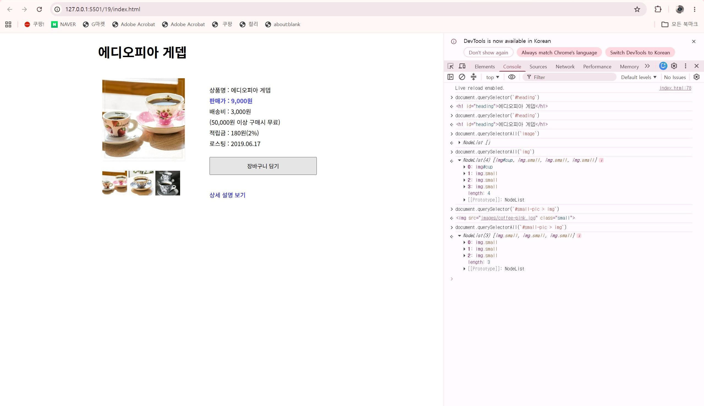
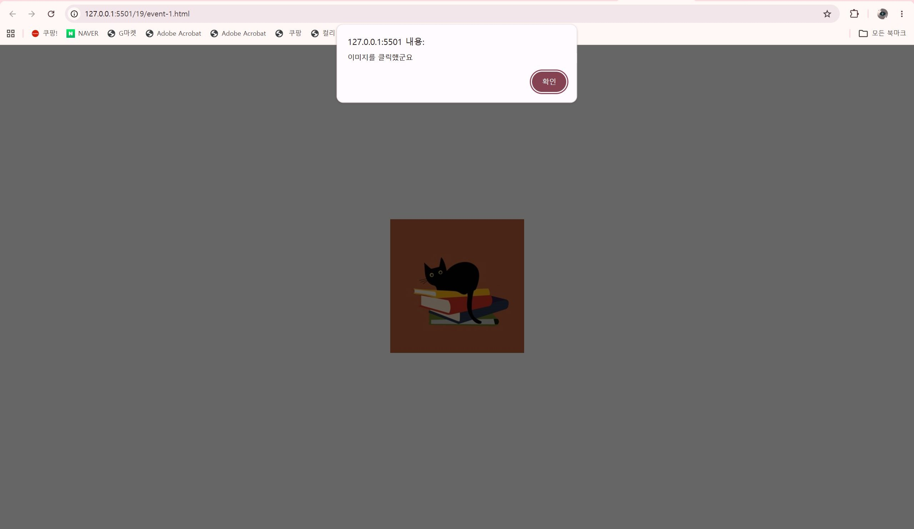

# 25일차

## JavaScript 객체, 배열 메서드와 DOM 이벤트

📌 학습일 : 2026.08.21

📌 학습 내용 : Array 객체, concat(), join(), push(), unshift(), pop(), shift(), splice(), Date 객체, getTime(), Window 객체, open(), close(), DOM, querySelector(), innerText, src, onclick, addEventListener(), mouseover, mouseout, class

---

#### 1. Array 객체

배열은 여러 개의 값을 하나의 변수에 저장하여 관리할 때 사용한다.

```html
<!DOCTYPE html>
<html lang="ko">
<head>
  <meta charset="UTF-8">
  <title>배열</title>
</head>
<body>
  <script>
    let numbers = [1, 2, 3];
    let items = ["a", "b", "c"];

    console.log(numbers);
    console.log(items);
  </script>
</body>
</html>
```

배열에는 숫자, 문자열 등의 여러 값을 순서대로 저장할 수 있다.

#### 2. concat()

`concat()`은 두 개 이상의 배열을 하나의 새로운 배열로 합칠 때 사용한다.

```html
<!DOCTYPE html>
<html lang="ko">
<head>
  <meta charset="UTF-8">
  <title>배열 합치기</title>
</head>
<body>
  <script>
    let first = [1, 2, 3];
    let second = ["a", "b", "c"];

    let result = first.concat(second);

    console.log(result);
  </script>
</body>
</html>
```

기존 배열 자체를 변경하는 것이 아니라 합쳐진 새로운 배열을 반환한다.

#### 3. join()

`join()`은 배열의 각 요소를 하나의 문자열로 연결한다.

```html
<!DOCTYPE html>
<html lang="ko">
<head>
  <meta charset="UTF-8">
  <title>배열 문자열 변환</title>
</head>
<body>
  <script>
    let numbers = [1, 2, 3];

    let result1 = numbers.join("");
    let result2 = numbers.join("/");

    console.log(result1);
    console.log(result2);
  </script>
</body>
</html>
```

`join()` 안에 원하는 구분자를 지정할 수 있다.

#### 4. push()와 unshift()

배열에 새로운 요소를 추가할 때 `push()`와 `unshift()`를 사용할 수 있다.

```html
<!DOCTYPE html>
<html lang="ko">
<head>
  <meta charset="UTF-8">
  <title>배열 요소 추가</title>
</head>
<body>
  <script>
    let items = ["b", "c"];

    items.push("d");
    items.unshift("a");

    console.log(items);
  </script>
</body>
</html>
```

* `push()` : 배열의 맨 뒤에 요소 추가
* `unshift()` : 배열의 맨 앞에 요소 추가

두 메서드는 요소를 추가한 뒤 변경된 배열의 `length` 값을 반환한다.

#### 5. pop()과 shift()

배열의 요소를 제거할 때 `pop()`과 `shift()`를 사용할 수 있다.

```html
<!DOCTYPE html>
<html lang="ko">
<head>
  <meta charset="UTF-8">
  <title>배열 요소 제거</title>
</head>
<body>
  <script>
    let items = ["a", "b", "c"];

    let last = items.pop();
    let first = items.shift();

    console.log(last);
    console.log(first);
    console.log(items);
  </script>
</body>
</html>
```

* `pop()` : 배열의 마지막 요소 제거
* `shift()` : 배열의 첫 번째 요소 제거

제거된 요소는 반환값으로 받을 수 있다.

#### 6. splice()

`splice()`는 배열의 원하는 위치에서 요소를 삭제하거나 새로운 요소를 추가할 때 사용한다.

```html
<!DOCTYPE html>
<html lang="ko">
<head>
  <meta charset="UTF-8">
  <title>splice</title>
</head>
<body>
  <script>
    let items = [
      "HTML",
      "CSS",
      "JavaScript",
      "React"
    ];

    let removed = items.splice(2, 1);

    console.log(removed);
    console.log(items);
  </script>
</body>
</html>
```

기본 구조는 다음과 같다.

`splice(시작 위치, 삭제할 개수, 추가할 값)`

인수의 개수에 따라 동작이 달라진다.

* 인수 1개 : 지정 위치부터 마지막까지 삭제
* 인수 2개 : 지정 위치부터 지정한 개수만큼 삭제
* 인수 3개 이상 : 요소를 삭제한 위치에 새로운 값 추가

#### 7. Date 객체

`Date` 객체를 이용하면 현재 날짜와 특정 날짜를 JavaScript에서 다룰 수 있다.

```html
<!DOCTYPE html>
<html lang="ko">
<head>
  <meta charset="UTF-8">
  <title>Date 객체</title>
</head>
<body>
  <script>
    let now = new Date();
    let startDay = new Date("2026-01-01");

    console.log(now);
    console.log(startDay);
  </script>
</body>
</html>
```

`new Date()`는 현재 날짜와 시간을 가진 객체를 생성한다.

#### 8. getTime()을 이용한 날짜 계산

`getTime()`은 특정 날짜를 밀리초 단위의 값으로 변환한다.

두 날짜의 값을 빼면 날짜 사이의 시간 차이를 계산할 수 있다.

```html
<!DOCTYPE html>
<html lang="ko">
<head>
  <meta charset="UTF-8">
  <title>날짜 계산</title>
</head>
<body>
  <p>
    지난 일수 :
    <span id="result"></span>
  </p>

  <script>
    let now = new Date();
    let startDay = new Date("2026-01-01");

    let currentTime = now.getTime();
    let startTime = startDay.getTime();

    let passedTime =
      currentTime - startTime;

    let passedDay = Math.round(
      passedTime /
      (1000 * 60 * 60 * 24)
    );

    document.querySelector("#result")
      .innerText = passedDay;
  </script>
</body>
</html>
```

밀리초를 일수로 변환할 때 다음 계산을 사용할 수 있다.

`1000 × 60 × 60 × 24`

#### 9. Window 객체

`window` 객체는 현재 브라우저 창을 다룰 때 사용한다.

`window.open()`을 이용하면 새로운 창을 열 수 있다.

```html
<!DOCTYPE html>
<html lang="ko">
<head>
  <meta charset="UTF-8">
  <title>새 창 열기</title>
</head>
<body>
  <script>
    window.open(
      "page.html",
      "popup",
      "width=500,height=400"
    );
  </script>
</body>
</html>
```

새 창의 크기나 위치 등의 옵션도 지정할 수 있다.

#### 10. window.close()

`window.close()`는 현재 창을 닫을 때 사용한다.

```html
<!DOCTYPE html>
<html lang="ko">
<head>
  <meta charset="UTF-8">
  <title>창 닫기</title>
</head>
<body>
  <button
    onclick="window.close();">
    닫기
  </button>
</body>
</html>
```

새로 열린 팝업 창 등에 닫기 버튼을 만들 때 사용할 수 있다.

#### 11. DOM

DOM은 HTML 문서의 요소를 JavaScript에서 객체처럼 선택하고 변경할 수 있도록 만들어진 구조이다.

```html
<!DOCTYPE html>
<html lang="ko">
<head>
  <meta charset="UTF-8">
  <title>DOM</title>
</head>
<body>
  <h1 id="heading">제목</h1>

  <script>
    let heading =
      document.querySelector(
        "#heading"
      );

    console.log(heading);
  </script>
</body>
</html>
```

JavaScript에서 HTML 요소를 선택한 후 내용이나 속성을 변경할 수 있다.

#### 12. querySelector()

`document.querySelector()`는 CSS 선택자를 이용하여 HTML 요소를 선택한다.

```html
<!DOCTYPE html>
<html lang="ko">
<head>
  <meta charset="UTF-8">
  <title>요소 선택</title>
</head>
<body>
  <h1 id="heading">제목</h1>

  <script>
    let heading =
      document.querySelector(
        "#heading"
      );
  </script>
</body>
</html>
```

CSS 선택자와 동일한 형식을 사용한다.

* `#아이디` : id 선택
* `.클래스` : class 선택
* `태그명` : 태그 선택

#### 13. innerText로 텍스트 변경

선택한 HTML 요소의 `innerText`를 변경하면 화면에 표시되는 텍스트를 변경할 수 있다.

```html
<!DOCTYPE html>
<html lang="ko">
<head>
  <meta charset="UTF-8">
  <title>텍스트 변경</title>
</head>
<body>
  <h1 id="heading">
    기존 제목
  </h1>

  <script>
    let heading =
      document.querySelector(
        "#heading"
      );

    heading.onclick = () => {
      heading.innerText =
        "변경된 제목";
    };
  </script>
</body>
</html>
```

#### 14. src 속성을 이용한 이미지 변경

JavaScript에서 이미지의 `src` 속성을 변경하면 다른 이미지로 교체할 수 있다.

```html
<!DOCTYPE html>
<html lang="ko">
<head>
  <meta charset="UTF-8">
  <title>이미지 변경</title>
</head>
<body>
  

  <script>
    let image =
      document.querySelector(
        "#image"
      );

    image.onclick = () => {
      image.src =
        "images/image2.jpg";
    };
  </script>
</body>
</html>
```

#### 15. onclick 이벤트

`onclick`을 사용하면 사용자가 HTML 요소를 클릭했을 때 특정 기능을 실행할 수 있다.

```html
<!DOCTYPE html>
<html lang="ko">
<head>
  <meta charset="UTF-8">
  <title>클릭 이벤트</title>
</head>
<body>
  

  <script>
    let image =
      document.querySelector(
        "#image"
      );

    image.onclick = () => {
      alert(
        "이미지를 클릭했습니다."
      );
    };
  </script>
</body>
</html>
```

#### 16. 이벤트 처리 함수 연결

이벤트에서 실행할 코드를 별도의 함수로 작성한 후 연결할 수도 있다.

```html
<!DOCTYPE html>
<html lang="ko">
<head>
  <meta charset="UTF-8">
  <title>이벤트 함수</title>
</head>
<body>
  

  <script>
    let image =
      document.querySelector(
        "#image"
      );

    image.onclick = changeImage;

    function changeImage() {
      image.src =
        "images/image2.jpg";
    }
  </script>
</body>
</html>
```

함수를 따로 만들면 같은 기능을 관리하기 편리하다.

#### 17. addEventListener()

`addEventListener()`를 사용하면 HTML 요소에 이벤트와 실행할 함수를 연결할 수 있다.

```html
<!DOCTYPE html>
<html lang="ko">
<head>
  <meta charset="UTF-8">
  <title>이벤트 리스너</title>
</head>
<body>
  

  <script>
    let image =
      document.querySelector(
        "#image"
      );

    image.addEventListener(
      "click",
      changeImage
    );

    function changeImage() {
      image.src =
        "images/image2.jpg";
    }
  </script>
</body>
</html>
```

기본 구조는 다음과 같다.

`요소.addEventListener("이벤트", 실행할 함수)`

#### 18. mouseover와 mouseout 이벤트

마우스 포인터가 요소 위에 올라오거나 벗어나는 것을 감지할 수 있다.

```html
<!DOCTYPE html>
<html lang="ko">
<head>
  <meta charset="UTF-8">
  <title>마우스 이벤트</title>
</head>
<body>
  

  <script>
    let image =
      document.querySelector(
        "#image"
      );

    image.addEventListener(
      "mouseover",
      changeImage
    );

    image.addEventListener(
      "mouseout",
      originImage
    );

    function changeImage() {
      image.src =
        "images/image2.jpg";
    }

    function originImage() {
      image.src =
        "images/image1.jpg";
    }
  </script>
</body>
</html>
```

* `mouseover` : 마우스가 요소 위에 올라왔을 때
* `mouseout` : 마우스가 요소에서 벗어났을 때

#### 19. 여러 클래스 적용

하나의 HTML 요소에 여러 개의 클래스를 동시에 지정할 수 있다.

```html
<!DOCTYPE html>
<html lang="ko">
<head>
  <meta charset="UTF-8">
  <title>여러 클래스</title>
  <style>
    .textColor {
      color: blue;
    }

    .border {
      border: 1px solid #222;
      padding: 5px;
    }
  </style>
</head>
<body>
  <p class="textColor border">
    내용
  </p>
</body>
</html>
```

각 클래스에 서로 다른 스타일을 지정한 후 하나의 요소에서 함께 사용할 수 있다.

#### 20. 체크박스와 버튼 상태 변경 실습

체크박스 선택 여부에 따라 비활성화된 버튼의 상태를 변경하는 형태의 실습도 진행했다.

```html
<!DOCTYPE html>
<html lang="ko">
<head>
  <meta charset="UTF-8">
  <title>체크박스와 버튼</title>
</head>
<body>
  <label>
    <input
      type="checkbox"
      id="agree">
    필수 항목 동의
  </label>

  <button
    id="proceed"
    disabled>
    다음으로 진행
  </button>
</body>
</html>
```

실습 파일에서는 체크박스와 비활성화된 버튼의 HTML 구조까지 작성하고, JavaScript를 이용해 버튼을 활성화하는 부분은 실습 과제로 남겨두었다.

---

#### 핵심 정리

* Array 객체의 메서드를 이용하여 배열을 **합치거나, 문자열로 변환하고, 요소를 추가·삭제**할 수 있다.
* `splice()`를 이용하면 배열의 특정 위치에서 요소를 삭제하거나 새로운 요소를 추가할 수 있다.
* Date 객체와 `getTime()`을 이용하여 날짜 사이의 시간 차이를 계산할 수 있다.
* Window 객체의 `open()`과 `close()`를 이용하여 브라우저의 새 창을 열고 닫을 수 있다.
* DOM을 이용하면 JavaScript에서 HTML 요소를 선택하고 텍스트와 이미지 등의 내용을 변경할 수 있다.
* `onclick`과 `addEventListener()`를 이용하여 사용자의 동작에 따라 기능을 실행할 수 있다.
* `mouseover`, `mouseout` 등의 이벤트를 활용하면 마우스 움직임에 따라 화면 요소를 동적으로 변경할 수 있다.

---

```html
<!DOCTYPE html>
<html lang="ko">
<head>
	<meta charset="UTF-8">
	<meta name="viewport" content="width=device-width, initial-scale=1.0">
	<meta http-equiv="X-UA-Compatible" content="ie=edge">
	<title>DOM</title>
	<link rel="stylesheet" href="css/product.css">
</head>
<body>
	<div id="container">
		<h1 id="heading">에디오피아 게뎁</h1>
		<div id="prod-pic">
			
				<div id="small-pic"> 
					
					
					
				</div>
		</div>			
		<div id="desc">
			<ul>
				<li>상품명 : 에디오피아 게뎁</li>
				<li class="bluetext">판매가 : 9,000원</li>
				<li>배송비 : 3,000원<br>(50,000원 이상 구매시 무료)</li>
				<li>적립금 : 180원(2%)</li>
				<li>로스팅 : 2019.06.17</li>
				<button>장바구니 담기</button>
			</ul>				
			<a href="#" id="view">상세 설명 보기</a>				
		</div>
			
		<div id="detail">									
			<hr>
			<h2>상품 상세 정보</h2>
			<ul>
				<li>원산지 : 에디오피아</li>
				<li>지 역 : 이르가체프 코체레</li>
				<li>농 장 : 게뎁</li>
				<li>고 도 : 1,950 ~ 2,000 m</li>
				<li>품 종 : 지역 토착종</li>
				<li>가공법 : 워시드</li>
			</ul>
			<h3>Information</h3>
			<p>2차 세계대전 이후 설립된 게뎁농장은 유기농 인증 농장으로 여성의 고용 창출과 지역사회 발전에 기여하며 3대째 이어져 내려오는 오랜 역사를 가진 농장입니다. 게뎁 농장은 SCAA 인증을 받은 커피 품질관리 실험실을 갖추고 있어 철처한 관리를 통해 스페셜티커피를 생산합니다.</p>
			<h3>Flavor Note</h3>
			<p>은은하고 다채로운 꽃향, 망고, 다크 체리, 달달함이 입안 가득.</p>
		</div>
	</div>
</body>
</html>
```
<p align="center">
  
</p>

querySelector()와 querySelectorAll()을 이용해 CSS 선택자 방식으로 HTML 요소를 선택할 수 있으며, 하나의 요소와 여러 요소를 선택하는 방법의 차이를 알게 되었다.

여기서 주의 할점은 반드시 괄호 안에 `#`가 들어가야 한다.

```html
<!DOCTYPE html>
<html lang="ko">
<head>
	<meta charset="UTF-8">
	<meta name="viewport" content="width=device-width, initial-scale=1.0">
  <title>DOM event 객체</title>
  <style>
    * {
      margin: 0;
      padding: 0;
      box-sizing: border-box;
    }    
    body {
      display: flex;
      justify-content: center;
      align-items: center;
      height: 100vh;
    }
  </style>
</head>
<body>
  <div class="container">
    		
  </div>

	<script>
    let cat = document.querySelector("#cat");
    cat.onclick = () => alert("이미지를 클릭했군요");

	</script>
</body>
</html>
```

<p align="center">
  
</p>

dom을 이용한 이벤트 처리방법으로 선택한 이미지를 클릭했을 때 실행할 이벤트를 화살표 함수를 사용하여 클릭 시 실행할 동작을 작성했다.

실제로 실행해서 위에 처럼 이미지를 선택하면 "이미지를 클릭했군요"라는 팝업창이 뜬다.

여기서 주의할 점은 querySelector()에서 괄호안에 반드시 "#"가 들어가야 한다는 점이다.

아직은 배우는 과정이라 좀 더 연습해서 익혀야 할 것 같다.
