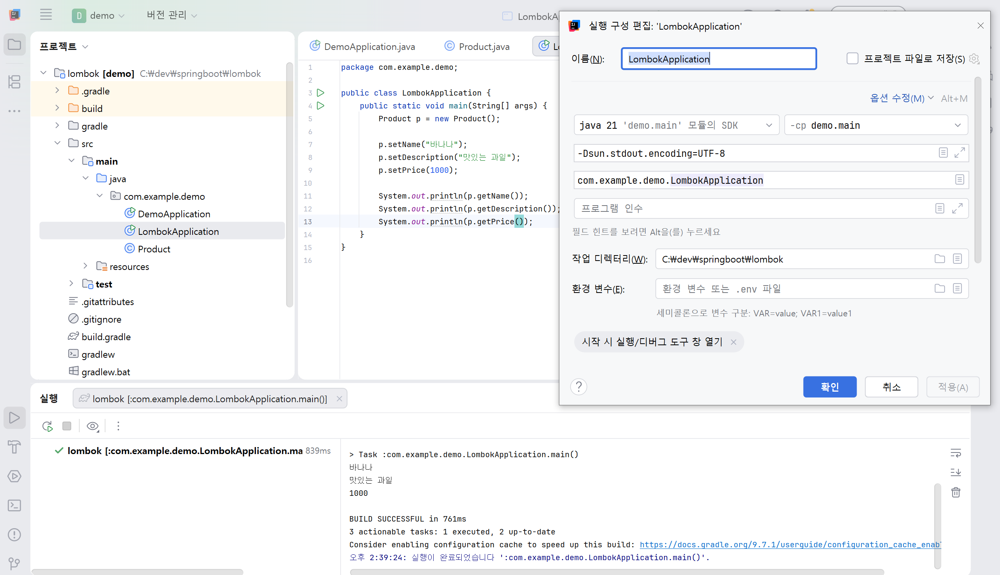

# 34일차

## Spring Boot DI, Bean, AOP, 비동기 처리, Lombok 및 Oracle 실습

📌 학습일 : 2026.09.03

📌 학습 내용 : DI(Dependency Injection), Interface, Spring Bean, @Component, @Autowired, @Order, @PostConstruct, AOP, @Async, CompletableFuture, Lombok, Logging, Oracle 테이블 생성 및 데이터 입력

---

#### 1. 의존성 주입 전 객체 생성 방식

```java
public class 사용클래스명 {

    private 의존클래스명 객체명;

    public 사용클래스명() {
        this.객체명 = new 의존클래스명();
    }

    public void 실행메서드명() {
        System.out.println(객체명.기능메서드명());
    }
}
```

클래스 내부에서 필요한 객체를 직접 생성하는 방식이다.

특정 클래스에 직접 의존하기 때문에 다른 객체를 사용하려면 내부 코드도 함께 수정해야 한다.

#### 2. 인터페이스를 이용한 DI

```java
public interface 인터페이스명 {

    String 기능메서드명();
}
```

```java
public class 구현클래스명 implements 인터페이스명 {

    @Override
    public String 기능메서드명() {
        return "실행 결과";
    }
}
```

```java
public class 사용클래스명 {

    private 인터페이스명 객체명;

    public void set객체명(인터페이스명 객체명) {
        this.객체명 = 객체명;
    }

    public void 실행메서드명() {
        System.out.println(객체명.기능메서드명());
    }
}
```

```java
사용클래스명 사용객체명 = new 사용클래스명();

사용객체명.set객체명(
        new 구현클래스명()
);

사용객체명.실행메서드명();
```

구현 클래스가 아닌 인터페이스 타입으로 객체를 받아 사용하면 필요한 구현체를 바꿔서 사용할 수 있다.

#### 3. Spring Bean 설정

```xml
<bean id="빈이름"
      class="패키지명.구현클래스명"/>

<bean id="사용빈이름"
      class="패키지명.사용클래스명"
      init-method="실행메서드명">

    <property name="객체명"
              ref="빈이름"/>

</bean>
```

Spring이 객체를 Bean으로 생성하고 필요한 객체를 연결하도록 설정할 수 있다.

`ref`에는 주입할 Bean의 `id`를 지정한다.

#### 4. @Component와 @Autowired

```java
@Component
public class 구현클래스명 implements 인터페이스명 {

    @Override
    public String 기능메서드명() {
        return "실행 결과";
    }
}
```

```java
@Component
public class 사용클래스명 {

    @Autowired
    private List<인터페이스명> 객체목록;
}
```

`@Component`는 클래스를 Spring Bean으로 등록하고, `@Autowired`는 필요한 Bean을 자동으로 주입한다.

같은 인터페이스를 구현한 Bean이 여러 개라면 `List<인터페이스명>` 형태로 한 번에 주입받을 수 있다.

#### 5. @Order와 @PostConstruct

```java
@Component
@Order(1)
public class 첫번째구현클래스명 implements 인터페이스명 {

    @Override
    public String 기능메서드명() {
        return "첫 번째 실행 결과";
    }
}
```

```java
@Component
@Order(2)
public class 두번째구현클래스명 implements 인터페이스명 {

    @Override
    public String 기능메서드명() {
        return "두 번째 실행 결과";
    }
}
```

`@Order`는 여러 Bean의 처리 순서를 지정하며 숫자가 작을수록 먼저 처리된다.

```java
@PostConstruct
public void 초기화메서드명() {

    for (인터페이스명 객체명 : 객체목록) {
        System.out.println(
                객체명.기능메서드명()
        );
    }
}
```

`@PostConstruct`는 Bean 생성과 의존성 주입이 끝난 뒤 실행할 초기화 작업에 사용할 수 있다.

#### 6. AOP와 사용자 정의 어노테이션

```java
@Target(ElementType.METHOD)
@Retention(RetentionPolicy.RUNTIME)
public @interface 사용자정의어노테이션명 {
}
```

```java
@사용자정의어노테이션명
반환타입 실행메서드명(자료형 매개변수명) {

    // 핵심 기능

    return 반환값;
}
```

공통 기능을 적용할 메서드에 사용자 정의 어노테이션을 붙여 사용할 수 있다.

```java
@Component
@Aspect
public class 공통기능클래스명 {

    @Around("@annotation(사용자정의어노테이션명)")
    public Object 공통기능메서드명(
            ProceedingJoinPoint 조인포인트
    ) throws Throwable {

        long 시작시간 = System.currentTimeMillis();

        Object 결과값 = 조인포인트.proceed();

        long 실행시간 =
                System.currentTimeMillis() - 시작시간;

        System.out.println(
                "실행 시간 : " + 실행시간 + "ms"
        );

        return 결과값;
    }
}
```

AOP를 사용하면 실행 시간 측정처럼 여러 곳에서 반복되는 기능을 핵심 기능과 분리해서 관리할 수 있다.

#### 7. AOP Advice

```java
@Before("@annotation(사용자정의어노테이션명)")
```

대상 메서드가 실행되기 전에 동작한다.

```java
@After("@annotation(사용자정의어노테이션명)")
```

대상 메서드가 실행된 후 동작한다.

```java
@AfterReturning(
        pointcut = "@annotation(사용자정의어노테이션명)",
        returning = "결과값"
)
```

대상 메서드가 정상적으로 값을 반환한 뒤 동작한다.

```java
@AfterThrowing(
        pointcut = "@annotation(사용자정의어노테이션명)",
        throwing = "예외객체"
)
```

대상 메서드에서 예외가 발생했을 때 동작한다.

```java
@Around("@annotation(사용자정의어노테이션명)")
```

대상 메서드 실행 전과 후를 모두 처리할 수 있다.

#### 8. @Async를 이용한 비동기 처리

```java
@Async
CompletableFuture<반환자료형> 비동기메서드명(
        자료형 매개변수명
) {

    반환자료형 결과값 = 값;

    return CompletableFuture.completedFuture(
            결과값
    );
}
```

`@Async`를 사용하면 메서드를 비동기 방식으로 실행할 수 있다.

비동기 작업의 결과가 필요한 경우 `CompletableFuture`를 이용해 결과를 반환할 수 있다.

#### 9. ApplicationRunner

```java
@Component
public class 실행클래스명
        implements ApplicationRunner {

    @Autowired
    private 사용클래스명 객체명;

    @Override
    public void run(
            ApplicationArguments 매개변수명
    ) throws Exception {

        객체명.실행메서드명();
    }
}
```

`ApplicationRunner`의 `run()` 메서드는 Spring Boot 애플리케이션이 실행된 뒤 자동으로 호출된다.

애플리케이션 시작 직후 실행해야 하는 작업이나 테스트 코드를 작성할 때 사용할 수 있다.

#### 10. Lombok

```java
@Data
@NoArgsConstructor
@AllArgsConstructor
@Builder
@EqualsAndHashCode(of = {"필드명1", "필드명2"})
public class 클래스명 {

    private 자료형 필드명1;
    private 자료형 필드명2;
    private 자료형 필드명3;
}
```

- `@Data` : Getter, Setter, `toString()`, `equals()`, `hashCode()` 등을 생성
- `@NoArgsConstructor` : 기본 생성자 생성
- `@AllArgsConstructor` : 모든 필드를 받는 생성자 생성
- `@Builder` : Builder 방식으로 객체 생성
- `@EqualsAndHashCode` : 객체 비교에 사용할 필드 지정

```java
클래스명 객체명 = 클래스명.builder()
        .필드명1(값1)
        .필드명2(값2)
        .필드명3(값3)
        .build();
```

Builder를 사용하면 필요한 값을 지정하면서 객체를 생성할 수 있다.

#### 11. Logging

```java
@Slf4j
public class 실행클래스명 {

    public static void main(String[] args) {

        log.info("정보 메시지");
        log.warn("경고 메시지");
        log.error("오류 메시지");
    }
}
```

`@Slf4j`를 사용하면 로그의 목적에 따라 `info`, `warn`, `error` 등의 레벨을 나누어 출력할 수 있다.

#### 12. Oracle 테이블 생성

```sql
CREATE TABLE 테이블명(
    기본키컬럼 NUMBER
        GENERATED BY DEFAULT AS IDENTITY
        PRIMARY KEY,

    필수컬럼 VARCHAR2(128) NOT NULL,

    고유컬럼 VARCHAR2(256)
        NOT NULL UNIQUE,

    숫자컬럼 NUMBER
);
```

`IDENTITY`를 사용하면 기본키 값을 직접 입력하지 않아도 자동으로 생성된다.

`NOT NULL`은 반드시 값이 들어가야 하는 컬럼에 사용하고, `UNIQUE`는 중복된 값을 허용하지 않을 때 사용한다.

#### 13. Oracle 데이터 입력 및 조회

```sql
INSERT INTO 테이블명(
    필수컬럼,
    고유컬럼,
    숫자컬럼
)
VALUES(
    '값1',
    '값2',
    숫자값
);
```

```sql
COMMIT;
```

```sql
SELECT *
FROM 테이블명;
```

`INSERT`로 데이터를 추가하고 `COMMIT`으로 변경 내용을 저장한 뒤 `SELECT`로 결과를 확인할 수 있다.

`IDENTITY`가 적용된 기본키 컬럼은 INSERT문에서 값을 직접 입력하지 않아도 자동으로 번호가 생성된다.

---

#### 핵심 정리

- DI를 사용하면 필요한 객체를 외부에서 전달받아 클래스 간 의존성을 줄일 수 있다.
- 인터페이스를 이용하면 실제 사용하는 구현 클래스를 쉽게 교체할 수 있다.
- Spring은 Bean의 생성과 의존성 주입을 관리한다.
- `@Component`는 클래스를 Bean으로 등록하고 `@Autowired`는 필요한 Bean을 자동으로 주입한다.
- `@Order`는 여러 Bean의 처리 순서를 지정한다.
- `@PostConstruct`는 의존성 주입이 끝난 뒤 실행할 초기화 작업에 사용한다.
- AOP는 여러 곳에서 반복되는 공통 기능을 핵심 기능과 분리할 때 사용한다.
- `@Before`, `@After`, `@AfterReturning`, `@AfterThrowing`, `@Around`를 이용해 실행 시점에 맞는 공통 기능을 적용할 수 있다.
- `@Async`와 `CompletableFuture`를 이용해 비동기 작업을 처리할 수 있다.
- `ApplicationRunner`는 Spring Boot 실행 직후 필요한 작업을 실행할 때 사용할 수 있다.
- Lombok을 사용하면 Getter, Setter, 생성자 등 반복적인 코드를 줄일 수 있다.
- `@Slf4j`를 이용하면 로그를 단계별로 구분해서 출력할 수 있다.
- Oracle의 `IDENTITY`를 이용하면 기본키 값을 자동으로 생성할 수 있다.
- `INSERT` → `COMMIT` → `SELECT` 순서로 데이터 입력과 저장 결과를 확인할 수 있다.

---

<p align="center">
  
</p>
Lombok 실습 코드를 작성한 뒤 실행 버튼을 눌러 프로그램을 실행했다. 실행 과정에서 바로 실행되지 않거나 실행 설정이 필요한 경우, IntelliJ 상단의 실행 버튼 옆에 있는 아래 화살표를 눌러 구성 편집으로 들어갔다. 실행 구성 화면에서 실행할 클래스가 맞는지 확인하고, 사용할 JDK와 모듈을 지정했다. 
그리고 main() 메서드가 있는 클래스를 메인 클래스로 설정했고 콘솔에서 한글이 깨지지 않도록 VM 옵션에 -Dsun.stdout.encoding=UTF-8도 입력했다. 
설정을 저장한 뒤 다시 실행 버튼을 눌러 프로그램이 정상적으로 실행되는지 확인했다.

처음에는 코드를 작성한 뒤 바로 실행하면 되는 줄 알았는데, 실행할 클래스와 JDK 등을 지정하는 실행 구성도 확인해야 한다는 것을 알게 되었고, 특히 한글이 제대로 출력되지 않을 때는 코드뿐만 아니라 VM 옵션과 같은 실행 환경 설정도 확인해야 한다는 점이 기억에 남았다.
