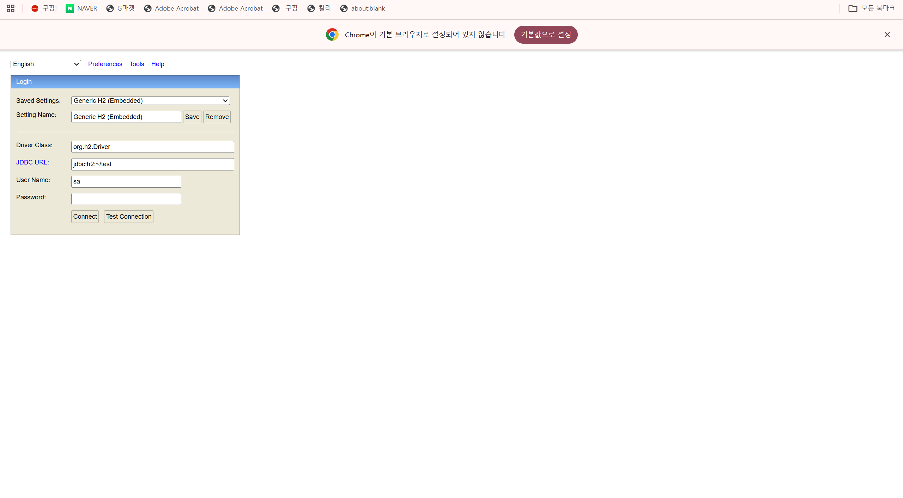
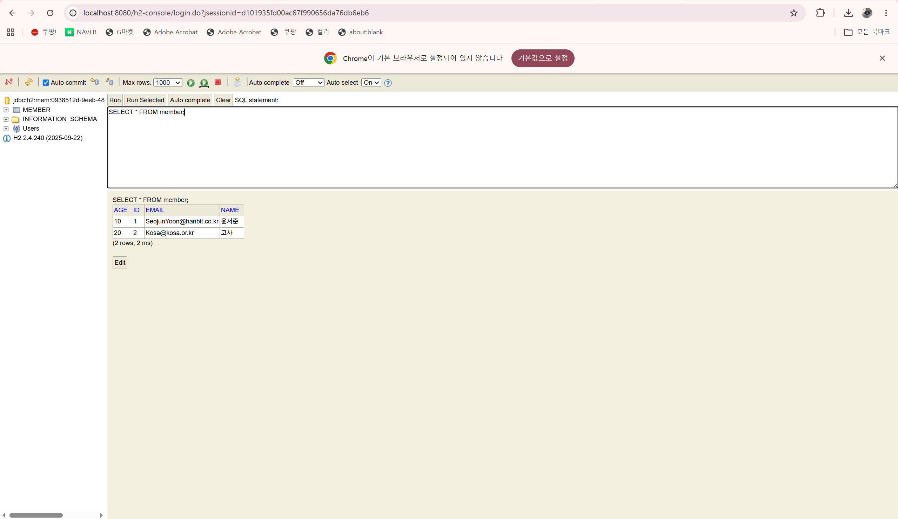

# 36일차

## Spring Data JPA와 REST API를 이용한 회원 데이터 처리

📌 학습일 : 2026.09.05

📌 학습 내용 : Spring Data JPA, Entity, JpaRepository, 쿼리 메서드,
Query by Example, H2 Console, REST API, @RestController,
@RequestMapping, @PostMapping, @GetMapping, @PutMapping, @DeleteMapping

---

#### 1. JPA SQL 로그 설정

``` properties
spring.application.name=프로젝트명

spring.jpa.show-sql=true
logging.level.org.hibernate.orm.jdbc.bind=trace

spring.jpa.properties.hibernate.highlight_sql=true
spring.jpa.properties.hibernate.use_sql_comments=true
```

JPA가 실행하는 SQL과 전달되는 값을 콘솔에서 확인할 수 있도록 로그를
설정한다.

#### 2. JPA Entity 클래스

``` java
@Entity
@Table(name = "테이블명")
@Data
@Builder
@NoArgsConstructor
@AllArgsConstructor
public class 엔티티클래스명 {

    @Id
    @GeneratedValue(strategy = GenerationType.IDENTITY)
    private Long 기본키;

    @Column(name = "컬럼명1")
    private String 필드명1;

    @Column(name = "컬럼명2")
    private String 필드명2;

    private Integer 필드명3;
}
```

`@Entity`로 JPA가 관리하는 클래스를 지정하고 `@Table`로 연결할 테이블을
지정한다. 필드와 실제 컬럼명이 다를 때는 `@Column`으로 연결할 수 있다.

`@GeneratedValue(strategy = GenerationType.IDENTITY)`를 사용하면 기본키
값을 자동으로 생성할 수 있다.

#### 3. JpaRepository

``` java
@Repository
public interface 저장소인터페이스명
        extends JpaRepository<엔티티클래스명, Long> {
}
```

`JpaRepository`를 상속하면 기본적인 저장, 조회, 수정, 삭제 기능을 사용할
수 있다.

``` java
저장소객체.save(객체명);
저장소객체.findAll();
저장소객체.findById(기본키값);
저장소객체.deleteById(기본키값);
```

#### 4. 쿼리 메서드를 이용한 조건 조회

``` java
List<엔티티클래스명> findBy필드명1(String 검색값);

List<엔티티클래스명> findBy필드명2(String 검색값);

List<엔티티클래스명> findBy숫자필드GreaterThan(
        Integer 기준값
);
```

메서드 이름에 조회할 필드와 조건을 작성하면 별도의 SQL문을 직접 작성하지
않고 필요한 데이터를 조회할 수 있다.

`GreaterThan`은 지정한 값보다 큰 데이터를 조회할 때 사용한다.

#### 5. 조건을 이용한 데이터 삭제

``` java
@Transactional
int deleteBy필드명1(String 값);

@Transactional
int deleteBy필드명2(String 값);
```

기본키뿐만 아니라 특정 필드의 값을 기준으로 데이터를 삭제하는 메서드도
만들 수 있다.

삭제 작업에는 `@Transactional`을 적용하여 트랜잭션 안에서 처리할 수
있다.

#### 6. JPA를 이용한 데이터 저장

``` java
var 객체명 = 엔티티클래스명.builder()
        .필드명1(값1)
        .필드명2(값2)
        .필드명3(값3)
        .build();

저장소객체.save(객체명);

log.info("저장 결과 = {}", 객체명);
```

Builder로 객체를 만든 뒤 `save()`를 사용하여 데이터를 저장할 수 있다.

#### 7. 조건에 맞는 데이터 조회

``` java
var 결과목록 =
        저장소객체.findBy필드명2(검색값);

log.info("조회 결과 = {}", 결과목록);
```

``` java
var 결과목록 =
        저장소객체.findBy숫자필드GreaterThan(기준값);

log.info("조건 조회 결과 = {}", 결과목록);
```

Repository에 작성한 쿼리 메서드를 호출하여 특정 값과 일치하거나
기준값보다 큰 데이터를 조회할 수 있다.

#### 8. Query by Example

``` java
var 객체명 = 엔티티클래스명.builder()
        .필드명1(검색값)
        .필드명3(검색값)
        .build();

Example<엔티티클래스명> 예제객체 =
        Example.of(객체명);

var 결과목록 =
        저장소객체.findAll(예제객체);

log.info("조회 결과 = {}", 결과목록);
```

`Example.of()`를 이용하면 객체에 입력된 값을 검색 조건으로 사용하여
일치하는 데이터를 조회할 수 있다.

#### 9. H2 Console 설정

``` properties
spring.application.name=프로젝트명

spring.h2.console.enabled=true
```

H2 Console을 활성화하면 브라우저에서 H2 데이터베이스의 테이블과 데이터를
확인할 수 있다.

#### 10. REST API용 Entity와 Repository

``` java
@Entity
@Data
public class 엔티티클래스명 {

    @Id
    @GeneratedValue(strategy = GenerationType.IDENTITY)
    private Long 기본키;

    private String 필드명1;
    private String 필드명2;
    private Integer 필드명3;
}
```

``` java
public interface 저장소인터페이스명
        extends JpaRepository<엔티티클래스명, Long> {
}
```

JPA Entity와 `JpaRepository`를 이용해 REST API에서 사용할 데이터 구조와
데이터 접근 기능을 구성할 수 있다.

#### 11. REST Controller 기본 설정

``` java
@RestController
@RequestMapping("/api/경로명")
@RequiredArgsConstructor
public class 컨트롤러클래스명 {

    private final 저장소인터페이스명 저장소객체;
}
```

`@RestController`로 REST API Controller를 만들고 `@RequestMapping`으로
공통 URL 경로를 지정한다.

`@RequiredArgsConstructor`를 이용하면 `final`로 선언한 Repository를
생성자 방식으로 주입받을 수 있다.

#### 12. POST - 데이터 등록

``` java
@PostMapping
public List<엔티티클래스명> 등록메서드명(
        @RequestBody List<엔티티클래스명> 객체목록
) {
    return 저장소객체.saveAll(객체목록);
}
```

`@PostMapping`은 새로운 데이터를 등록할 때 사용한다.

`@RequestBody`로 요청 데이터를 Java 객체로 받고 `saveAll()`을 이용해
여러 데이터를 한 번에 저장할 수 있다.

#### 13. GET - 전체 데이터 조회

``` java
@GetMapping
public List<엔티티클래스명> 전체조회메서드명() {
    return 저장소객체.findAll();
}
```

`@GetMapping`과 `findAll()`을 이용해 저장된 전체 데이터를 조회할 수
있다.

#### 14. GET - 특정 데이터 조회

``` java
@GetMapping("/{id}")
public 엔티티클래스명 단건조회메서드명(
        @PathVariable("id") Long 기본키
) {
    return 저장소객체
            .findById(기본키)
            .orElse(null);
}
```

URL에 포함된 값을 `@PathVariable`로 받아 기본키를 기준으로 특정 데이터를
조회할 수 있다.

#### 15. PUT - 데이터 수정

``` java
@PutMapping("/{id}")
public 엔티티클래스명 수정메서드명(
        @PathVariable("id") Long 기본키,
        @RequestBody 엔티티클래스명 객체명
) {
    객체명.set기본키(기본키);
    return 저장소객체.save(객체명);
}
```

`@PutMapping`은 기존 데이터를 수정할 때 사용한다. URL에서 받은 기본키를
객체에 지정한 뒤 `save()`로 수정된 데이터를 저장할 수 있다.

#### 16. DELETE - 데이터 삭제

``` java
@DeleteMapping("/{id}")
public void 삭제메서드명(
        @PathVariable Long 기본키
) {
    저장소객체.deleteById(기본키);
}
```

`@DeleteMapping`과 `deleteById()`를 이용해 기본키에 해당하는 데이터를
삭제할 수 있다.

#### 17. REST API CRUD 흐름

``` text
POST    /api/경로명       → 데이터 등록
GET     /api/경로명       → 전체 데이터 조회
GET     /api/경로명/{id}  → 특정 데이터 조회
PUT     /api/경로명/{id}  → 데이터 수정
DELETE  /api/경로명/{id}  → 데이터 삭제
```

HTTP 요청 방식에 따라 등록, 조회, 수정, 삭제 기능을 구분하여 처리할 수
있다.

---

#### 핵심 정리

-   `@Entity`를 이용해 Java 클래스를 JPA가 관리하는 엔티티로 지정할 수
    있다.
-   `@Table`, `@Column`을 이용해 클래스와 데이터베이스의 테이블·컬럼을
    연결할 수 있다.
-   `@Id`, `@GeneratedValue`로 기본키와 자동 생성 방식을 지정할 수 있다.
-   `JpaRepository`를 상속하면 기본적인 CRUD 기능을 사용할 수 있다.
-   Repository의 메서드 이름을 이용해 특정 조건에 맞는 데이터를
    조회하거나 삭제할 수 있다.
-   `@Transactional`을 적용하여 삭제 작업을 트랜잭션 안에서 처리할 수
    있다.
-   `Example`을 이용하면 객체에 입력한 값을 검색 조건으로 사용할 수
    있다.
-   H2 Console을 활성화하여 데이터베이스 내용을 직접 확인할 수 있다.
-   `@RestController`와 `@RequestMapping`으로 REST API의 기본 구조와
    경로를 설정할 수 있다.
-   `@RequestBody`는 요청 데이터를 Java 객체로 받을 때 사용한다.
-   `@PathVariable`은 URL에 포함된 값을 매개변수로 받을 때 사용한다.
-   `@PostMapping`, `@GetMapping`, `@PutMapping`, `@DeleteMapping`을
    이용해 REST API의 CRUD 기능을 구현할 수 있다.
-   JPA Repository와 REST Controller를 연결하여 웹 요청으로 데이터 등록,
    조회, 수정, 삭제를 처리하는 흐름을 실습했다.
    
---

<p align="center">
  
</p>

<p align="center">
  
</p>
