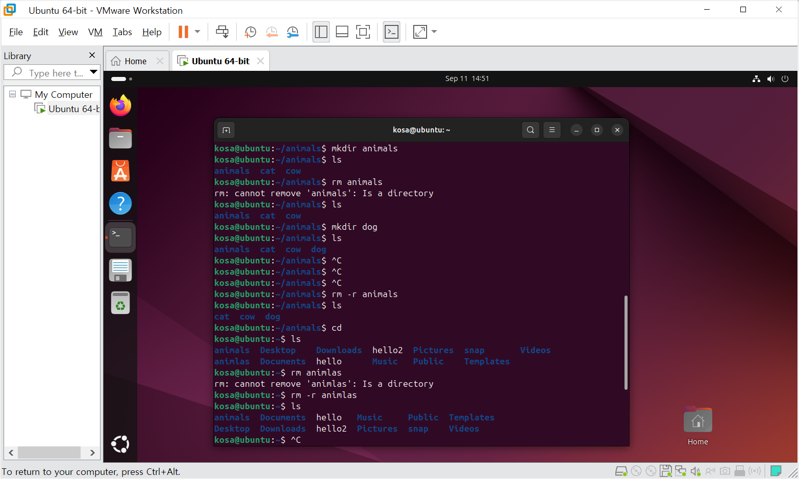

# 41일차

## Linux 터미널·셸 및 파일 시스템 기초

📌 학습일 : 2026.09.11

📌 학습 내용 : 터미널, 셸, 셸 스크립트, Linux 기본 명령어, 파일 시스템,
디렉터리, 경로, 파일·디렉터리 생성

------------------------------------------------------------------------

#### 1. 터미널과 셸

터미널은 사용자와 컴퓨터가 명령을 주고받을 수 있도록 연결하는
프로그램이며, 셸은 운영체제에서 명령어를 입력하고 실행할 수 있도록
제공하는 명령어 기반 인터페이스이다.

-   **터미널** : 사용자와 컴퓨터가 상호작용하는 매체
-   **셸(Shell)** : 입력한 명령어를 처리하는 인터페이스
-   **Bash** : 리눅스에서 사용하는 대표적인 셸

#### 2. 셸 스크립트

셸 스크립트는 셸에서 실행할 수 있는 여러 명령어를 하나의 파일에 작성한
것이다.

``` bash
echo "Hello"
```

`nano` 편집기를 이용해 `hello.sh` 파일을 작성하고 저장한 뒤 실행하여
결과를 확인하였다.

#### 3. Linux 기본 명령어

``` bash
ls
ls -l
ls -al
```

-   `ls` : 파일과 디렉터리 목록 확인
-   `ls -l` : 파일 정보를 자세하게 출력
-   `ls -al` : 숨김 파일을 포함하여 자세하게 출력

``` bash
cd 디렉터리명
pwd
cat 파일명
man 명령어
exit
```

-   `cd` : 현재 작업 디렉터리 이동
-   `pwd` : 현재 작업 디렉터리의 절대 경로 확인
-   `cat` : 파일 내용 조회
-   `man` : 명령어나 개념에 대한 매뉴얼 확인
-   `exit` : 현재 실행 중인 셸 종료

#### 4. nano 텍스트 편집기

``` bash
nano 파일명
```

`nano`를 이용하여 터미널에서 새로운 파일을 생성하고 내용을 작성한 뒤
저장하는 방법을 실습하였다.

#### 5. 상대 경로와 절대 경로

-   **상대 경로** : 현재 작업 디렉터리를 기준으로 파일이나 디렉터리의
    위치를 표현
-   **절대 경로** : 루트 디렉터리(`/`)를 기준으로 전체 위치를 표현

현재 위치에 따라 상대 경로는 달라질 수 있지만 절대 경로는 항상 동일한
위치를 나타낸다.

#### 6. 파일 시스템

파일은 컴퓨터에서 데이터를 저장하고 조직화하는 기본 단위이며, 파일
시스템은 파일에 대한 정보를 관리하는 소프트웨어이다.

-   **디스크 기반 파일 시스템** : HDD, SSD 등의 저장 장치를 위한 파일
    시스템
-   **네트워크 기반 파일 시스템** : 서버의 저장 장치를 네트워크를 통해
    사용하는 파일 시스템
-   **가상 파일 시스템** : 시스템이나 프로세스 등의 정보를 파일과
    디렉터리 형태로 제공

#### 7. Linux 파일 계층 구조

Linux의 파일과 디렉터리는 계층 구조로 구성되며 가장 위에는 루트
디렉터리(`/`)가 존재한다.

Windows의 드라이브 방식과 달리 Linux에서는 파일 시스템이 설치된 저장
장치를 특정 디렉터리에 연결하여 사용하는 구조를 학습하였다.

#### 8. 디렉터리

-   **루트 디렉터리** : 파일 시스템의 최상위 디렉터리
-   **현재 작업 디렉터리** : 현재 Bash가 실행되고 있는 디렉터리
-   **홈 디렉터리** : 사용자별로 할당되는 개인 디렉터리

``` bash
pwd
```

`pwd`를 이용하여 현재 작업 중인 디렉터리의 위치를 확인하였다.

#### 9. mkdir을 이용한 디렉터리 생성

``` bash
mkdir animals
mkdir dog cat cow
mkdir snake
```

`mkdir` 명령어를 이용하여 하나 또는 여러 개의 디렉터리를 생성하는 방법을
실습하였다.

#### 10. mkdir -p를 이용한 하위 디렉터리 생성

``` bash
mkdir -p fruits/apple
```

상위 디렉터리가 존재하지 않을 때 `-p` 옵션을 이용하여 상위 디렉터리와
하위 디렉터리를 함께 생성하는 방법을 배웠다.

`-p` 옵션을 사용하지 않았을 때와 사용했을 때의 차이도 직접 확인하였다.

---

#### 핵심 정리

-   터미널은 사용자와 컴퓨터가 상호작용하기 위한 매체이다.
-   셸은 운영체제가 제공하는 명령어 기반 인터페이스이다.
-   셸 스크립트를 이용하면 여러 명령어를 하나의 파일에 작성하여 실행할
    수 있다.
-   `ls`, `cd`, `pwd`, `cat`, `man`, `exit` 등의 Linux 기본 명령어를
    학습하였다.
-   `nano`를 이용하여 터미널에서 파일을 작성하고 저장할 수 있다.
-   상대 경로는 현재 작업 디렉터리, 절대 경로는 루트 디렉터리를 기준으로
    한다.
-   Linux의 파일과 디렉터리는 루트 디렉터리를 기준으로 계층 구조를
    가진다.
-   파일 시스템에는 디스크 기반, 네트워크 기반, 가상 파일 시스템 등이
    있다.
-   `mkdir`로 디렉터리를 생성하고 `mkdir -p`로 상위·하위 디렉터리를 함께
    생성할 수 있다.

---

<p align="center">
  
</p>
