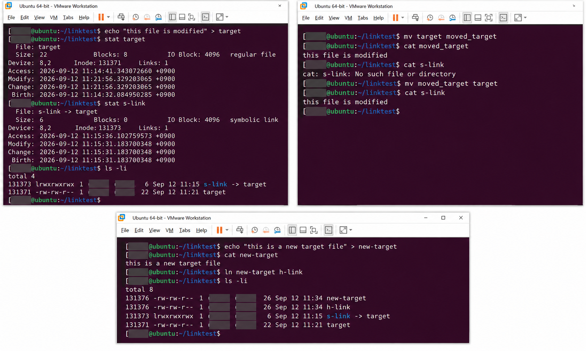

# 42일차

## Linux 파일·디렉터리 관리, 링크 및 사용자 관리

📌 학습일 : 2026.09.12

📌 학습 내용 : 디렉터리 이동·생성·삭제, 파일 복사·이동·삭제, inode, 소프트 링크, 하드 링크, Linux 사용자 계정 관리

---

#### 1. 디렉터리 이동 및 경로 확인

`cd` 명령어를 이용하여 디렉터리를 이동하고 `pwd`를 이용하여 현재 작업 디렉터리의 위치를 확인하였다.

```bash
cd
pwd
/home/user

cd Downloads/
pwd
/home/user/Downloads

cd ../Pictures/
pwd
/home/user/Pictures
```

- `cd` : 홈 디렉터리 또는 지정한 디렉터리로 이동
- `pwd` : 현재 작업 디렉터리의 절대 경로 확인
- `..` : 현재 디렉터리의 상위 디렉터리
- `.` : 현재 작업 디렉터리

상대 경로와 절대 경로를 이용하여 같은 디렉터리로 이동하는 방법을 실습하였다.

#### 2. mkdir을 이용한 디렉터리 생성

```bash
mkdir animals/snake
```

`mkdir`을 이용하여 새로운 디렉터리를 생성하였다.

상위 디렉터리가 존재하지 않는 상태에서 하위 디렉터리를 생성하면 오류가 발생하는 것도 확인하였다.

```bash
mkdir fruits/apple
mkdir: cannot create directory 'fruits/apple': No such file or directory
```

이 경우 `-p` 옵션을 사용하면 필요한 상위 디렉터리까지 함께 생성할 수 있다.

```bash
mkdir -p fruits/apple
```

#### 3. rmdir을 이용한 디렉터리 삭제

`rmdir`은 비어 있는 디렉터리를 삭제할 때 사용하는 명령어이다.

```bash
rmdir cat
rmdir cow dog snake
```

내용이 존재하는 디렉터리는 `rmdir`만으로 삭제할 수 없다는 것을 확인하였다.

```bash
rmdir fruits/
rmdir: failed to remove 'fruits/': Directory not empty
```

```bash
rmdir -p fruits/apple
```

`-p` 옵션을 이용하면 하위 디렉터리를 삭제한 뒤 비어 있는 상위 디렉터리까지 함께 삭제할 수 있다.

#### 4. cp를 이용한 파일 복사

`cp` 명령어를 이용하여 파일을 다른 이름으로 복사하는 방법을 실습하였다.

```bash
echo "hello word" > greetings

cp greetings say_hello

cat say_hello
hello word
```

여러 파일을 하나의 디렉터리로 복사하는 방법도 확인하였다.

```bash
mkdir temporary
cp greetings say_hello temporary/
```

#### 5. mv를 이용한 파일 이동 및 이름 변경

`mv`는 파일이나 디렉터리를 다른 위치로 이동하거나 이름을 변경할 때 사용한다.

```bash
mv say_hello hello
mv greetings welcom
```

다른 디렉터리에 있는 파일을 현재 작업 디렉터리로 이동할 수도 있다.

```bash
mv temporary/hello ./
```

파일을 이동하면서 이름을 동시에 변경하는 방법도 실습하였다.

```bash
mv temporary/welcom ./welcome
mv welcome WELCOME
```

Linux에서는 파일 이름의 대소문자를 구분하기 때문에 `welcome`과 `WELCOME`은 서로 다른 이름으로 처리된다.

#### 6. mv를 이용한 디렉터리 이동 및 이름 변경

파일뿐만 아니라 디렉터리도 `mv`를 이용하여 이동하거나 이름을 변경할 수 있다.

```bash
mkdir haha
mv haha hoho
mv hoho temporary/
mv temporary/hoho ./hihi
```

`hoho` 디렉터리를 이동한 뒤 다시 가져오면서 `hihi`로 이름을 변경하는 과정을 실습하였다.

#### 7. rm을 이용한 파일 및 디렉터리 삭제

일반 파일은 `rm` 명령어를 이용하여 삭제할 수 있다.

```bash
rm say_hello
```

`-i` 옵션을 이용하면 삭제하기 전에 사용자에게 삭제 여부를 확인한다.

```bash
rm -i hello
rm: remove regular file 'hello'? y
```

일반 `rm`으로 디렉터리를 삭제하려고 하면 오류가 발생하는 것을 확인하였다.

```bash
rm temporary/
rm: cannot remove 'temporary/': Is a directory
```

비어 있는 디렉터리는 `rm -d`로 삭제할 수 있지만 내용이 존재하는 디렉터리는 삭제되지 않는다.

```bash
rm -d hihi/
rm: cannot remove 'hihi/': Directory not empty
```

디렉터리 내부의 내용까지 함께 삭제할 때는 `-r` 옵션을 사용한다.

```bash
rm -r hihi/
```

`rm -r`은 하위 파일과 디렉터리까지 함께 삭제하기 때문에 사용하기 전에 삭제 대상을 확인하는 것이 중요하다.

#### 8. inode와 파일 정보 확인

Linux에서는 파일 이름과 실제 파일의 정보가 분리되어 관리된다.

- **inode** : 파일의 메타데이터와 실제 데이터 위치 등의 정보를 관리
- **inode 번호** : inode를 식별하는 번호
- **데이터 블록** : 파일의 실제 내용이 저장되는 영역
- **dentry** : 파일 이름과 inode를 연결하는 정보

```bash
ls -li
stat target
```

`ls -li`와 `stat`을 이용하여 파일의 inode 번호와 링크 수를 직접 확인하였다.

#### 9. 소프트 링크 생성

소프트 링크는 대상 파일의 경로를 가리키는 링크이며 심볼릭 링크라고도 한다.

```bash
echo "this is a target file" > target
ln -s target s-link
```

`ls -li`를 이용하여 확인한 결과 원본 파일과 소프트 링크의 inode 번호가 서로 다른 것을 확인하였다.

```text
131373 lrwxrwxrwx 1 user user  6 s-link -> target
131371 -rw-rw-r-- 1 user user 22 target
```

소프트 링크를 통해 원본 파일의 내용을 확인할 수 있었다.

```bash
cat s-link
this is a target file
```

#### 10. 소프트 링크 대상 파일 이동

원본 파일의 이름을 변경한 뒤 소프트 링크에 접근하였다.

```bash
mv target moved_target

cat s-link
cat: s-link: No such file or directory
```

소프트 링크는 원본의 경로를 가리키기 때문에 대상 파일의 이름이나 위치가 변경되면 기존 경로를 찾지 못해 링크가 깨질 수 있다는 것을 확인하였다.

원본 파일 이름을 다시 복원하자 소프트 링크도 정상적으로 동작하였다.

```bash
mv moved_target target

cat s-link
this file is modified
```

#### 11. 하드 링크 생성 및 inode 확인

하드 링크는 기존 파일과 동일한 inode를 공유하는 또 하나의 파일 이름을 만드는 방식이다.

```bash
echo "this is a new target file" > new-target
ln new-target h-link
```

`ls -li`로 확인한 결과 두 파일의 inode 번호가 동일하고 링크 수가 `2`로 증가하였다.

```text
131376 -rw-rw-r-- 2 user user 26 h-link
131376 -rw-rw-r-- 2 user user 26 new-target
```

#### 12. 하드 링크 파일 수정 및 삭제

원본 파일의 내용을 변경한 뒤 하드 링크의 내용을 확인하였다.

```bash
echo "modified version of new target file" > new-target

cat new-target
modified version of new target file

cat h-link
modified version of new target file
```

두 파일이 동일한 inode를 공유하기 때문에 어느 이름으로 접근해도 같은 내용이 출력되는 것을 확인하였다.

원본 파일의 이름을 변경해도 하드 링크는 계속 사용할 수 있었다.

```bash
mv new-target new_target2
```

이후 `new_target2`를 삭제한 뒤에도 `h-link`가 남아 있었으며 링크 수만 `2`에서 `1`로 감소하였다.

```bash
rm new_target2
```

```text
131376 -rw-rw-r-- 1 user user 36 h-link
```

#### 13. 소프트 링크와 하드 링크 비교

- **소프트 링크** : 대상 파일의 경로를 가리키며 원본과 다른 inode를 사용
- **하드 링크** : 대상 파일과 동일한 inode를 공유
- 소프트 링크는 대상의 경로나 이름이 변경되면 링크가 깨질 수 있음
- 하드 링크는 한쪽 파일 이름을 변경해도 같은 inode를 통해 계속 접근 가능
- 하드 링크 중 하나를 삭제해도 다른 하드 링크가 남아 있으면 데이터에 접근 가능

#### 14. Linux 사용자 계정 정보 확인

Linux의 사용자 계정 기본 정보는 `/etc/passwd` 파일에서 확인할 수 있다.

```bash
cat /etc/passwd
```

사용자 정보는 다음과 같은 구조로 저장된다.

```text
사용자이름:x:UID:GID:설명:홈디렉터리:로그인셸
```

- **사용자 이름** : 로그인할 때 사용하는 계정 이름
- **UID** : 사용자를 식별하는 ID
- **GID** : 사용자가 속한 기본 그룹의 ID
- **홈 디렉터리** : 사용자에게 할당된 기본 디렉터리
- **로그인 셸** : 로그인 후 사용하는 셸

실습에서는 사용자 및 시스템 계정 정보가 `/etc/passwd`에 저장되는 것을 확인하였다.

※ 공개 저장소 기록을 위해 실제 시스템의 전체 사용자 계정 출력은 생략하였다.

#### 15. 사용자 계정 생성

`adduser`를 이용하여 실습용 사용자 계정을 생성하였다.

```bash
sudo adduser testuser
```

사용자를 생성하면서 사용자 그룹과 홈 디렉터리가 함께 생성되는 것을 확인하였다.

```text
info: Adding new group `testuser' ...
info: Adding new user `testuser' with group `testuser' ...
info: Creating home directory `/home/testuser' ...
info: Copying files from `/etc/skel' ...
```

※ sudo 비밀번호 입력 프롬프트와 사용자 비밀번호 설정 과정은 공개 기록에서 생략하였다.

#### 16. 사용자 홈 디렉터리 확인

생성한 사용자의 홈 디렉터리를 확인하였다.

```bash
sudo ls -al /home/testuser/
```

```text
.bash_logout
.bashrc
.profile
```

사용자를 생성하면 `/etc/skel`의 기본 설정 파일이 새로운 사용자의 홈 디렉터리에 복사되는 것을 확인하였다.

로그인 화면에서도 기존 사용자와 새로 생성한 실습용 사용자 `testuser`가 표시되는 것을 확인하였다.

#### 17. 사용자 계정 삭제 및 확인

실습용 사용자와 홈 디렉터리를 삭제하였다.

```bash
sudo deluser --remove-home testuser
```

삭제 후 `/etc/passwd`와 `/etc/group`에서 사용자 및 그룹 정보가 제거되었는지 확인하였다.

```bash
grep testuser /etc/passwd
grep testuser /etc/group
```

출력 결과가 없으므로 `testuser` 사용자와 그룹이 삭제되었음을 확인하였다.

이후 홈 디렉터리 상태를 다시 확인했을 때 UID/GID `1001` 소유의 `.cache` 디렉터리가 남아 있는 것도 확인하였다.

```text
/home/testuser/.cache
```

사용자 계정을 삭제한 뒤에는 계정 정보뿐만 아니라 관련 파일이나 디렉터리가 남아 있는지도 확인할 필요가 있다는 것을 알게 되었다.

---

#### 핵심 정리

- `cd`와 `pwd`를 이용하여 디렉터리를 이동하고 현재 작업 경로를 확인할 수 있다.
- `mkdir`로 디렉터리를 생성하며 `mkdir -p`를 사용하면 필요한 상위 디렉터리까지 함께 생성할 수 있다.
- `rmdir`은 비어 있는 디렉터리를 삭제할 때 사용한다.
- `cp`를 이용하여 파일을 복사할 수 있다.
- `mv`는 파일과 디렉터리의 이동 및 이름 변경에 사용한다.
- `rm`은 파일 삭제에 사용하며 `rm -r`을 이용하면 내용이 있는 디렉터리를 재귀적으로 삭제할 수 있다.
- inode는 파일의 메타데이터와 데이터 위치 등의 정보를 관리한다.
- 소프트 링크는 대상의 경로를 가리키며 원본과 서로 다른 inode를 가진다.
- 하드 링크는 같은 inode를 공유하므로 한쪽 파일 이름이 변경되거나 삭제되어도 다른 링크를 통해 접근할 수 있다.
- `/etc/passwd`에서 Linux 사용자 계정의 기본 정보를 확인할 수 있다.
- `sudo adduser`로 사용자를 생성하고 `sudo deluser --remove-home`으로 사용자를 삭제할 수 있다.
- 사용자 삭제 후에는 `/etc/passwd`, `/etc/group`, 홈 디렉터리 등을 확인하여 관련 정보가 제대로 정리되었는지 확인하는 것이 중요하다.

---

<p align="center">
  
</p>

소프트 링크와 하드 링크는 설명만 봤을 때는 차이가 헷갈렸지만 `ls -li`와 `stat`을 이용하여 inode 번호를 직접 비교하고, 원본 파일의 이름을 변경하거나 삭제해 보면서 차이를 이해할 수 있었다.
<br/>특히 소프트 링크는 원본의 경로가 변경되면 링크가 깨지는 반면, 하드 링크는 같은 inode를 공유하기 때문에 한쪽 파일을 삭제해도 다른 링크를 통해 계속 접근할 수 있다는 점이 기억에 남았다.
<br/>파일과 디렉터리를 삭제할 때는 `rmdir`, `rm -d`, `rm -r`처럼 대상의 상태에 따라 사용하는 명령어와 옵션이 달라진다는 것도 실습을 통해 확인하였다.
<br/>사용자 계정을 생성하고 삭제한 뒤 `/etc/passwd`, `/etc/group`, 홈 디렉터리 상태까지 다시 확인하면서 명령어를 실행하는 것뿐만 아니라 실행 결과를 직접 검증하는 과정도 중요하다고 느꼈다.
