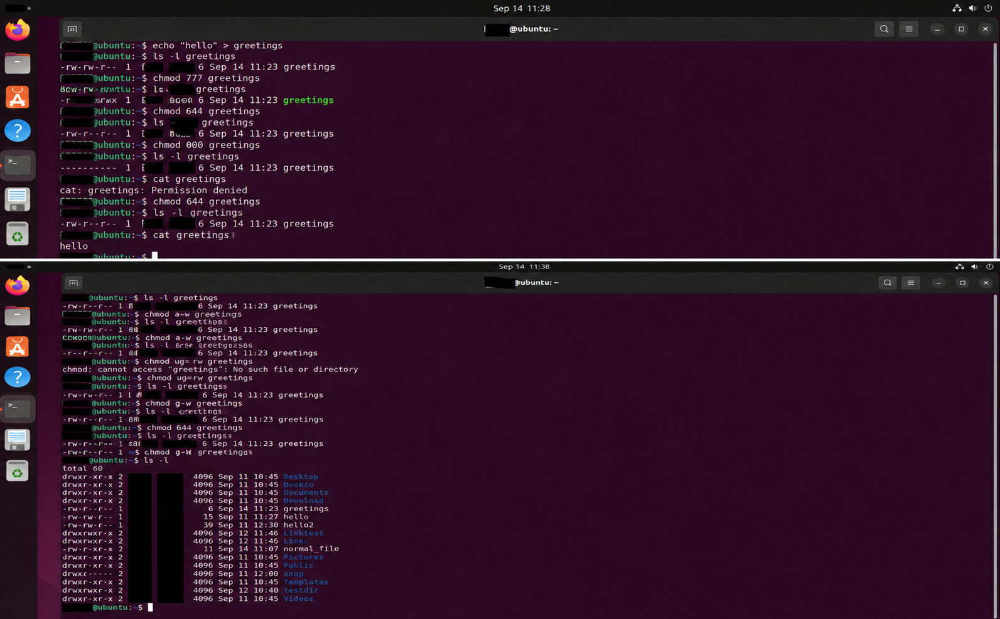

# 43일차

## Linux 사용자·그룹·권한 및 프로세스 관리

📌 학습일 : 2026.09.14

📌 학습 내용 : 사용자·그룹 관리, `/etc/passwd`, `/etc/group`, 소유권과
권한, 프로세스, 스레드, 표준 스트림, 포어그라운드·백그라운드 작업, IPC

---

#### 1. 사용자 정보와 /etc/passwd

Linux에서는 사용자 정보를 `/etc/passwd` 파일에서 관리한다.

``` bash
cat /etc/passwd
```

사용자 정보에는 사용자 이름, 비밀번호 표시, UID, GID, 설명, 홈 디렉터리,
로그인 셸 등이 포함된다.

-   **사용자 이름** : 사용자를 구분하는 이름
-   **비밀번호** : `/etc/passwd`에는 `x`로 표시되며 실제 암호화된
    비밀번호는 `/etc/shadow`에 저장
-   **UID** : 사용자를 구분하는 사용자 ID
-   **GID** : 사용자가 속한 그룹의 ID
-   **홈 디렉터리** : 일반적으로 `/home/사용자명` 형태로 설정
-   **로그인 셸** : 사용자가 로그인할 때 실행되는 셸의 절대 경로

#### 2. 사용자 그룹 정보와 /etc/group

사용자 그룹 정보는 `/etc/group` 파일에서 관리한다.

``` bash
grep 그룹명 /etc/group
```

그룹 정보에는 그룹 이름, 비밀번호 표시, GID, 그룹에 속한 사용자 목록
등이 포함된다.

#### 3. 그룹 생성 및 사용자 추가

``` bash
sudo addgroup 그룹명
sudo adduser --ingroup 그룹명 유저명
```

`addgroup`으로 그룹을 생성하고 `adduser --ingroup`으로 사용자를 특정
그룹에 소속시키는 방법을 실습하였다.

사용자가 생성되면 UID가 부여되고 홈 디렉터리도 함께 생성되는 것을
확인하였다.

``` bash
sudo deluser 유저명
sudo delgroup 그룹명
```

`deluser`와 `delgroup`을 이용하여 사용자와 그룹을 삭제할 수 있다는 것도
학습하였다.

#### 4. 사용자 전환 및 비밀번호 변경

``` bash
su - 유저명
whoami
exit
```

`su -`로 다른 사용자 계정으로 전환하고 `whoami`로 현재 사용자를
확인하였다.

``` bash
passwd
sudo passwd 유저명
```

일반 사용자가 자신의 비밀번호를 변경하는 방법과 관리자 권한으로 다른
사용자의 비밀번호를 변경하는 방법을 실습하였다.

#### 5. 파일 소유권

파일 소유권은 해당 파일이 어떤 사용자와 그룹의 소유인지를 나타내는
속성이다.

``` bash
ls -l 파일명
sudo chown 유저명 파일명
sudo chown 유저명:그룹명 파일명
```

`chown`을 이용하여 파일의 소유자 또는 소유자와 소유 그룹을 함께 변경하고
`ls -l`로 결과를 확인하였다.

#### 6. 파일 권한

파일 권한은 파일에 대해 읽기, 쓰기, 실행 중 어떤 작업을 할 수 있는지를
정의한다.

-   `r` : 읽기 권한
-   `w` : 쓰기 권한
-   `x` : 실행 권한

권한은 파일의 **소유자(user)**, **소유 그룹(group)**, **기타
사용자(other)**별로 각각 설정할 수 있다.

#### 7. 8진수 표기법을 이용한 chmod

``` bash
chmod 777 파일명
chmod 644 파일명
chmod 000 파일명
```

`chmod`를 이용하여 파일 권한을 8진수 3자리로 설정하는 방법을 실습하였다.

-   `777` : 모든 사용자에게 읽기·쓰기·실행 권한 부여
-   `644` : 소유자는 읽기·쓰기, 그룹과 기타 사용자는 읽기
-   `000` : 모든 권한 제거

``` bash
ls -l 파일명
```

권한을 변경한 뒤 `ls -l`로 실제 권한 표시가 어떻게 달라지는지
확인하였다.

#### 8. 의미 표기법을 이용한 chmod

``` bash
chmod u+w 파일명
chmod g-w 파일명
chmod g+w 파일명
chmod o-r 파일명
chmod a+x 파일명
```

기존 권한을 기준으로 특정 사용자의 권한을 추가하거나 제거하는 의미
표기법을 실습하였다.

-   `u` : 소유자
-   `g` : 그룹
-   `o` : 기타 사용자
-   `a` : 모든 사용자
-   `+` : 권한 추가
-   `-` : 권한 제거

#### 9. 사용자별 읽기·쓰기 권한 실습

``` bash
cat 파일명
echo "내용" > 파일명
```

여러 사용자로 전환하여 같은 파일을 읽거나 수정하면서 권한에 따른 차이를
확인하였다.

권한이 부족하면 다음과 같은 오류가 발생하였다.

``` text
Permission denied
Operation not permitted
```

같은 그룹에 속한 사용자라도 그룹에 필요한 권한이 없으면 파일을 수정할 수
없으며, 파일 소유자가 아닌 사용자가 권한을 변경하려고 하면 제한될 수
있다는 것을 확인하였다.

#### 10. 파일 실행 권한

``` bash
echo "echo 메시지" > 파일명
chmod a+x 파일명
./파일명
```

파일에 실행 권한을 추가하고 직접 실행하는 방법을 실습하였다. 셸 명령어가
작성된 파일에 실행 권한을 부여한 뒤 실행 결과를 확인하였다.

#### 11. 디렉터리 권한

디렉터리에도 읽기, 쓰기, 실행 권한이 존재하지만 파일의 권한과 의미가
다르게 적용된다.

-   **읽기(r)** : 디렉터리 내부의 파일 목록을 확인
-   **쓰기(w)** : 디렉터리 내부에서 파일이나 디렉터리를 생성·삭제
-   **실행(x)** : 디렉터리에 들어가 내부 파일에 접근

특히 디렉터리의 쓰기 권한은 실행 권한과 함께 있을 때 실제 작업에 사용할
수 있다는 것을 학습하였다.

#### 12. 공유 디렉터리 권한 실습

``` bash
sudo mkdir 디렉터리명
sudo chmod 777 디렉터리명
```

여러 사용자가 접근할 수 있도록 디렉터리를 만든 뒤 사용자별로 파일을
생성하고 읽거나 수정해 보았다.

``` bash
chmod o+w 디렉터리명
chmod o+rx /home/유저명
```

홈 디렉터리와 하위 디렉터리의 권한을 변경하면서 상위 디렉터리에 접근
권한이 없으면 하위 디렉터리에도 접근할 수 없다는 것을 확인하였다.

#### 13. 접근이 제한된 디렉터리

``` bash
mkdir 비공개디렉터리
chmod g-rwx 비공개디렉터리
```

그룹의 읽기, 쓰기, 실행 권한을 제거하여 다른 사용자의 접근을 제한하는
방법을 실습하였다.

또한 sudo 권한이 없는 사용자가 관리자 명령을 실행하면 다음과 같이
제한되는 것을 확인하였다.

``` text
유저명 is not in the sudoers file.
```

#### 14. 프로그램과 프로세스

-   **프로그램** : 디스크에 저장된 실행 파일
-   **프로세스** : 메모리에서 실행 중인 프로그램

컴퓨터는 CPU, 레지스터, RAM, 저장 장치, 시스템 버스 등을 이용하여
프로그램을 실행한다.

CPU는 명령어를 처리하고, RAM에는 실행 중인 프로그램의 코드와 데이터가
저장된다.

#### 15. 부모 프로세스와 자식 프로세스

프로세스는 다른 프로세스를 생성할 수 있으며 생성한 프로세스를 부모
프로세스, 생성된 프로세스를 자식 프로세스라고 한다.

Linux가 부팅될 때 최초로 생성되는 초기화 프로세스는 PID 1을 사용하며,
이후 여러 프로세스가 계층 구조로 생성된다.

종료 처리가 완전히 이루어지지 않은 프로세스를 **좀비 프로세스**, 부모
프로세스가 먼저 종료된 경우의 자식 프로세스를 **고아 프로세스**라고
한다.

#### 16. ps를 이용한 프로세스 조회

``` bash
ps
ps -f
ps -ef
ps -ef --forest
ps -ef | more
```

`ps`를 이용하여 현재 실행 중인 프로세스를 확인하였다.

-   `ps -f` : 자세한 프로세스 정보 확인
-   `ps -ef` : 전체 프로세스 확인
-   `ps -ef --forest` : 부모·자식 관계를 계층 형태로 확인
-   `ps -ef | more` : 많은 결과를 화면 단위로 확인

#### 17. 프로세스 생성과 종료

``` bash
sleep 300
ps -ef | grep sleep
kill PID
kill -KILL PID
killall -TERM sleep
```

`sleep`으로 프로세스를 실행한 뒤 PID를 검색하고 `kill`과 `killall`을
이용하여 프로세스를 종료하는 방법을 실습하였다.

#### 18. 프로세스의 생애 주기와 상태

프로세스는 생성된 뒤 실행되고 최종적으로 종료되는 생애 주기를 가진다.

주요 프로세스 상태는 다음과 같다.

-   **실행/실행 대기** : CPU에서 실행 중이거나 실행을 기다리는 상태
-   **중단** : 중단 시그널을 받아 멈춘 상태
-   **종료** : 실행이 끝난 상태
-   **수면** : 특정 이벤트가 발생하기를 기다리는 상태

프로세스의 종료 코드는 일반적으로 `0`이면 성공, `0` 이외의 값이면 실패를
의미한다.

#### 19. 프로세스 스케줄링과 컨텍스트 스위칭

여러 프로세스를 동시에 처리하기 위해 운영체제는 프로세스 스케줄링을
수행한다.

스케줄러는 공평성, 우선순위, 효율성, 응답 시간 등을 고려하여 CPU에서
처리할 프로세스를 선택한다.

**컨텍스트 스위칭**은 실행 중인 프로세스의 상태를 저장하고 다음
프로세스의 상태를 불러와 실행 대상을 변경하는 과정이다. 이때 프로세스의
상태 정보는 PCB(Process Control Block)에 저장된다.

#### 20. 스레드

스레드는 프로세스 내부에서 실행되는 가장 작은 실행 단위이다.

-   **싱글 스레드 프로세스** : 하나의 스레드로 실행
-   **멀티 스레드 프로세스** : 여러 개의 스레드로 실행

하나의 프로세스 안에서도 여러 스레드가 존재할 수 있다는 것을 학습하였다.

#### 21. 파일 디스크립터와 표준 스트림

파일 디스크립터는 프로세스가 파일 등을 관리하기 위해 사용하는 추상화된
개념이다.

Linux의 기본 표준 스트림은 다음과 같다.

-   `0` : 표준 입력(stdin)
-   `1` : 표준 출력(stdout)
-   `2` : 표준 에러(stderr)

프로세스는 표준 입력을 통해 데이터를 받고 표준 출력과 표준 에러를 통해
결과나 오류를 출력한다.

#### 22. 포어그라운드와 백그라운드 프로세스

-   **포어그라운드 프로세스** : 사용자와 직접 상호작용하면서 실행
-   **백그라운드 프로세스** : 사용자의 입력과 관계없이 뒤에서 실행

``` bash
ping 8.8.8.8
ping -c 3 8.8.8.8
ping -c 3 8.8.8.8 &
```

`ping`을 이용하여 포어그라운드와 백그라운드 실행 방식을 실습하였다.

#### 23. 작업 중단 및 백그라운드 전환

``` bash
Ctrl+Z
bg
jobs
```

실행 중인 작업을 `Ctrl+Z`로 중단한 뒤 `bg`를 이용하여 백그라운드에서
다시 실행하는 방법을 실습하였다.

`jobs` 명령어를 이용하면 현재 셸 세션에서 실행되고 있는 작업을 확인하고
관리할 수 있다는 것도 학습하였다.

#### 24. IPC와 파이프

IPC(Inter-Process Communication)는 서로 다른 프로세스가 데이터를
주고받기 위한 통신 방법이다.

**파이프(pipe)**는 두 프로세스 사이에서 데이터를 전달할 때 사용하는 IPC
방식이며, 파일 형태의 이름을 가지는 **명명된 파이프(named pipe)**도
존재한다.

``` bash
ps -ef | more
ps -ef | grep 프로세스명
```

실습에서 사용한 `|`도 앞 명령어의 출력을 다음 명령어의 입력으로 전달하는
파이프 방식이다.

#### 25. 메시지 큐와 소켓

프로세스 간 통신 방법으로 메시지 큐와 소켓도 학습하였다.

-   **메시지 큐** : 큐에 메시지를 넣고 빼면서 데이터를 교환하며 FIFO
    방식으로 처리
-   **소켓** : 네트워크로 연결된 다른 시스템의 프로세스와 통신할 때 사용

#### 26. 파일·디렉터리 권한 종합 실습

``` bash
touch 파일명
chmod 644 파일명
chmod 777 파일명
chmod o-w 파일명
```

숫자 방식과 의미 표기법을 함께 사용하여 파일의 권한 변화를 확인하였다.

``` text
-rw-r--r--
-rwxrwxrwx
-rwxrwxr-x
```

디렉터리도 동일하게 `chmod`로 권한을 변경하고 `ls -ld`로 디렉터리 자체의
권한을 확인하였다.

``` bash
mkdir 디렉터리명
chmod 777 디렉터리명
chmod o-w 디렉터리명
ls -ld 디렉터리명
```

마지막으로 `chown`을 이용하여 파일 소유자를 다른 사용자로 변경하고 실제
소유권 변화를 확인하였다.

---

#### 핵심 정리

-   사용자 정보는 `/etc/passwd`, 그룹 정보는 `/etc/group`에서 관리한다.
-   실제 암호화된 사용자 비밀번호는 `/etc/shadow`에 저장된다.
-   `adduser`, `deluser`, `addgroup`, `delgroup`으로 사용자와 그룹을
    관리할 수 있다.
-   `su`, `passwd`를 이용하여 사용자를 전환하고 비밀번호를 변경할 수
    있다.
-   `chown`은 파일의 소유자와 소유 그룹을 변경하는 명령어이다.
-   `chmod`는 파일과 디렉터리의 읽기, 쓰기, 실행 권한을 변경하는
    명령어이다.
-   파일 권한은 소유자, 그룹, 기타 사용자별로 각각 설정할 수 있다.
-   디렉터리의 읽기, 쓰기, 실행 권한은 파일 권한과 의미가 다르다.
-   프로그램은 디스크에 저장된 실행 파일이고 프로세스는 메모리에서 실행
    중인 프로그램이다.
-   프로세스는 부모·자식 관계를 가지며 다양한 실행 상태를 가진다.
-   프로세스 스케줄링과 컨텍스트 스위칭을 통해 여러 프로세스를 처리한다.
-   스레드는 프로세스 내부의 가장 작은 실행 단위이다.
-   표준 입력, 출력, 에러의 파일 디스크립터 번호는 각각 `0`, `1`,
    `2`이다.
-   `ps`, `grep`, `kill`, `killall`을 이용하여 프로세스를 조회하고
    종료할 수 있다.
-   `&`, `Ctrl+Z`, `bg`, `jobs`를 이용하여 포어그라운드와 백그라운드
    작업을 관리할 수 있다.
-   IPC에는 파이프, 메시지 큐, 소켓 등의 방식이 있다.

---

<p align="center">
  
</p>

chmod 명령어를 사용해 파일의 읽기·쓰기·실행 권한을 변경하는 방법을 배웠다. 권한을 000으로 설정하면 파일을 읽을 수 없어 Permission denied가 발생하고, 
다시 644로 변경하면 파일 내용 등을 확인할 수 있다는 것을 실습했다.

처음에는 숫자로 권한을 설정하는 방식이 조금 헷갈렸지만, o+w나 o+rw처럼 권한을 직접 추가하거나 변경하는 방식은 비교적 쉽게 이해할 수 있었다. 
</br>직접 권한을 변경하고 오류가 발생하는 과정까지 확인하면서 권한 설정이 실제 파일 사용에 바로 영향을 준다는 점이 기억에 남았다.
