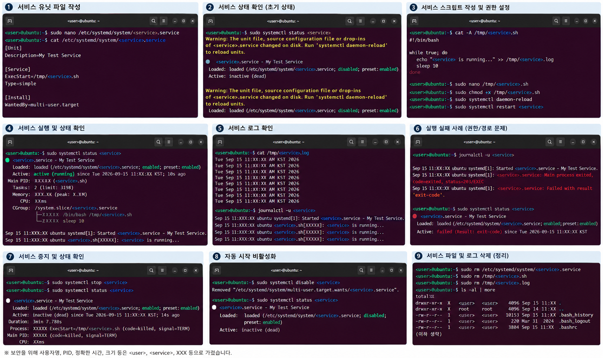

# 44일차

## Linux 리디렉션·파이프라인·시스템 관리 및 필수 커맨드라인 툴

📌 학습일 : 2026.09.15

📌 학습 내용 : 리디렉션, 표준 입력·출력·에러, Here Documents·Here Strings, 파이프라인, 패키지 관리 시스템, `apt`, `systemd`, 서비스 유닛 파일, `.bashrc`, `grep`, `find`, `stat`, `wc`, `df`, `du`, `tar`, `read`, `tr`

---

#### 1. 리디렉션(Redirection)

리디렉션은 **스트림을 파일로 저장하거나 파일의 내용을 스트림으로 가져오는 것**을 의미한다.

프로세스의 표준 입력, 표준 출력, 표준 에러의 흐름을 파일과 연결하여 명령어의 입력과 출력 방향을 변경할 수 있다.

#### 2. 출력 리디렉션

출력 리디렉션은 **프로세스의 출력 스트림을 파일로 출력하는 것**이다.

``` bash
echo "내용" > 파일명
echo "추가 내용" >> 파일명
```

-   `>` : 표준 출력을 파일에 저장하며 기존 내용이 있으면 덮어쓴다.
-   `>>` : 기존 내용을 유지하고 표준 출력을 파일 끝에 추가한다.

실습에서는 `echo`의 출력 결과를 파일에 저장한 뒤 `cat`으로 내용을 확인하고, `>`와 `>>`의 차이를 확인하였다.

#### 3. 표준 에러 리디렉션

표준 에러는 파일 디스크립터 `2`를 사용하며 `2>`를 이용해 오류 메시지를 파일로 리디렉션할 수 있다.

``` bash
명령어 2> 에러파일
```

표준 출력과 표준 에러를 서로 다른 파일에 저장하는 방법도 실습하였다.

``` bash
명령어 > 출력파일 2> 에러파일
```

한 스트림을 다른 스트림으로 리디렉션할 수도 있으며, 표준 에러를 표준 출력과 같은 곳으로 보내려면 다음과 같이 사용할 수 있다.

``` bash
명령어 > 파일명 2>&1
```

#### 4. 입력 리디렉션

입력 리디렉션은 **파일의 내용을 프로세스의 표준 입력으로 전달하는 것**이다.

``` bash
wc < 파일명
grep "검색문자열" < 파일명
```

실습에서는 파일 내용을 `wc`와 `grep`의 입력으로 전달하여 결과를 확인하였다.

``` bash
grep "검색문자열" < 입력파일 > 출력파일
```

입력과 출력 리디렉션을 함께 사용하여 파일에서 원하는 내용을 검색한 뒤 결과를 새로운 파일에 저장하는 방법도 확인하였다.

#### 5. Here Documents와 Here Strings

**Here Documents**는 프로세스의 입력 스트림에 연결할 내용을 파일에서 읽어오는 대신 셸에서 여러 줄로 직접 입력하는 방법이다.

``` bash
명령어 << EOF
입력할 내용
EOF
```

임시 파일을 별도로 생성하고 삭제하지 않아도 여러 줄의 데이터를 표준 입력으로 전달할 수 있다.

**Here Strings**는 Here Documents와 유사하지만 한 줄의 텍스트를 표준 입력으로 전달할 때 사용한다.

``` bash
명령어 <<< "입력할 내용"
```

#### 6. 파이프라인(Pipeline)

파이프라인은 **프로세스 스트림 간의 상호작용**으로, 앞 명령어의 표준 출력을 다음 명령어의 표준 입력으로 전달한다.

``` bash
cat 파일명 | grep "검색문자열"
```

실습에서는 `cat`, `grep`, `wc` 등을 파이프로 연결하여 여러 명령어의 결과를 연속적으로 처리하였다.

``` bash
cat 파일명 | grep "검색문자열" | wc
```

#### 7. 파이프라인의 프로세스 종료 코드

`$?`를 이용하여 직전에 실행한 명령이나 파이프라인의 종료 코드를 확인할 수 있다.

``` bash
echo $?
```

일반적으로 종료 코드 `0`은 정상 종료를 의미하며, `0` 이외의 값은 다른 종료 상태를 의미한다.

`pipefail` 옵션이 비활성화된 상태에서는 파이프라인에서 **마지막으로 실행된 명령의 종료 코드**가 전체 파이프라인의 종료 코드가 되는 것을 실습을 통해 확인하였다.

#### 8. 패키지와 패키지 관리 시스템

**패키지(package)**는 소프트웨어 프로그램과 관련 파일을 포함한 묶음이다.

**패키지 관리 시스템(PMS, Package Management System)**은 패키지의 설치, 업데이트, 구성, 제거를 자동화하고 관리하는 시스템이다.

Ubuntu에서는 `apt(Advanced Package Tool)`를 이용하여 패키지를 관리한다.

#### 9. apt를 이용한 패키지 관리

``` bash
apt list
apt list --installed
sudo apt update
sudo apt install 패키지명
sudo apt remove 패키지명
sudo apt autoremove
```

-   `apt list` : 패키지 목록 조회
-   `apt list --installed` : 설치된 패키지 조회
-   `apt update` : 패키지 DB 업데이트
-   `apt install` : 패키지 설치
-   `apt remove` : 패키지 삭제
-   `apt autoremove` : 더 이상 필요하지 않은 의존 패키지 제거

실습에서는 패키지 목록을 확인하고 `apt update`로 패키지 정보를 갱신한 뒤 패키지를 설치·삭제·재설치하였다. 삭제 과정에서 작업을 취소하는 경우와 불필요한 의존 패키지를 함께 제거하는 과정도 확인하였다.

#### 10. systemd와 데몬

**데몬(daemon) 프로세스**는 백그라운드에서 실행되면서 특정 기능을 수행하는 프로세스이다.

`systemd`는 Linux에서 서비스와 시스템 동작을 관리하며, 서비스의 설정은 **유닛 파일(unit file)**에 정의한다.

유닛 파일에는 서비스에 필요한 설정, 실행 방법, 실행 시점, 다른 서비스와의 의존성, 실패 시 재시작 방법 등을 설정할 수 있다.

#### 11. systemctl을 이용한 서비스 관리

``` bash
systemctl list-units
systemctl cat 서비스명
sudo systemctl start 서비스명
sudo systemctl stop 서비스명
sudo systemctl status 서비스명
sudo systemctl enable 서비스명
sudo systemctl disable 서비스명
sudo systemctl daemon-reload
```

-   `list-units` : 현재 시스템의 유닛 목록 조회
-   `start` : 서비스 시작
-   `stop` : 서비스 중지
-   `status` : 서비스 현재 상태 확인
-   `enable` : 부팅할 때 서비스가 자동으로 시작되도록 설정
-   `disable` : 부팅할 때 서비스가 자동으로 시작되지 않도록 설정
-   `cat` : 서비스의 유닛 파일 내용 조회
-   `daemon-reload` : 변경된 systemd 관리자 설정을 다시 읽어들임

#### 12. systemd 유닛 파일의 주요 디렉터리

systemd 유닛 파일은 목적에 따라 서로 다른 디렉터리에 저장된다.

-   `/etc/systemd/system/` : 시스템 관리자가 생성하거나 수정한 유닛 파일
-   `/usr/lib/systemd/system/` : 시스템에 설치된 패키지가 제공하는 유닛 파일

실습에서는 기존 서비스의 유닛 파일을 조회하고 사용자 정의 서비스 파일을 `/etc/systemd/system/`에 생성하였다.

#### 13. 서비스 유닛 파일의 구조

서비스 유닛 파일은 주로 `[Unit]`, `[Service]`, `[Install]` 섹션으로 구성된다.

``` ini
[Unit]
Description=서비스 설명

[Service]
ExecStart=실행할 파일
Type=simple

[Install]
WantedBy=multi-user.target
```

-   **Unit 섹션** : 설명, 문서 링크 등 유닛의 기본 정보와 다른 유닛에 대한 의존성 정의
-   **Service 섹션** : 서비스의 실행 방식, 환경 변수, 실행할 명령어 등을 정의
-   **Install 섹션** : 서비스를 활성화할 때 필요한 설정 정의

Install 섹션에서는 다음과 같은 설정을 사용할 수 있다.

-   `WantedBy` : 현재 서비스가 어떤 대상에 필요한지 지정
-   `Alias` : 서비스에 추가 이름인 별칭을 설정
-   `Also` : 해당 서비스를 활성화할 때 함께 활성화할 다른 서비스 지정

#### 14. systemd 서비스 등록 실습

서비스에서 실행할 스크립트를 생성하고 실행 권한을 부여한 뒤 유닛 파일을 작성하였다.

``` bash
chmod +x /tmp/서비스스크립트.sh
sudo nano /etc/systemd/system/서비스명.service
sudo systemctl daemon-reload
sudo systemctl start 서비스명
sudo systemctl status 서비스명
```

유닛 파일을 생성하거나 수정한 뒤 `daemon-reload`를 실행하여 systemd가 변경된 설정을 다시 읽도록 하였다.

``` bash
sudo systemctl enable 서비스명
sudo systemctl stop 서비스명
sudo systemctl disable 서비스명
```

서비스를 활성화하여 시스템이 초기화될 때 자동으로 시작되도록 설정하고, 이후 서비스를 종료하고 자동 시작을 비활성화하는 과정까지 실습하였다.

#### 15. .bashrc 파일을 이용한 개인화

`.bashrc`는 **Bash가 초기화될 때 읽어들이는 셸 스크립트 파일**이다.

`.bashrc`에서는 다음과 같은 설정을 할 수 있다.

1. 다른 파일을 읽어들인다.
2. 변수를 설정한다.
3. `alias`를 설정한다.
4. Bash 셸 옵션을 설정한다.

``` bash
nano ~/.bashrc
source ~/.bashrc
```

`source` 명령어를 이용하면 수정한 `.bashrc` 파일을 현재 셸에서 다시 읽어 변경 사항을 적용할 수 있다.

#### 16. .bashrc 변수와 alias 설정

`.bashrc`에는 사용자별로 초기화할 내용을 직접 설정할 수 있다.

**alias**는 특정 명령어에 별칭을 지정하는 기능으로, 자주 사용하는 긴 명령어를 짧게 사용하거나 특정 명령어의 기본 옵션을 지정할 때 활용할 수 있다.

``` bash
alias 별칭='명령어'
source ~/.bashrc
```

#### 17. grep

`grep(Global Regular Expression Print)`은 표준 입력이나 텍스트 파일에서 특정 패턴이나 문자열을 검색하는 커맨드라인 툴이다.

``` bash
grep "검색문자열" 파일명
grep -i "검색문자열" 파일명
```

`-i` 옵션을 사용하면 대소문자를 구분하지 않고 검색할 수 있다.

파이프라인과 함께 사용하여 다른 명령어의 출력 결과에서 필요한 내용만 검색할 수도 있다.

``` bash
명령어 | grep "검색문자열"
```

#### 18. find

`find`는 파일이나 디렉터리를 검색하는 커맨드라인 툴이다.

``` bash
find .
find 검색경로 -name "파일명"
find 검색경로 -name "*문자열*"
```

실습에서는 현재 디렉터리의 파일을 검색하고 특정 경로에서 이름이 정확히 일치하거나 특정 문자열이 포함된 파일을 검색하였다.

#### 19. stat

`stat`은 파일이나 파일 시스템의 상세한 상태 정보를 표시하는 커맨드라인 툴이다.

``` bash
stat 파일명
stat -t 파일명
```

파일의 크기, 블록, inode, 접근 권한, UID, GID 등의 상세 정보를 확인할 수 있다는 것을 학습하였다.

#### 20. wc

`wc(Word Count)`는 텍스트 파일의 줄 수, 단어 수, 바이트 수 등을 계산하는 커맨드라인 툴이다.

``` bash
wc 파일명
wc -l 파일명
wc -w 파일명
wc -c 파일명
```

-   `-l` : 줄 수 확인
-   `-w` : 단어 수 확인
-   `-c` : 바이트 수 확인

#### 21. df와 du

`df(Disk Free)`는 **파일 시스템의 디스크 사용량**을 확인하는 명령어이다.

``` bash
df
df -T
df -h
```

-   `-T` : 파일 시스템 종류와 사용량 확인
-   `-h` : 사람이 읽기 쉬운 단위로 출력

`du(Disk Usage)`는 **파일이나 디렉터리가 차지하는 디스크 사용량**을 추정하여 출력한다.

``` bash
du
du -h
```

`df`는 파일 시스템 전체의 사용량을 확인하고, `du`는 개별 파일이나 디렉터리가 차지하는 용량을 확인할 때 사용할 수 있다.

#### 22. tar와 아카이브

`tar(Tape Archive)`는 파일과 디렉터리를 아카이브하고 압축하는 데 사용하는 커맨드라인 툴이다.

**아카이브(archive)**는 여러 파일과 디렉터리를 하나의 파일로 묶는 것을 의미하며, 아카이브와 압축은 서로 다른 개념이다.

``` bash
tar -cvf archive.tar 파일명1 파일명2
tar -tvf archive.tar
tar -xvf archive.tar
```

-   `c` : 새로운 아카이브 생성
-   `t` : 아카이브 내부 목록 확인
-   `x` : 아카이브 해제
-   `v` : 처리 중인 파일 표시
-   `f` : 아카이브 파일명 지정

#### 23. tar를 이용한 gzip 압축과 해제

`z` 옵션을 사용하면 gzip 방식으로 tar 아카이브를 압축하거나 해제할 수 있다.

``` bash
tar -cvzf 압축파일.tar.gz 디렉터리명/
tar -xvzf 압축파일.tar.gz
```

특정 위치에 압축을 해제할 때는 `-C` 옵션을 사용할 수 있다.

``` bash
tar -xvzf 압축파일.tar.gz -C /경로
```

실습에서는 여러 파일을 tar 아카이브로 생성하고 기존 아카이브에 파일을 추가한 뒤 내부 목록을 확인하였다. 이후 gzip 방식으로 압축하고 다른 디렉터리에 압축을 해제하여 파일이 정상적으로 복원되는지 확인하였다.

#### 24. tar 압축 종합 실습

``` bash
mkdir 디렉터리명
cd 디렉터리명
touch 파일1.txt 파일2.txt 파일3.log
cd
tar -cvzf 디렉터리명.tar.gz 디렉터리명/
mkdir /tmp/복원디렉터리
tar -xvzf 디렉터리명.tar.gz -C /tmp/복원디렉터리
ls -l /tmp/복원디렉터리/디렉터리명
```

홈 디렉터리에 실습용 디렉터리와 여러 빈 파일을 생성하고 디렉터리 전체를 `tar.gz` 형식으로 압축하였다.

이후 `/tmp` 아래에 복원용 디렉터리를 생성하고 `-C` 옵션을 이용하여 압축을 해제한 뒤 파일이 정상적으로 복원되는 것을 확인하였다.

#### 25. read

`read`는 Bash의 내장 명령어로 **표준 입력에서 한 줄을 읽어 변수에 저장**할 때 사용한다.

``` bash
read 변수명
```

사용자가 입력한 값을 셸 스크립트에서 변수로 받아 처리할 때 활용할 수 있다.

#### 26. tr

`tr(translate)`은 **표준 입력으로 받은 문자들을 변환, 삭제, 압축하는 커맨드라인 툴**이다.

파이프라인과 함께 사용하면 앞 명령어에서 전달된 문자열을 변환하여 다음 작업에 활용할 수 있다.

``` bash
echo "hello" | tr 'a-z' 'A-Z'
```

문자 집합을 지정하여 특정 문자를 다른 문자로 변환하는 방식으로 사용할 수 있다는 것을 학습하였다.

---

#### 핵심 정리

-   리디렉션은 프로세스의 스트림을 파일로 저장하거나 파일의 내용을 스트림으로 전달하는 기능이다.
-   `>`는 표준 출력 덮어쓰기, `>>`는 표준 출력 추가, `2>`는 표준 에러 리디렉션에 사용한다.
-   `<`를 이용하면 파일의 내용을 프로세스의 표준 입력으로 전달할 수 있다.
-   Here Documents는 여러 줄, Here Strings는 한 줄의 텍스트를 표준 입력으로 직접 전달할 때 사용한다.
-   파이프라인은 앞 프로세스의 출력을 다음 프로세스의 입력으로 전달한다.
-   `pipefail`이 비활성화된 상태에서는 마지막 명령의 종료 코드가 파이프라인의 종료 코드가 된다.
-   패키지 관리 시스템은 소프트웨어의 설치, 업데이트, 구성, 제거를 관리하며 Ubuntu에서는 `apt`를 사용한다.
-   `systemd`는 서비스와 시스템 동작을 관리하고 서비스 설정은 유닛 파일에 정의한다.
-   `systemctl`을 이용하여 서비스를 시작·중지·조회·활성화·비활성화할 수 있다.
-   systemd 서비스 유닛 파일은 주로 `[Unit]`, `[Service]`, `[Install]` 섹션으로 구성된다.
-   `.bashrc`를 이용하여 사용자별 변수, alias, Bash 옵션 등을 설정할 수 있다.
-   `grep`은 문자열 검색, `find`는 파일·디렉터리 검색에 사용한다.
-   `stat`은 파일의 상세 정보, `wc`는 줄·단어·바이트 수를 확인한다.
-   `df`는 파일 시스템 전체의 디스크 사용량, `du`는 파일이나 디렉터리의 사용량을 확인한다.
-   `tar`는 여러 파일과 디렉터리를 하나의 아카이브로 묶고 gzip 등의 방식으로 압축하거나 해제할 수 있다.
-   `read`는 표준 입력을 변수에 저장하고 `tr`은 표준 입력의 문자를 변환·삭제·압축할 때 사용한다.

---

<p align="center">
  
</p>

리디렉션과 파이프라인을 이용해 명령어의 입력과 출력 흐름을 제어하는 방법을 배웠다. 또한 `apt`를 이용한 패키지 관리와 `systemd`를 이용한 서비스 등록·실행·중지 방법을 실습하고, `grep`, `find`, `stat`, `wc`, `df`, `du`, `tar` 등 리눅스에서 자주 사용하는 커맨드라인 툴의 사용 방법을 익혔다.

처음에는 리디렉션 기호와 `tar`의 여러 옵션이 비슷해 보여 헷갈렸지만, 직접 파일에 결과를 저장하고 압축·해제하는 과정을 반복하면서 각 옵션의 역할을 구분할 수 있었다. 특히 서비스를 직접 등록하고 실행 상태를 확인하는 과정을 통해 `systemd`가 리눅스의 서비스를 어떻게 관리하는지 이해하는 데 도움이 되었다.
