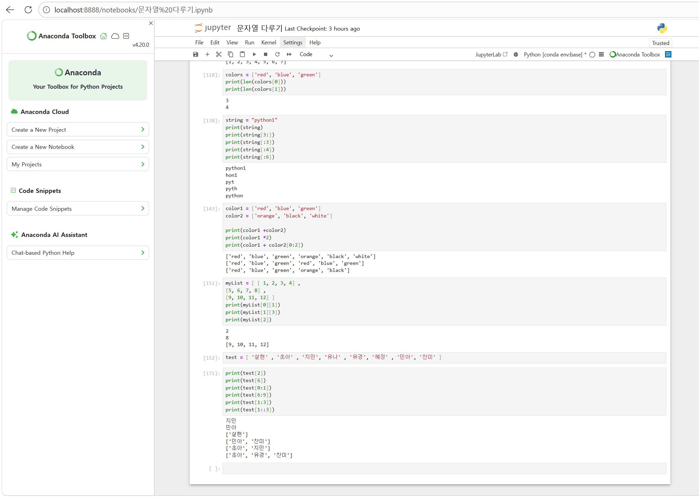

# 47일차 Python 기초 문법 · 문자열 · 리스트

📌 학습일 : 2026.09.18

---

## 학습 내용

### 1. Python 기본 문법과 사칙연산

-   정수와 실수의 기본 연산을 실습하였다.
-   `+`, `-`, `*`, `/` 연산자를 이용해 덧셈, 뺄셈, 곱셈, 나눗셈을
    수행하였다.
-   `**`를 이용한 거듭제곱, `%`를 이용한 나머지, `//`를 이용한 몫 계산을
    확인하였다.
-   변수에 값을 저장하고 변수끼리 연산하는 방법을 실습하였다.

``` python
a = 3
b = 4

print(a + b)
print(a - b)
print(a * b)
print(a / b)
print(a ** b)
print(7 % 3)
print(7 // 4)
```

### 2. 입력값을 이용한 사칙연산

-   `input()`으로 값을 입력받고 `int()`를 이용해 정수형으로 변환하였다.
-   입력받은 두 정수를 이용해 사칙연산 결과를 출력하였다.

``` python
x = int(input("첫 번째 정수를 입력하세요, x: "))
y = int(input("두 번째 정수를 입력하세요, y: "))

print("두 수의 합:", x + y)
print("두 수의 차:", x - y)
print("두 수의 곱:", x * y)
print("두 수의 나눗셈:", x / y)
```

### 3. 문자열 표현과 줄바꿈

-   작은따옴표와 큰따옴표를 이용해 문자열을 표현하였다.
-   문자열 내부에 따옴표가 필요한 경우 이스케이프 문자를 사용하는 방법을
    확인하였다.
-   `\n`을 사용해 문자열을 여러 줄로 출력하였다.
-   문자열의 `+` 연산으로 문자열을 연결하고 `*` 연산으로 문자열을
    반복하였다.

``` python
food = 'python\'s favorite food is perl'
multline = "Life is too short\nYou need python"

print(food)
print(multline)
```

### 4. 문자열 길이와 인덱싱

-   `len()`을 이용해 문자열의 길이를 확인하였다.
-   문자열의 각 문자는 `0`부터 시작하는 인덱스로 접근할 수 있다는 것을
    확인하였다.
-   음수 인덱스를 이용하면 문자열의 뒤쪽부터 접근할 수 있다.

``` python
a = "Life is too short, You need Python"

print(len(a))
print(a[0])
print(a[-1])
```

### 5. 문자열 슬라이싱

-   `[시작:끝]` 형식으로 문자열의 원하는 범위를 추출하였다.
-   시작이나 끝 인덱스를 생략하는 방법을 실습하였다.
-   날짜, 날씨 등의 문자열을 필요한 부분으로 분리하는 방법을 확인하였다.

``` python
a = "20010331Rainy"

year = a[:4]
day = a[4:8]
weather = a[8:]

print(year)
print(day)
print(weather)
```

### 6. 문자열 포매팅

-   `%d`, `%s`, `%f`를 이용한 문자열 포매팅을 실습하였다.
-   출력 폭과 소수점 자릿수를 지정하는 방법을 확인하였다.
-   f-string을 이용해 문자열 안에 변수와 연산 결과를 직접 삽입하였다.
-   여러 줄 문자열과 f-string을 함께 사용해 여러 줄에 변수를 포함하여
    출력하였다.

``` python
name = "홍길동"
age = 30

print(f"나의 이름은 {name}입니다. 나이는 {age}입니다.")
print(f"나는 내년이면 {age + 1}살이 된다.")
```

### 7. 동전 교환 실습

-   `//`와 `%`를 활용해 입력한 금액을 500원, 100원, 50원, 10원 단위로
    계산하였다.
-   계산한 값을 f-string을 이용해 여러 줄로 출력하였다.

``` python
money = int(input("교환할 돈은 얼마? "))

c500 = money // 500
money %= 500
c100 = money // 100
money %= 100
c50 = money // 50
money %= 50
c10 = money // 10
```

입력값이 `7777`일 때 결과:

``` text
500원짜리 ==> 15개
100원짜리 ==> 2개
50원짜리 ==> 1개
10원짜리 ==> 2개
```

### 8. 문자열 관련 함수

-   `count()` : 특정 문자의 개수를 확인
-   `find()` : 특정 문자의 위치를 검색
-   `join()` : 문자열 사이에 지정한 문자를 삽입
-   `strip()` : 문자열 양쪽의 공백 제거
-   `lower()` : 영문 대문자를 소문자로 변환
-   `replace()` : 문자열의 일부를 다른 문자열로 변경
-   `split()` : 문자열을 기준에 따라 나누어 리스트로 반환

``` python
a = "Life is too short"

print(a.replace("Life", "Your leg"))
print(a.split())
```

### 9. 리스트 생성과 인덱싱

-   숫자, 문자열 등 여러 데이터를 리스트에 저장하는 방법을 실습하였다.
-   리스트도 문자열처럼 인덱스를 이용해 원하는 요소에 접근할 수 있다.
-   리스트 안에 리스트가 있는 중첩 리스트의 요소에 접근하는 방법을
    확인하였다.

``` python
a = [1, 2, 3, ['a', 'b', 'c']]

print(a[0])
print(a[-1][0])
```

### 10. 리스트 슬라이싱과 연산

-   슬라이싱을 이용해 리스트의 일부 요소를 가져왔다.
-   `+`를 이용해 리스트를 연결하고 원하는 범위를 조합하였다.
-   `*`를 이용해 리스트의 요소를 반복하였다.

``` python
color1 = ['red', 'blue', 'green']
color2 = ['orange', 'black', 'white']

print(color1 + color2)
print(color1 * 2)
print(color1 + color2[0:2])
```

### 11. 리스트 수정 및 주요 함수

-   인덱스를 이용해 리스트의 값을 수정하였다.
-   슬라이싱과 `del`을 이용해 리스트의 일부 요소를 삭제하였다.
-   리스트에서 자주 사용하는 주요 함수를 실습하였다.

  함수          기능
  ------------- -------------------------------
  `append()`    리스트 끝에 요소 추가
  `sort()`      리스트 정렬
  `reverse()`   리스트 순서 뒤집기
  `index()`     특정 값의 인덱스 확인
  `insert()`    원하는 위치에 요소 삽입
  `remove()`    특정 값을 삭제
  `pop()`       리스트의 요소를 꺼내면서 삭제
  `count()`     특정 값의 개수 확인
  `extend()`    다른 리스트의 요소를 추가

### 12. 2차원 리스트와 슬라이싱 실습

-   2차원 리스트에서 `[행][열]` 형태로 원하는 값에 접근하였다.
-   리스트 슬라이싱을 이용해 원하는 범위의 요소를 추출하였다.
-   `[시작:끝:간격]` 형식을 이용해 일정한 간격으로 요소를 선택하였다.

``` python
myList = [[1, 2, 3, 4],
          [5, 6, 7, 8],
          [9, 10, 11, 12]]

print(myList[0][1])
print(myList[1][3])
print(myList[2])
```

``` python
test = ['설현', '초아', '지민', '유나', '유경', '혜정', '민아', '찬미']

print(test[2])
print(test[6])
print(test[0:1])
print(test[6:9])
print(test[1:3])
print(test[1::3])
```

### 13. Jupyter Notebook 기본 사용

-   코드 셀을 실행하면서 Python 코드와 실행 결과를 확인하였다.
-   Markdown 셀을 이용해 실습 내용과 설명을 함께 문서화하였다.
-   `Shift + Enter`, `Ctrl + Enter`, `Alt + Enter` 등 셀 실행 관련
    단축키를 확인하였다.

## 핵심 키워드

`Python` · `Jupyter Notebook` · `변수` · `사칙연산` · `input()` ·
`문자열` · `이스케이프 문자` · `인덱싱` · `슬라이싱` · `문자열 포매팅` ·
`f-string` · `문자열 함수` · `리스트` · `2차원 리스트` · `리스트 함수`

---

<p align="center">
  
</p>

문자열과 리스트에서 인덱스를 이용해 원하는 값에 접근하고, 슬라이싱을 이용해 필요한 범위의 데이터를 추출하는 방법을 배웠다. 
또한 리스트의 결합과 반복, 2차원 리스트에서 원하는 요소에 접근하는 방법도 실습하였다.
인덱싱과 슬라이싱의 범위를 지정하는 부분이 처음에는 헷갈렸지만, 여러 형태로 직접 값을 출력해 보면서 사용 방법을 이해할 수 있었다.
