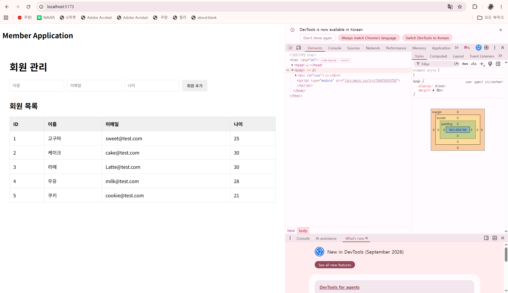

# 49일차

## Spring Boot REST API·JPA·Oracle·React 데이터 연동

📌 학습일 : 2026.09.21

📌 학습 내용 : Spring Data JPA, Entity, Repository, Entity 연관관계, REST API, Oracle 연동, CORS, Swagger/OpenAPI, React fetch, CRUD

---

#### 1. Spring Data JPA를 이용한 Entity 생성

```java
@Entity
public class 회원 {

    @Id
    @GeneratedValue(strategy = GenerationType.IDENTITY)
    private Long id;

    private String 이름;
    private String 이메일;
    private Integer 나이;
}
```

`@Entity`를 이용하여 데이터베이스 테이블과 연결되는 객체를 생성하였다.

`@Id`와 `@GeneratedValue`를 이용하여 기본키와 자동 증가 값을 설정하는 방법을 학습하였다.

#### 2. Entity 간 연관관계 설정

```java
@ManyToOne(fetch = FetchType.LAZY)
@JoinColumn(name = "소유자")
private 소유자 소유자;
```

자동차와 소유자처럼 서로 연관된 데이터를 JPA에서 관리하기 위해 `@ManyToOne`, `@OneToMany`를 사용하는 방법을 실습하였다.

`@JoinColumn`을 이용하여 두 Entity 사이의 외래키 관계를 설정하였다.

#### 3. Repository를 이용한 데이터 관리

```java
public interface 회원Repository
        extends JpaRepository<회원, Long> {
}
```

`JpaRepository`를 상속하여 별도의 SQL을 직접 작성하지 않고 데이터 조회, 저장, 수정, 삭제 등의 기능을 사용할 수 있도록 Repository를 생성하였다.

`findAll()`, `findById()`, `save()`, `deleteById()` 등의 메서드를 이용하여 데이터를 관리하였다.

#### 4. CommandLineRunner를 이용한 초기 데이터 저장

```java
@Override
public void run(String... args) {

    Repository.saveAll(Arrays.asList(데이터1, 데이터2));

    Repository.save(
        new 데이터("값1", "값2", "값3")
    );
}
```

`CommandLineRunner`를 구현하여 Spring Boot 애플리케이션이 실행될 때 초기 데이터를 데이터베이스에 저장하는 방법을 실습하였다.

Repository의 `save()`와 `saveAll()`을 이용하여 여러 데이터를 저장하였다.

#### 5. Spring Boot REST API 구현

```java
@RestController
public class 데이터Controller {

    private final 데이터Repository repository;

    @GetMapping("/데이터")
    public Iterable<데이터> getData() {
        return repository.findAll();
    }
}
```

`@RestController`와 `@GetMapping`을 이용하여 데이터베이스의 데이터를 외부에서 조회할 수 있는 REST API를 구현하였다.

Repository의 `findAll()`을 이용하여 전체 데이터를 조회하고 JSON 형태로 반환하는 과정을 확인하였다.

#### 6. Oracle 데이터베이스와 Spring Boot 연동

```properties
spring.datasource.url=jdbc:oracle:thin:@localhost:1521:XE
spring.datasource.username=사용자
spring.datasource.password=비밀번호
spring.datasource.driver-class-name=oracle.jdbc.OracleDriver
```

Oracle JDBC 드라이버를 추가하고 `application.properties`에 데이터베이스 접속 정보를 설정하여 Spring Boot와 Oracle을 연결하였다.

JPA와 Hibernate를 이용하여 Entity와 데이터베이스 테이블이 연결되는 과정을 확인하였다.

#### 7. JPA와 Hibernate 설정

```properties
spring.jpa.show-sql=true
spring.jpa.hibernate.ddl-auto=create
```

Hibernate가 실행하는 SQL을 콘솔에서 확인하고 Entity를 기준으로 데이터베이스 테이블을 생성하는 방법을 실습하였다.

JPA가 Java 객체와 데이터베이스 사이의 데이터를 변환하고 관리하는 과정을 확인하였다.

#### 8. CORS 설정

```java
@Configuration
public class WebConfig implements WebMvcConfigurer {

    @Override
    public void addCorsMappings(CorsRegistry registry) {
        registry.addMapping("/**")
                .allowedOrigins("http://localhost:5173")
                .allowedMethods(
                    "GET", "POST", "PUT", "DELETE", "OPTIONS"
                )
                .allowedHeaders("*");
    }
}
```

React 개발 서버와 Spring Boot 서버의 주소가 다를 때 발생할 수 있는 CORS 문제를 해결하기 위해 CORS 설정을 추가하였다.

React에서 Spring Boot REST API에 접근할 수 있도록 허용할 Origin과 HTTP 메서드를 설정하였다.

#### 9. Swagger/OpenAPI를 이용한 API 문서화

```java
@Bean
public OpenAPI 데이터OpenAPI() {
    return new OpenAPI()
            .info(new Info()
            .title("REST API")
            .description("데이터 관리 API")
            .version("1.0"));
}
```

Swagger/OpenAPI를 이용하여 REST API의 정보를 문서화하는 방법을 학습하였다.

API의 제목, 설명, 버전 등의 정보를 설정하여 API 명세를 확인할 수 있도록 구성하였다.

#### 10. React에서 REST API 데이터 조회

```tsx
useEffect(() => {
    fetch("http://localhost:8080/api/데이터")
        .then(response => response.json())
        .then(data => set데이터(data))
        .catch(error => console.error(error));
}, []);
```

React에서 `fetch()`를 이용하여 Spring Boot REST API에 요청을 보내고 서버에서 전달받은 JSON 데이터를 State에 저장하는 방법을 실습하였다.

`useEffect()`를 이용하여 컴포넌트가 처음 실행될 때 데이터를 조회하도록 구성하였다.

#### 11. React에서 데이터 목록 출력

```tsx
<tbody>
    {데이터.map((항목) => (
        <tr key={항목.id}>
            <td>{항목.id}</td>
            <td>{항목.이름}</td>
            <td>{항목.이메일}</td>
            <td>{항목.나이}</td>
        </tr>
    ))}
</tbody>
```

서버에서 전달받은 배열 데이터를 `map()`으로 반복하여 HTML 테이블에 출력하였다.

각 데이터를 구분하기 위해 `key` 속성에 고유한 ID를 지정하였다.

#### 12. React에서 회원 추가

```tsx
fetch("http://localhost:8080/api/데이터", {
    method: "POST",
    headers: {
        "Content-Type": "application/json",
    },
    body: JSON.stringify([
        {
            이름: 이름,
            이메일: 이메일,
            나이: Number(나이),
        },
    ]),
})
```

React에서 입력한 데이터를 `fetch()`의 `POST` 요청으로 Spring Boot 서버에 전달하는 방법을 실습하였다.

JSON 형식으로 데이터를 전송하기 위해 `Content-Type`을 설정하고 `JSON.stringify()`를 사용하였다.

#### 13. Spring Boot에서 회원 CRUD API 구현

```java
@GetMapping
public List<회원> getAll() {
    return repository.findAll();
}

@GetMapping("/{id}")
public 회원 get(@PathVariable Long id) {
    return repository.findById(id).orElse(null);
}

@PutMapping("/{id}")
public 회원 put(
        @PathVariable Long id,
        @RequestBody 회원 회원) {

    회원.setId(id);
    return repository.save(회원);
}

@DeleteMapping("/{id}")
public void delete(@PathVariable Long id) {
    repository.deleteById(id);
}
```

`GET`, `POST`, `PUT`, `DELETE` 요청을 이용하여 회원 데이터를 조회, 추가, 수정, 삭제하는 CRUD API를 구현하였다.

`@PathVariable`을 이용하여 URL에 포함된 ID를 가져오고 `@RequestBody`를 이용하여 요청으로 전달된 JSON 데이터를 객체로 변환하였다.

#### 14. Spring Boot와 React의 데이터 연동

```text
React
  ↓ fetch()
Spring Boot REST API
  ↓ Repository
JPA / Hibernate
  ↓
Oracle Database
```

React에서 요청을 보내면 Spring Boot의 REST API가 요청을 처리하고, Repository와 JPA를 통해 Oracle 데이터베이스의 데이터를 조회하거나 저장하는 전체 흐름을 확인하였다.

데이터베이스의 결과가 다시 REST API를 통해 React 화면에 출력되는 과정도 실습하였다.

---

#### 핵심 정리

- `@Entity`를 이용하여 데이터베이스와 연결되는 Java 객체를 생성할 수 있다.
- `JpaRepository`를 이용하면 기본적인 CRUD 기능을 간단하게 구현할 수 있다.
- `@ManyToOne`, `@OneToMany`를 이용하여 Entity 간 연관관계를 설정할 수 있다.
- `CommandLineRunner`를 이용하여 애플리케이션 실행 시 초기 데이터를 저장할 수 있다.
- `@RestController`와 `@GetMapping` 등을 이용하여 REST API를 구현할 수 있다.
- Spring Boot와 Oracle을 JDBC 및 JPA를 이용하여 연동할 수 있다.
- CORS 설정을 통해 React와 Spring Boot 간의 통신을 허용할 수 있다.
- Swagger/OpenAPI를 이용하여 REST API를 문서화할 수 있다.
- React의 `fetch()`를 이용하여 Spring Boot REST API와 데이터를 주고받을 수 있다.
- `GET`, `POST`, `PUT`, `DELETE`를 이용하여 REST API의 CRUD 기능을 구현할 수 있다.
- React → Spring Boot → JPA → Oracle → Spring Boot → React로 이어지는 데이터 처리 흐름을 확인하였다.

---

<p align="center">
  
</p>

이번에는 Spring Boot 백엔드 API랑 React 프론트엔드를 연결해서 데이터 조회랑 등록 기능을 구현해 봤다.
</br>처음에는 가져온 데이터를 그냥 텍스트로 늘어놓다 보니 화면이 지저분해 보였는데, 테이블 형태로 싹 바꿔주니까 회원 목록이 한눈에 들어오고 훨씬 깔끔해졌다.
</br>그리고 회원 추가 버튼을 눌러도 화면에 바로 안 뜨는 문제가 있었는데, 데이터 등록 요청이 끝난 뒤에 목록을 다시 불러오도록 로직을 고쳐서 바로 반영되게 해결했다. 
</br>이번에 직접 해보면서 프론트랑 백엔드가 비동기로 데이터 주고받는 전체적인 흐름을 확실히 감 잡았고, 사용자 입장에서 보기 편한 UI 구성이랑 제때 화면을 갱신해 주는 게 얼마나 중요한지 느꼈다.
