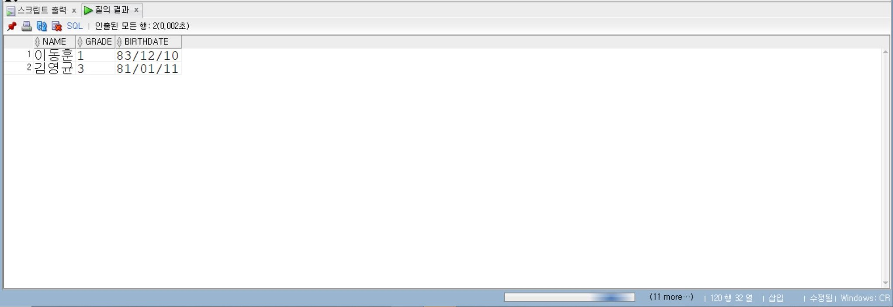

**2️일차**

Oracle 조건 조회와 연산자

📌학습일: 2026.07.21

📌학습 내용: 컬럼 별칭, 연결·산술 연산자, WHERE 조건문, 비교·논리 연산자, BETWEEN, IN, LIKE, NULL, 집합 연산자

---
SELECT 컬럼명 AS 별칭 FROM 테이블명;

SELECT 컬럼명 AS "별칭 이름" FROM 테이블명;

조회 결과의 컬럼명을 원하는 이름으로 변경한다.
   
SELECT 컬럼명1 || ' ' || 컬럼명2 FROM 테이블명;

두 개 이상의 컬럼이나 문자열을 하나로 연결한다.
   
SELECT 컬럼명 * 숫자 FROM 테이블명;

조회한 데이터에 +, -, *, / 등의 산술 연산을 수행한다.
   
SELECT ROWID, 컬럼명 FROM 테이블명;

각 행의 저장 위치를 식별하는 ROWID를 조회한다.
   
SELECT 컬럼명 FROM 테이블명 WHERE 조건;

조건을 만족하는 데이터만 조회한다.
   
WHERE 컬럼명 = 값;

WHERE 컬럼명 > 값;

WHERE 컬럼명 < 값;

WHERE 컬럼명 >= 값;

WHERE 컬럼명 <= 값;

WHERE 컬럼명 <> 값;

값을 서로 비교하여 조건에 맞는 데이터를 조회한다.
   
WHERE 조건1 AND 조건2;

두 조건을 모두 만족하는 데이터를 조회한다.
   
WHERE 조건1 OR 조건2;

두 조건 중 하나 이상을 만족하는 데이터를 조회한다.
   
WHERE NOT 조건;

해당 조건을 만족하지 않는 데이터를 조회한다.

   
WHERE 조건1 AND (조건2 OR 조건3);

여러 조건을 함께 사용할 경우 괄호를 이용하여 조건의 우선순위를 지정할 수 있다.
   
WHERE 컬럼명 BETWEEN 값1 AND 값2;

값1 이상 값2 이하의 범위에 포함되는 데이터를 조회한다.
   
WHERE 컬럼명 IN (값1, 값2, 값3);

지정한 여러 값 중 하나와 일치하는 데이터를 조회한다.
   
WHERE 컬럼명 NOT IN (값1, 값2);

지정한 값들에 포함되지 않는 데이터를 조회한다.
   
WHERE 컬럼명 LIKE '문자%';

특정 문자로 시작하는 데이터를 조회한다.
   
WHERE 컬럼명 LIKE '%문자';

특정 문자로 끝나는 데이터를 조회한다.
   
WHERE 컬럼명 LIKE '%문자%';

특정 문자를 포함하는 데이터를 조회한다.
   
LIKE '김%';

%는 0개 이상의 문자를 의미한다.
   
LIKE '김_영';

_는 정확히 한 개의 문자를 의미한다.
   
WHERE 컬럼명 LIKE '문자\_%' ESCAPE '\';

%, _ 같은 와일드카드를 일반 문자로 검색할 때 사용한다.
   
WHERE 컬럼명 IS NULL;

값이 NULL인 데이터를 조회한다.
   
CREATE TABLE 새테이블명 AS SELECT * FROM 기존테이블명 WHERE 조건;

조회한 데이터를 이용하여 새로운 테이블을 생성한다.
   
SELECT 컬럼명 FROM 테이블1 UNION SELECT 컬럼명 FROM 테이블2;

두 조회 결과를 합치고 중복된 데이터는 제거한다.
   
SELECT 컬럼명 FROM 테이블1 UNION ALL SELECT 컬럼명 FROM 테이블2;

두 조회 결과를 중복 제거 없이 모두 합친다.
   
SELECT 컬럼명 FROM 테이블1 MINUS SELECT 컬럼명 FROM 테이블2;

첫 번째 조회 결과에서 두 번째 조회 결과에 존재하는 데이터를 제외한다.

---

학생 테이블에서 81년에서 83년도에 태어난 학생의 이름과 생년 월일을 출력하고 그 중에서 1학년이거나 3학년인 학생 이름, 학년, 생일 출력

<pre>
<code>
SQL> SELECT name, grade, birthdate
     FROM student
     where birthdate between '81/01/01' and '83/12/31'
     and (grade= '1' or grade= '3');
</code>
</pre>

  

(grade= '1' or grade= '3') 이 부분에서 괄호와 ''은 꼭 들어가야 한다.

숫자에 ''을 실수로 빼먹곤 하는데 좀 더 연습해야겠다.
