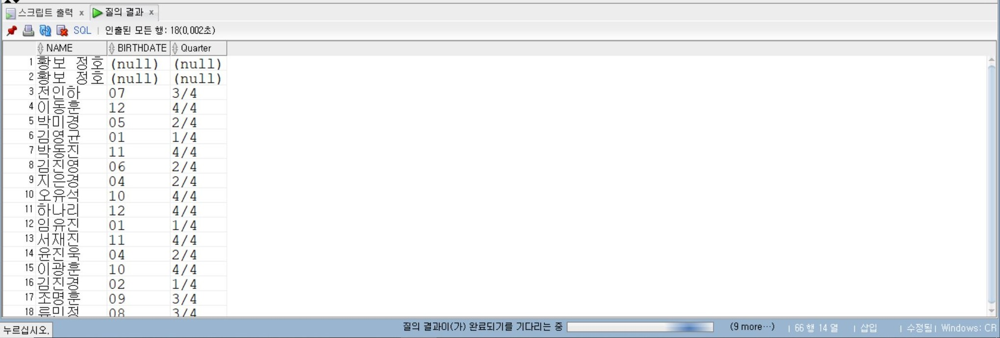
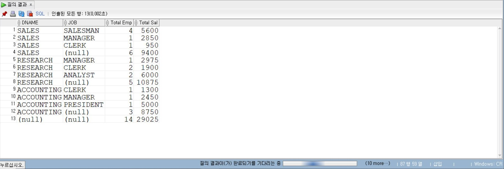
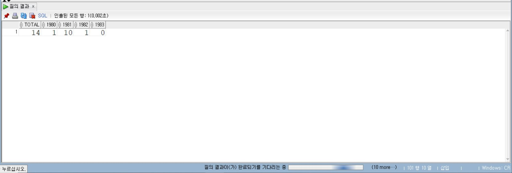

# 4일차

## Oracle NULL 함수, 그룹 함수 및 JOIN

📌 학습일: 2026.07.23

📌 학습 내용: NVL, NVL2, NULLIF, COALESCE, DECODE, CASE, 그룹 함수, GROUP BY, HAVING, ROLLUP, CUBE, GROUPING, GROUPING SETS, JOIN

#### 1. NVL - NULL 값 변환

```sql
SELECT NVL(컬럼명, 대체값) FROM 테이블명;
```

컬럼 값이 NULL이면 지정한 값으로 변경

```sql
SELECT 컬럼명1 + NVL(컬럼명2, 0) FROM 테이블명;
```

NULL 값을 0으로 변환하여 산술 연산 수행

```sql
SELECT NVL(컬럼명1 + 컬럼명2, 컬럼명1) FROM 테이블명;
```

연산 결과가 NULL이면 지정한 컬럼 값으로 변경

#### 2. NVL2 - NULL 여부에 따라 다른 값 반환

```sql
SELECT NVL2(컬럼명, NULL이아닐때값, NULL일때값) FROM 테이블명;
```

컬럼이 NULL인지 여부에 따라 서로 다른 값을 반환

```sql
SELECT NVL2(컬럼명1, 컬럼명2 + 컬럼명1, 컬럼명2) FROM 테이블명;
```

첫 번째 컬럼이 NULL이 아니면 계산된 값을, NULL이면 두 번째 컬럼 값을 반환

```sql
SELECT NVL2(컬럼명, TO_CHAR(컬럼명), '대체문자') FROM 테이블명;
```

NULL이 아니면 값을 문자로 출력하고 NULL이면 지정한 문자열을 출력

#### 3. NULLIF - 두 값 비교

```sql
SELECT NULLIF(값1, 값2) FROM 테이블명;
```

두 값이 같으면 NULL을 반환하고 다르면 첫 번째 값을 반환

```sql
SELECT NULLIF(함수1(컬럼명1), 함수2(컬럼명2)) FROM 테이블명;
```

함수 처리 결과를 비교하여 같으면 NULL, 다르면 첫 번째 결과를 반환

#### 4. COALESCE - 첫 번째 NULL이 아닌 값 반환

```sql
SELECT COALESCE(컬럼명1, 컬럼명2, 값) FROM 테이블명;
```

왼쪽부터 확인하여 처음으로 NULL이 아닌 값을 반환

#### 5. DECODE - 조건에 따라 값 변환

```sql
SELECT DECODE(컬럼명, 값1, 결과1, 값2, 결과2, 기본값) FROM 테이블명;
```

컬럼 값에 따라 지정한 결과로 변환

#### 6. CASE - 조건에 따라 값 반환

```sql
SELECT CASE WHEN 조건1 THEN 결과1 WHEN 조건2 THEN 결과2 ELSE 기본값 END FROM 테이블명;
```

여러 조건을 순서대로 검사하여 조건에 맞는 결과를 반환

```sql
SELECT CASE WHEN 컬럼명=값1 THEN 계산식1 WHEN 컬럼명=값2 THEN 계산식2 ELSE 기본값 END FROM 테이블명;
```

컬럼 값에 따라 서로 다른 계산식을 적용

#### 7. CASE + IN

```sql
SELECT CASE WHEN 컬럼명 IN (값1, 값2, 값3) THEN 결과1 WHEN 컬럼명 IN (값4, 값5, 값6) THEN 결과2 END FROM 테이블명;
```

여러 값을 하나의 조건으로 묶어 결과를 반환

#### 8. COUNT - 행 개수 계산

```sql
SELECT COUNT(*) FROM 테이블명;
```

테이블의 전체 행 개수를 계산

```sql
SELECT COUNT(컬럼명) FROM 테이블명;
```

해당 컬럼에서 NULL을 제외한 값의 개수를 계산

```sql
SELECT COUNT(DISTINCT 컬럼명) FROM 테이블명;
```

중복 값을 제거한 후 개수를 계산

#### 9. SUM - 합계

```sql
SELECT SUM(컬럼명) FROM 테이블명;
```

지정한 숫자 컬럼의 합계를 계산

#### 10. AVG - 평균

```sql
SELECT AVG(컬럼명) FROM 테이블명;
```

지정한 숫자 컬럼의 평균을 계산

```sql
SELECT ROUND(AVG(컬럼명)) FROM 테이블명;
```

평균값을 계산한 후 반올림

#### 11. MAX - 최댓값

```sql
SELECT MAX(컬럼명) FROM 테이블명;
```

지정한 컬럼에서 가장 큰 값을 반환

#### 12. MIN - 최솟값

```sql
SELECT MIN(컬럼명) FROM 테이블명;
```

지정한 컬럼에서 가장 작은 값을 반환

#### 13. STDDEV - 표준편차

```sql
SELECT STDDEV(컬럼명) FROM 테이블명;
```

지정한 숫자 컬럼의 표준편차를 계산

#### 14. VARIANCE - 분산

```sql
SELECT VARIANCE(컬럼명) FROM 테이블명;
```

지정한 숫자 컬럼의 분산을 계산

#### 15. 여러 그룹 함수 함께 사용

```sql
SELECT MAX(컬럼명), MIN(컬럼명), SUM(컬럼명), AVG(컬럼명) FROM 테이블명;
```

최댓값, 최솟값, 합계, 평균을 한 번에 계산

#### 16. GROUP BY - 데이터 그룹화

```sql
SELECT 그룹컬럼, COUNT(*) FROM 테이블명 GROUP BY 그룹컬럼;
```

같은 값을 가진 행들을 하나의 그룹으로 묶어 집계

```sql
SELECT 그룹컬럼, SUM(컬럼명) FROM 테이블명 GROUP BY 그룹컬럼;
```

그룹별 합계를 계산

```sql
SELECT 그룹컬럼, AVG(컬럼명) FROM 테이블명 GROUP BY 그룹컬럼;
```

그룹별 평균을 계산

#### 17. 여러 컬럼으로 GROUP BY

```sql
SELECT 그룹컬럼1, 그룹컬럼2, COUNT(*) FROM 테이블명 GROUP BY 그룹컬럼1, 그룹컬럼2;
```

두 개 이상의 컬럼을 기준으로 세부 그룹 생성

```sql
SELECT 그룹컬럼1, 그룹컬럼2, COUNT(*), ROUND(AVG(컬럼명)) FROM 테이블명 GROUP BY 그룹컬럼1, 그룹컬럼2 ORDER BY 그룹컬럼1, 그룹컬럼2;
```

여러 컬럼을 기준으로 그룹화하고 그룹별 개수와 평균값을 계산한 후 정렬

#### 18. HAVING - 그룹 결과에 조건 적용

```sql
SELECT 그룹컬럼, COUNT(*) FROM 테이블명 GROUP BY 그룹컬럼 HAVING COUNT(*) > 값;
```

GROUP BY로 생성된 그룹 중 조건을 만족하는 그룹만 조회

```sql
SELECT 그룹컬럼, MAX(컬럼명), MIN(컬럼명) FROM 테이블명 GROUP BY 그룹컬럼 HAVING MAX(컬럼명) >= 값;
```

그룹별 집계 결과를 기준으로 조건을 지정

#### 19. GROUP BY + ORDER BY

```sql
SELECT 그룹컬럼, AVG(컬럼명) FROM 테이블명 GROUP BY 그룹컬럼 ORDER BY AVG(컬럼명) DESC;
```

그룹별 평균을 계산하고 평균이 높은 순으로 정렬

```sql
SELECT 그룹컬럼, ROUND(AVG(컬럼명), 2) AS 컬럼별칭 FROM 테이블명 GROUP BY 그룹컬럼 ORDER BY 컬럼별칭 DESC;
```

집계 결과에 컬럼 별칭을 지정하여 정렬

#### 20. 중첩 그룹 함수

```sql
SELECT MAX(AVG(컬럼명)) FROM 테이블명 GROUP BY 그룹컬럼;
```

각 그룹의 평균값 중 가장 큰 값을 반환

```sql
SELECT MAX(COUNT(컬럼명)), MIN(COUNT(컬럼명)) FROM 테이블명 GROUP BY 그룹컬럼;
```

그룹별 개수 중 가장 큰 값과 가장 작은 값을 반환

#### 21. ROLLUP - 소계와 총계

```sql
SELECT 그룹컬럼, SUM(컬럼명) FROM 테이블명 GROUP BY ROLLUP(그룹컬럼);
```

그룹별 집계 결과와 전체 총계를 함께 출력

```sql
SELECT 그룹컬럼1, 그룹컬럼2, COUNT(*) FROM 테이블명 GROUP BY ROLLUP(그룹컬럼1, 그룹컬럼2);
```

세부 그룹 결과, 상위 그룹 소계, 전체 총계를 함께 출력

#### 22. CUBE - 모든 조합의 소계와 총계

```sql
SELECT 그룹컬럼1, 그룹컬럼2, COUNT(*) FROM 테이블명 GROUP BY CUBE(그룹컬럼1, 그룹컬럼2);
```

지정한 그룹 컬럼의 가능한 모든 조합에 대한 집계 결과를 출력

#### 23. GROUPING - 집계 행 구분

```sql
SELECT 그룹컬럼, GROUPING(그룹컬럼) FROM 테이블명 GROUP BY ROLLUP(그룹컬럼);
```

해당 행이 일반 데이터 그룹인지 ROLLUP으로 생성된 집계 행인지 구분

```sql
SELECT 그룹컬럼1, 그룹컬럼2, GROUPING(그룹컬럼1), GROUPING(그룹컬럼2) FROM 테이블명 GROUP BY ROLLUP(그룹컬럼1, 그룹컬럼2);
```

여러 그룹 컬럼이 집계에 사용되었는지 여부를 확인

#### 24. GROUPING SETS - 원하는 그룹 조합 지정

```sql
SELECT 그룹컬럼1, 그룹컬럼2, COUNT(*) FROM 테이블명 GROUP BY GROUPING SETS((그룹컬럼1, 그룹컬럼2), (그룹컬럼1, 그룹컬럼3));
```

여러 GROUP BY 결과를 하나의 SQL에서 원하는 조합으로 계산

```sql
SELECT 그룹컬럼1, 그룹컬럼2, TO_CHAR(날짜컬럼, 'YYYY'), COUNT(*) FROM 테이블명 GROUP BY GROUPING SETS((그룹컬럼1, 그룹컬럼2), (그룹컬럼1, TO_CHAR(날짜컬럼, 'YYYY')));
```

첫 번째 그룹 조합과 날짜를 이용한 두 번째 그룹 조합을 한 번에 계산

#### 25. CASE + SUM - 조건별 개수 계산

```sql
SELECT SUM(CASE WHEN 조건 THEN 1 ELSE 0 END) FROM 테이블명;
```

조건을 만족하는 행의 개수를 계산

```sql
SELECT COUNT(*), SUM(CASE WHEN 조건1 THEN 1 ELSE 0 END), SUM(CASE WHEN 조건2 THEN 1 ELSE 0 END) FROM 테이블명;
```

전체 개수와 여러 조건별 개수를 한 번에 계산

#### 26. 테이블명.컬럼명 - 컬럼 소속 지정

```sql
SELECT 테이블명.컬럼명 FROM 테이블명;
```

컬럼 앞에 테이블명을 작성하여 해당 컬럼이 어느 테이블에 속하는지 명확하게 지정

```sql
SELECT 테이블명1.컬럼명, 테이블명2.컬럼명 FROM 테이블명1, 테이블명2 WHERE 테이블명1.공통컬럼 = 테이블명2.공통컬럼;
```

두 테이블의 공통 컬럼을 기준으로 데이터를 연결

#### 27. 테이블 별칭 - 테이블명 축약

```sql
SELECT 테이블별칭.컬럼명 FROM 테이블명 테이블별칭;
```

테이블명에 짧은 별칭을 지정하여 이후 SQL에서 간단하게 사용

```sql
SELECT 테이블별칭1.컬럼명, 테이블별칭2.컬럼명 FROM 테이블명1 테이블별칭1, 테이블명2 테이블별칭2;
```

두 테이블에 각각 별칭을 지정하여 컬럼을 구분

#### 28. EQUI JOIN - 등가 조인

```sql
SELECT 테이블별칭1.컬럼명, 테이블별칭2.컬럼명 FROM 테이블명1 테이블별칭1, 테이블명2 테이블별칭2 WHERE 테이블별칭1.공통컬럼 = 테이블별칭2.공통컬럼;
```

두 테이블에서 값이 같은 공통 컬럼을 기준으로 데이터를 연결

```sql
SELECT 테이블별칭1.컬럼명, 테이블별칭2.컬럼명 FROM 테이블명1 테이블별칭1, 테이블명2 테이블별칭2 WHERE 테이블별칭1.공통컬럼 = 테이블별칭2.공통컬럼 AND 조건;
```

두 테이블을 연결한 후 추가 조건을 만족하는 데이터만 조회

#### 29. JOIN - 두 테이블의 정보 함께 조회

```sql
SELECT 테이블별칭1.컬럼명, 테이블별칭2.컬럼명 FROM 테이블명1 테이블별칭1, 테이블명2 테이블별칭2 WHERE 테이블별칭1.공통컬럼 = 테이블별칭2.공통컬럼;
```

두 테이블의 공통 컬럼을 기준으로 연결하여 서로 다른 테이블의 정보를 함께 조회

#### 30. JOIN + 특정 값 조건

```sql
SELECT 테이블별칭1.컬럼명, 테이블별칭2.컬럼명 FROM 테이블명1 테이블별칭1, 테이블명2 테이블별칭2 WHERE 테이블별칭1.공통컬럼 = 테이블별칭2.공통컬럼 AND 테이블별칭1.컬럼명 = '값';
```

두 테이블을 연결한 후 첫 번째 테이블의 컬럼 값으로 조회 조건을 지정

```sql
SELECT 테이블별칭1.컬럼명, 테이블별칭2.컬럼명 FROM 테이블명1 테이블별칭1, 테이블명2 테이블별칭2 WHERE 테이블별칭1.공통컬럼 = 테이블별칭2.공통컬럼 AND 테이블별칭2.컬럼명 = '값';
```

두 테이블을 연결한 후 두 번째 테이블의 컬럼 값으로 조회 조건을 지정

#### 31. JOIN + 숫자 비교 조건

```sql
SELECT 테이블별칭1.컬럼명, 테이블별칭2.컬럼명 FROM 테이블명1 테이블별칭1, 테이블명2 테이블별칭2 WHERE 테이블별칭1.공통컬럼 = 테이블별칭2.공통컬럼 AND 테이블별칭1.컬럼명 >= 값;
```

두 테이블을 연결한 후 숫자 조건을 만족하는 데이터만 조회

#### 32. JOIN + 그룹 함수

```sql
SELECT COUNT(*), MAX(테이블별칭1.컬럼명), MIN(테이블별칭1.컬럼명) FROM 테이블명1 테이블별칭1, 테이블명2 테이블별칭2 WHERE 테이블별칭1.공통컬럼 = 테이블별칭2.공통컬럼;
```

두 테이블을 연결한 결과를 대상으로 개수, 최댓값, 최솟값 등을 계산

```sql
SELECT COUNT(*), MAX(테이블별칭1.컬럼명), MIN(테이블별칭1.컬럼명) FROM 테이블명1 테이블별칭1, 테이블명2 테이블별칭2 WHERE 테이블별칭1.공통컬럼 = 테이블별칭2.공통컬럼 AND 테이블별칭2.컬럼명 = '값';
```

조인 결과 중 추가 조건을 만족하는 데이터만 대상으로 그룹 함수를 사용

#### 33. JOIN + GROUP BY

```sql
SELECT 테이블별칭2.그룹컬럼, COUNT(*), SUM(테이블별칭1.컬럼명) FROM 테이블명1 테이블별칭1, 테이블명2 테이블별칭2 WHERE 테이블별칭1.공통컬럼 = 테이블별칭2.공통컬럼 GROUP BY 테이블별칭2.그룹컬럼;
```

두 테이블을 연결한 후 특정 컬럼을 기준으로 그룹화하여 집계

#### 34. JOIN + ROLLUP

```sql
SELECT 테이블별칭1.그룹컬럼1, 테이블별칭2.그룹컬럼2, COUNT(*), SUM(테이블별칭1.컬럼명) FROM 테이블명1 테이블별칭1, 테이블명2 테이블별칭2 WHERE 테이블별칭1.공통컬럼 = 테이블별칭2.공통컬럼 GROUP BY ROLLUP(테이블별칭1.그룹컬럼1, 테이블별칭2.그룹컬럼2);
```

조인된 데이터를 그룹화하고 세부 그룹, 소계, 전체 총계를 함께 계산

#### 35. GROUPING + ORDER BY

```sql
SELECT 그룹컬럼1, 그룹컬럼2, COUNT(*) FROM 테이블명 GROUP BY ROLLUP(그룹컬럼1, 그룹컬럼2) ORDER BY GROUPING(그룹컬럼1), 그룹컬럼1, GROUPING(그룹컬럼2);
```

ROLLUP으로 생성된 일반 행과 소계·총계 행의 출력 순서를 조정

#### 36. DISTINCT + COUNT

```sql
SELECT COUNT(DISTINCT 컬럼명) FROM 테이블명;
```

중복 값을 제거한 후 서로 다른 값의 개수를 계산

#### 37. 그룹 함수 + ROUND

```sql
SELECT ROUND(AVG(컬럼명), 자릿수) FROM 테이블명;
```

평균값을 지정한 소수점 자릿수까지 반올림

#### 38. NVL + TO_CHAR

```sql
SELECT NVL(TO_CHAR(컬럼명), '대체문자') FROM 테이블명;
```

숫자나 날짜를 문자로 변환한 후 NULL이면 지정한 문자열로 변경

#### 39. NVL2 + TO_CHAR

```sql
SELECT NVL2(컬럼명, TO_CHAR(컬럼명), '대체문자') FROM 테이블명;
```

컬럼이 NULL이 아니면 문자로 변환하여 출력하고 NULL이면 지정한 문자열을 출력


학생 테이블에서 학생들이 태어난 월과 몇 사분기에 태어났는지 출력(이름, 태어난 월, 분기)
```sql
SELECT name, to_char(birthdate, 'mm') birthdate, 
       CASE when to_char(birthdate, 'mm') in (1,2,3) THEN '1/4'
       when to_char(birthdate,'mm') in (4,5,6) then '2/4'
       when to_char(birthdate,'mm') in (7,8,9) then '3/4'
       when to_char(birthdate,'mm') in (10,11,12) then '4/4' 
       end "Quarter"
FROM student;
```
<p align="center">
  
</p>
CASE when 다음에 추가로 조건이 있으면 when으로 시작해야하고 조건이 분기면 in (1,2,3) 이런식으로 해당월을 조건으로 넣어야지 제대로 결과값이 나온다.

그리고 꼭 THEN 다음에 표시할 칼럼명이 와야 제대로 출력되니 유의해야겠다.


ROLLUP 연산자를 이용하여 아래와 같이 부서별, 직업별 전체 사원수 및 전체 급여의 합계를 출력

(아래와 같은 결과가 나오도록)

```text
DNAME      JOB       Total Emp Total Sal
-------------------- --------- ----------
SALES      CLERK         1       950
SALES      MANAGER       1       2850
SALES      SALESMAN      4       5600
SALES                    6       9400
RESEARCH   CLERK         2       1900
RESEARCH   ANALYST       2       6000
RESEARCH   MANAGER       1       2975
RESEARCH                 5       10875
ACCOUNTING CLERK         1       1300
ACCOUNTING MANAGER       1       2450
ACCOUNTING PRESIDENT     1       000
```
```text
DNAME JOB Total Emp Total Sal
-------------------- --------- ---------- ----------
ACCOUNTING 3 8750
<br/>14 29025
```
```sql
SELECT d.dname, e.job, count(*) "Total Emp", sum(sal) "Total Sal"
FROM emp e, dept d
WHERE e.deptno=d.deptno
GROUP BY ROLLUP(d.dname, e.job)
order by grouping(d.dname), d.dname desc, grouping(e.job);
```
<p align="center">
  
</p>
칼럼별 전체 합계를 구할려면 count(*)와 GROUP BY ROLLUP, order by grouping을 사용해야한다.

GROUP BY ROLLUP, order by grouping을 사용 할때는 뒤에 꼭 ()가 들어가야 한다는 걸 유의해야겠다.


1980, 1981, 1982, 1983년에 입사한 전체 사원 수와 연도별 사원수를 출력하는 SQL 작성
(적당한 열레이블을 부여하세요.)

```text
TOTAL 1980 1981 1982 1983
-------------------------
  14    1    1    0    1
```

```sql
SELECT count(empno) TOTAL, 
       sum(case when to_char(hiredate,'yy')=80 then 1 else 0 end) "1980",
       sum(case when to_char(hiredate,'yy')=81 then 1 else 0 end) "1981",
       sum(case when to_char(hiredate,'yy')=82 then 1 else 0 end) "1982",
       sum(case when to_char(hiredate,'yy')=83 then 1 else 0 end) "1983"
FROM emp;
```
<p align="center">
  
</p>
조건이 여러개인 합계를 구할때는 SUM 다음에 ()을 사용해서 CASE WHEN 조건 THEN 1 ELSE 0 END을 사용해야 한다.

여기에서 조건을 만족하는 행은 1이고 조건을 만족하지 않으면 0이라는 뜻이다.

꼭 뒤에 end가 와야 제대로 결과값이 출력되니 빼먹지 않도록 조심해야겠다.
