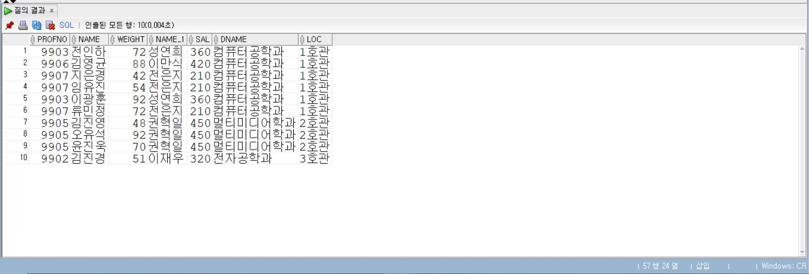

# 5일차

## Oracle JOIN 심화 및 서브쿼리

📌 학습일: 2026.07.24

📌 학습 내용: Cartesian Product, CROSS JOIN, EQUI JOIN, NATURAL JOIN, JOIN USING, INNER JOIN, NON-EQUI JOIN, OUTER JOIN, SELF JOIN, 서브쿼리

---
#### 1. Cartesian Product - 카티션 곱

```sql
SELECT 테이블별칭1.컬럼명, 테이블별칭2.컬럼명 FROM 테이블명1 테이블별칭1, 테이블명2 테이블별칭2;
```

두 테이블의 모든 행을 서로 조합하여 조회

#### 2. CROSS JOIN - 교차 조인

```sql
SELECT 테이블별칭1.컬럼명, 테이블별칭2.컬럼명 FROM 테이블명1 테이블별칭1 CROSS JOIN 테이블명2 테이블별칭2;
```

두 테이블의 모든 행을 조합하여 Cartesian Product와 같은 결과를 출력

#### 3. EQUI JOIN - 등가 조인

```sql
SELECT 테이블별칭1.컬럼명, 테이블별칭2.컬럼명 FROM 테이블명1 테이블별칭1, 테이블명2 테이블별칭2 WHERE 테이블별칭1.공통컬럼 = 테이블별칭2.공통컬럼;
```

두 테이블에서 값이 같은 공통 컬럼을 기준으로 데이터를 연결

#### 4. NATURAL JOIN - 같은 이름의 컬럼으로 자동 조인

```sql
SELECT 컬럼명1, 컬럼명2, 공통컬럼 FROM 테이블명1 NATURAL JOIN 테이블명2;
```

두 테이블에서 이름과 데이터형이 같은 컬럼을 자동으로 찾아 조인

#### 5. NATURAL JOIN + WHERE

```sql
SELECT 컬럼명1, 컬럼명2, 공통컬럼 FROM 테이블명1 NATURAL JOIN 테이블명2 WHERE 컬럼명 = 값;
```

NATURAL JOIN으로 연결한 결과에서 조건을 만족하는 데이터만 조회

#### 6. JOIN USING - 공통 컬럼 지정

```sql
SELECT 컬럼명1, 컬럼명2, 공통컬럼 FROM 테이블명1 JOIN 테이블명2 USING (공통컬럼);
```

두 테이블에서 이름이 같은 특정 컬럼을 직접 지정하여 조인

#### 7. JOIN USING + WHERE

```sql
SELECT 컬럼명1, 컬럼명2, 공통컬럼 FROM 테이블명1 JOIN 테이블명2 USING (공통컬럼) WHERE 조건;
```

USING으로 두 테이블을 연결한 후 추가 조건을 적용하여 조회

#### 8. INNER JOIN + ON

```sql
SELECT 테이블별칭1.컬럼명, 테이블별칭2.컬럼명 FROM 테이블명1 테이블별칭1 INNER JOIN 테이블명2 테이블별칭2 ON 테이블별칭1.공통컬럼 = 테이블별칭2.공통컬럼;
```

ON 절에 조인 조건을 작성하여 두 테이블에서 조건이 일치하는 데이터만 조회

#### 9. INNER JOIN + WHERE

```sql
SELECT 테이블별칭1.컬럼명, 테이블별칭2.컬럼명 FROM 테이블명1 테이블별칭1 INNER JOIN 테이블명2 테이블별칭2 ON 테이블별칭1.공통컬럼 = 테이블별칭2.공통컬럼 WHERE 조건;
```

두 테이블을 INNER JOIN한 후 WHERE 절을 이용하여 추가 조건을 적용

#### 10. 여러 테이블 EQUI JOIN

```sql
SELECT 테이블별칭1.컬럼명, 테이블별칭2.컬럼명, 테이블별칭3.컬럼명 FROM 테이블명1 테이블별칭1, 테이블명2 테이블별칭2, 테이블명3 테이블별칭3 WHERE 테이블별칭1.공통컬럼1 = 테이블별칭2.공통컬럼1 AND 테이블별칭1.공통컬럼2 = 테이블별칭3.공통컬럼2;
```

여러 테이블의 공통 컬럼을 이용하여 세 개 이상의 테이블을 연결

#### 11. 여러 테이블 INNER JOIN

```sql
SELECT 테이블별칭1.컬럼명, 테이블별칭2.컬럼명, 테이블별칭3.컬럼명 FROM 테이블명1 테이블별칭1 INNER JOIN 테이블명2 테이블별칭2 ON 테이블별칭1.공통컬럼1 = 테이블별칭2.공통컬럼1 INNER JOIN 테이블명3 테이블별칭3 ON 테이블별칭1.공통컬럼2 = 테이블별칭3.공통컬럼2;
```

INNER JOIN을 연속해서 사용하여 여러 테이블을 연결

#### 12. 여러 테이블 JOIN + WHERE

```sql
SELECT 테이블별칭1.컬럼명, 테이블별칭2.컬럼명, 테이블별칭3.컬럼명 FROM 테이블명1 테이블별칭1 INNER JOIN 테이블명2 테이블별칭2 ON 테이블별칭1.공통컬럼1 = 테이블별칭2.공통컬럼1 INNER JOIN 테이블명3 테이블별칭3 ON 테이블별칭1.공통컬럼2 = 테이블별칭3.공통컬럼2 WHERE 조건;
```

여러 테이블을 연결한 후 추가 조건을 만족하는 데이터만 조회

#### 13. NON-EQUI JOIN - 범위를 이용한 조인

```sql
SELECT 테이블별칭1.컬럼명, 테이블별칭2.컬럼명 FROM 테이블명1 테이블별칭1, 테이블명2 테이블별칭2 WHERE 테이블별칭1.컬럼명 BETWEEN 테이블별칭2.최솟값컬럼 AND 테이블별칭2.최댓값컬럼;
```

두 컬럼의 값이 정확히 같은지를 비교하지 않고 BETWEEN 등의 범위 조건을 이용하여 조인

#### 14. NON-EQUI JOIN + WHERE

```sql
SELECT 테이블별칭1.컬럼명, 테이블별칭2.컬럼명 FROM 테이블명1 테이블별칭1, 테이블명2 테이블별칭2 WHERE 테이블별칭1.컬럼명 BETWEEN 테이블별칭2.최솟값컬럼 AND 테이블별칭2.최댓값컬럼 AND 테이블별칭1.조건컬럼 = 값;
```

범위를 기준으로 테이블을 연결한 후 추가 조건을 만족하는 데이터만 조회

#### 15. Oracle OUTER JOIN (+)

```sql
SELECT 테이블별칭1.컬럼명, 테이블별칭2.컬럼명 FROM 테이블명1 테이블별칭1, 테이블명2 테이블별칭2 WHERE 테이블별칭1.공통컬럼 = 테이블별칭2.공통컬럼(+);
```

첫 번째 테이블의 데이터는 모두 출력하고 두 번째 테이블에 일치하는 데이터가 없으면 NULL로 출력

#### 16. LEFT OUTER JOIN

```sql
SELECT 테이블별칭1.컬럼명, 테이블별칭2.컬럼명 FROM 테이블명1 테이블별칭1 LEFT OUTER JOIN 테이블명2 테이블별칭2 ON 테이블별칭1.공통컬럼 = 테이블별칭2.공통컬럼;
```

왼쪽 테이블의 데이터는 모두 출력하고 오른쪽 테이블에서 일치하는 데이터를 연결

#### 17. RIGHT OUTER JOIN

```sql
SELECT 테이블별칭1.컬럼명, 테이블별칭2.컬럼명 FROM 테이블명1 테이블별칭1 RIGHT OUTER JOIN 테이블명2 테이블별칭2 ON 테이블별칭1.공통컬럼 = 테이블별칭2.공통컬럼;
```

오른쪽 테이블의 데이터는 모두 출력하고 왼쪽 테이블에서 일치하는 데이터를 연결

#### 18. FULL OUTER JOIN

```sql
SELECT 테이블별칭1.컬럼명, 테이블별칭2.컬럼명 FROM 테이블명1 테이블별칭1 FULL OUTER JOIN 테이블명2 테이블별칭2 ON 테이블별칭1.공통컬럼 = 테이블별칭2.공통컬럼;
```

양쪽 테이블의 데이터를 모두 출력하고 서로 일치하지 않는 부분은 NULL로 출력

#### 19. UNION을 이용한 OUTER JOIN

```sql
SELECT 테이블별칭1.컬럼명, 테이블별칭2.컬럼명 FROM 테이블명1 테이블별칭1, 테이블명2 테이블별칭2 WHERE 테이블별칭1.공통컬럼 = 테이블별칭2.공통컬럼(+) UNION SELECT 테이블별칭1.컬럼명, 테이블별칭2.컬럼명 FROM 테이블명1 테이블별칭1, 테이블명2 테이블별칭2 WHERE 테이블별칭1.공통컬럼(+) = 테이블별칭2.공통컬럼;
```

LEFT와 RIGHT 방식의 OUTER JOIN 결과를 UNION으로 결합하여 양쪽의 데이터를 모두 조회

#### 20. SELF JOIN - 같은 테이블끼리 조인

```sql
SELECT 테이블별칭1.컬럼명, 테이블별칭2.컬럼명 FROM 테이블명 테이블별칭1, 테이블명 테이블별칭2 WHERE 테이블별칭1.연결컬럼 = 테이블별칭2.공통컬럼;
```

하나의 테이블에 서로 다른 별칭을 지정하여 같은 테이블 내부의 데이터 관계를 조회

#### 21. SELF JOIN + 문자열 연결

```sql
SELECT 테이블별칭1.컬럼명 || '문자열' || 테이블별칭2.컬럼명 FROM 테이블명 테이블별칭1, 테이블명 테이블별칭2 WHERE 테이블별칭1.연결컬럼 = 테이블별칭2.공통컬럼;
```

SELF JOIN으로 연결한 두 데이터의 값을 문자열과 결합하여 출력

#### 22. SELF JOIN + WHERE

```sql
SELECT 테이블별칭1.컬럼명, 테이블별칭2.컬럼명 FROM 테이블명 테이블별칭1, 테이블명 테이블별칭2 WHERE 테이블별칭1.연결컬럼 = 테이블별칭2.공통컬럼 AND 테이블별칭1.컬럼명 >= 값;
```

같은 테이블을 서로 연결한 후 추가 조건을 만족하는 데이터만 조회

#### 23. SELF JOIN + JOIN ON

```sql
SELECT 테이블별칭1.컬럼명, 테이블별칭2.컬럼명 FROM 테이블명 테이블별칭1 JOIN 테이블명 테이블별칭2 ON 테이블별칭1.연결컬럼 = 테이블별칭2.공통컬럼;
```

JOIN ON 문법을 이용하여 하나의 테이블을 자기 자신과 연결

#### 24. 단일 행 서브쿼리

```sql
SELECT 컬럼명 FROM 테이블명 WHERE 컬럼명 = (SELECT 컬럼명 FROM 테이블명 WHERE 조건);
```

서브쿼리에서 조회한 하나의 값을 메인쿼리의 조건으로 사용

#### 25. 서브쿼리 + 비교 연산자

```sql
SELECT 컬럼명1, 컬럼명2 FROM 테이블명 WHERE 컬럼명1 < (SELECT AVG(컬럼명1) FROM 테이블명 WHERE 조건);
```

서브쿼리에서 계산한 평균 등의 결과와 메인쿼리의 값을 비교

#### 26. 서브쿼리 + AVG

```sql
SELECT 컬럼명1, 컬럼명2 FROM 테이블명 WHERE 컬럼명2 < (SELECT AVG(컬럼명2) FROM 테이블명 WHERE 조건);
```

특정 조건에 해당하는 데이터의 평균값을 구한 후 평균보다 작은 데이터를 조회

#### 27. JOIN + 서브쿼리

```sql
SELECT 테이블별칭1.컬럼명, 테이블별칭2.컬럼명 FROM 테이블명1 테이블별칭1, 테이블명2 테이블별칭2 WHERE 테이블별칭1.공통컬럼 = 테이블별칭2.공통컬럼 AND 테이블별칭1.컬럼명 < (SELECT AVG(컬럼명) FROM 테이블명1 WHERE 조건);
```

JOIN으로 여러 테이블을 연결하면서 서브쿼리의 결과를 추가 조건으로 사용

#### 28. GROUP BY + 서브쿼리

```sql
SELECT 그룹컬럼, COUNT(*) FROM 테이블명 GROUP BY 그룹컬럼 HAVING COUNT(컬럼명) = (SELECT MAX(COUNT(컬럼명)) FROM 테이블명 GROUP BY 그룹컬럼);
```

그룹별 개수를 계산한 후 가장 많은 데이터를 가진 그룹을 조회

#### 29. JOIN + GROUP BY + 서브쿼리

```sql
SELECT 테이블별칭2.그룹컬럼, 테이블별칭2.컬럼명, COUNT(테이블별칭1.컬럼명) FROM 테이블명1 테이블별칭1, 테이블명2 테이블별칭2 WHERE 테이블별칭1.공통컬럼 = 테이블별칭2.공통컬럼 GROUP BY 테이블별칭2.그룹컬럼, 테이블별칭2.컬럼명 HAVING COUNT(테이블별칭1.컬럼명) = (SELECT MAX(COUNT(컬럼명)) FROM 테이블명1 GROUP BY 그룹컬럼);
```

JOIN과 GROUP BY를 사용하여 그룹별 개수를 계산하고 서브쿼리로 최댓값에 해당하는 그룹을 조회

#### 30. 여러 개의 서브쿼리 조건

```sql
SELECT 컬럼명1, 컬럼명2, 컬럼명3 FROM 테이블명 WHERE 컬럼명2 = (SELECT 컬럼명2 FROM 테이블명 WHERE 조건) AND 컬럼명3 > (SELECT 컬럼명3 FROM 테이블명 WHERE 조건);
```

여러 서브쿼리를 사용하여 두 개 이상의 조건을 동시에 비교

#### 31. SELF JOIN - 상위 데이터 조회

```sql
SELECT 테이블별칭1.컬럼명, 테이블별칭2.컬럼명 FROM 테이블명 테이블별칭1, 테이블명 테이블별칭2 WHERE 테이블별칭1.상위번호컬럼 = 테이블별칭2.번호컬럼;
```

같은 테이블에서 현재 데이터와 상위 데이터의 번호를 연결하여 계층 관계를 조회

#### 32. SELF JOIN - 사원과 관리자 관계

```sql
SELECT 테이블별칭1.이름컬럼, 테이블별칭1.번호컬럼, 테이블별칭2.이름컬럼, 테이블별칭2.번호컬럼 FROM 테이블명 테이블별칭1, 테이블명 테이블별칭2 WHERE 테이블별칭1.관리자번호컬럼 = 테이블별칭2.번호컬럼;
```

같은 테이블을 SELF JOIN하여 각 데이터와 해당 데이터의 관리자 정보를 함께 조회

#### 33. SELF JOIN + 문자열 출력

```sql
SELECT 테이블별칭1.이름컬럼 || '문자열' || 테이블별칭1.번호컬럼 || '문자열' || 테이블별칭2.이름컬럼 || '문자열' || 테이블별칭2.번호컬럼 FROM 테이블명 테이블별칭1, 테이블명 테이블별칭2 WHERE 테이블별칭1.관리자번호컬럼 = 테이블별칭2.번호컬럼;
```

SELF JOIN으로 조회한 데이터와 관리자 정보를 문자열 연결 연산자를 이용하여 하나의 문장으로 출력

---

학생의 학번, 이름, 학생의 몸무게, 지도교수 이름, 지도교수 이름, 지도교수 급여, 학과 이름, 학과 위치를 출력
```sql
SELECT s.profno, s.name, s.weight, p.name, p.sal, d.dname, d.loc
FROM student s
INNER JOIN professor p
ON s.profno = p.profno
INNER JOIN department d
ON s.deptno = d.deptno;
```
<p align="center">
  
</p>
2개이상에 테이블에서 결과값을 출력할때 INNER JOIN를 사용하며, 뒤에는 ON과 별칭.칼럼명이 와야한다.

별칭.칼럼명이 해당되는 테이블에 없으면 오류가 나고 조인할 테이블이랑 공통된 칼라명으로 조건을 입력해야하고 3개이상 테이블과 연결 할때도 INNER JOIN를 테이블별로 각각 사용해야한다.

조건을 제대로 입력해야 제대로 결과값이 나오고 별칭도 잘 지정해야겠다.


