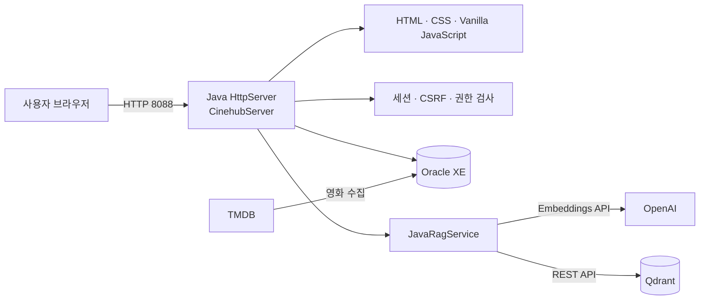
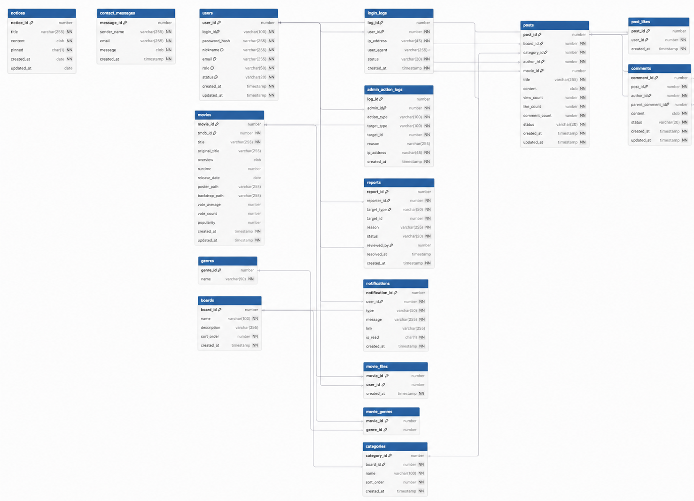
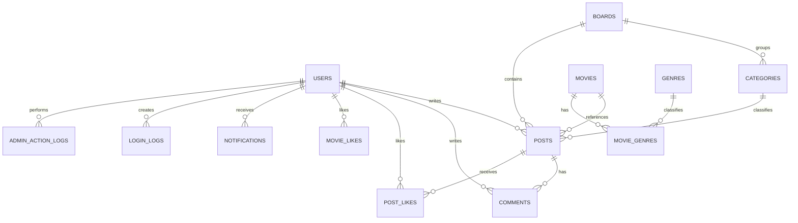

# CINEHUB


## 최근 개선 사항

- 로그인하지 않은 사용자의 게시글·영화 추천·영화 상세 접근을 차단
- 게시글 조회수는 회원별 최초 1회만 증가
- 게시글 목록과 홈 인기글에 조회수·좋아요 수 표시
- 자연어 영화 추천: Oracle 검색과 Qdrant 의미 검색 결과를 합쳐 후보 10편을 만들고, OpenAI가 최종 추천과 이유를 생성
- 랜덤 추천: Oracle 무작위 후보 30편 중 OpenAI가 한 편을 골라 추천 이유와 함께 표시

> 영화 탐색 · AI 의미 검색(RAG) · 영화 커뮤니티를 하나로 연결한 Java 웹 애플리케이션


## 프로젝트 소개

CINEHUB는 제목 검색뿐 아니라 **“우주를 떠도는 과학자”**, **“비 오는 날 혼자 보기 좋은 영화”**처럼 자연어로 영화를 찾고, 영화 감상과 추천을 커뮤니티에서 공유하는 서비스입니다.

Spring Boot 없이 JDK `HttpServer`와 JDBC로 구현했습니다. Oracle XE가 서비스 데이터를 저장하고, `JavaRagService`가 OpenAI Embeddings와 Qdrant REST API를 직접 호출해 의미 기반 영화 검색을 제공합니다.

## 주요 기능

### 회원 및 보안

| 기능 | 설명 |
| --- | --- |
| 회원가입 / 로그인 | 아이디, 비밀번호, 닉네임, 이메일 기반 인증 |
| 비밀번호 보안 | PBKDF2 해시 저장 및 비밀번호 변경 |
| 세션 / CSRF | 세션 쿠키 및 변경 요청 CSRF 토큰 검증 |
| 계정 상태 | `ACTIVE`, `SUSPENDED`, `WITHDRAWN` 상태 관리 |
| 회원탈퇴 | 게시글·댓글·신고 기록은 유지하고 계정만 탈퇴 상태로 변경 |
| 차단 즉시 적용 | 관리자 정지 시 기존 세션 폐기 및 이후 DB 상태 재검증 |

### 영화 탐색 및 AI 추천

| 기능 | 설명 |
| --- | --- |
| 영화 검색 | 제목, 원제, 줄거리 키워드 기반 Oracle 검색 |
| RAG 의미 검색 | 자연어 질의를 임베딩해 Qdrant 영화 벡터와 비교 |
| 하이브리드 결과 | Qdrant 의미 검색과 Oracle 키워드 검색 결과 결합 |
| 영화 상세 | 제목, 원제, 줄거리, 포스터 표시 |
| 인기 TOP 5 / 랜덤 추천 | TMDB 인기 수치와 저장 영화 데이터 활용 |

### 커뮤니티

| 기능 | 설명 |
| --- | --- |
| 게시판 | 공지사항, 자유게시판, 영화 추천 게시판 |
| 게시글 | 작성, 수정, 삭제, 검색, 10개 단위 페이지네이션 |
| 조회수 | 상세 조회 시 `posts.view_count` 증가 |
| 좋아요 | `post_likes` 복합키로 사용자별 중복 좋아요 방지, 재클릭 시 취소 |
| 댓글 / 알림 | 댓글 등록 및 게시글 작성자 알림 생성 |
| 신고 | 게시글·댓글 신고 접수 및 중복 신고 방지 |

### 관리자

| 기능 | 설명 |
| --- | --- |
| 회원 관리 | 회원 검색, 정지 / 정지 해제, 상태 확인 |
| 게시글 관리 | 게시글 검색 및 숨김 처리 |
| 신고 관리 | 신고 목록 검색, 처리 또는 반려 |
| 감사 로그 | 로그인 기록과 관리자 작업 기록 조회 |
| 로그 탐색 | 로그인·관리 작업을 각 10개씩 페이지네이션하고 통합 검색 |

## 서비스 구조



자세한 구조와 RAG 검색 흐름은 [SERVICE_ARCHITECTURE.md](docs/SERVICE_ARCHITECTURE.md)를 확인하세요.

## ERD







### ERD 테이블 설명

| 영역 | 테이블 | 역할 |
| --- | --- | --- |
| 계정 | `users` | 회원 계정, 권한, 활성·정지·탈퇴 상태의 중심 테이블 |
| 인증·감사 | `login_logs`, `admin_action_logs` | 로그인 이력과 관리자 제재·처리 이력 |
| 영화 | `movies`, `genres`, `movie_genres`, `movie_likes` | TMDB 영화 정보, 장르 N:M 관계, 영화 좋아요 |
| 게시판 | `boards`, `categories`, `posts` | 게시판 구조, 카테고리, 게시글, 조회수, 좋아요 수 |
| 상호작용 | `post_likes`, `comments` | 게시글 좋아요 및 대댓글을 포함한 댓글 |
| 운영 | `reports`, `notifications`, `notices`, `contact_messages` | 신고, 알림, 공지사항, 사용자 문의 |

`post_likes(post_id, user_id)`, `movie_likes(movie_id, user_id)`, `movie_genres(movie_id, genre_id)`는 N:M 관계를 풀어낸 연결 테이블입니다. 복합 기본키를 통해 한 사용자가 같은 게시글 또는 영화에 중복 좋아요를 남기지 못하게 합니다.

## 기술 스택

| 구분 | 기술 |
| --- | --- |
| Backend | Java 17+, JDK `HttpServer` |
| Frontend | HTML, CSS, Vanilla JavaScript |
| RDBMS | Oracle XE, JDBC |
| Vector DB | Qdrant |
| AI | OpenAI Embeddings API |
| Movie Data | TMDB API |

## 실행 방법

### 준비

- JDK 17 이상, Oracle XE, Qdrant (`http://127.0.0.1:6333`)
- `lib/ojdbc11-23.5.0.24.07.jar`
- `lib/slf4j-api-2.0.13.jar`, `lib/slf4j-simple-2.0.13.jar`
- 환경 변수 `DB_PASSWORD`, `OPENAI_API_KEY`

```powershell
[Environment]::SetEnvironmentVariable('DB_PASSWORD', 'Oracle_비밀번호', 'User')
[Environment]::SetEnvironmentVariable('OPENAI_API_KEY', 'OpenAI_API_키', 'User')
powershell -ExecutionPolicy Bypass -File .\run.ps1 -OraclePassword "Oracle_비밀번호"
```

실행 후 `http://127.0.0.1:8088`로 접속합니다.

## 프로젝트 구조

```text
src/project/          Java HTTP API, DAO, 인증, RAG
webapp/db/            Oracle 기본 스키마
webapp/static/assets/ CINEHUB 정적 화면 자산
docs/ERD.dbml         dbdiagram.io 전체 ERD 코드
docs/SERVICE_ARCHITECTURE.md 서비스 구조와 RAG 흐름
run.ps1               컴파일·서버 실행 스크립트
```

## 팀원 소개

| 이름 | 역할 | GitHub |
| --- | --- | --- |
| 노건우 | 팀장 / AI | [asdg441](https://github.com/asdg441) |
| 이연화 | Frontend / DB 설계 | [dusghk0802](https://github.com/dusghk0802) |
| 조문희 | Backend / API | [munhee777](https://github.com/munhee777) |

### 노건우 · 팀장 / AI

- 프로젝트 총괄 및 WBS 관리
- TMDB API 연동과 영화 데이터 파이프라인 구축
- Qdrant 벡터 DB 기반 줄거리 시맨틱 검색 및 추천 API 개발

### 이연화 · Frontend / DB 설계

- Oracle DB 모델링 및 ERD·DDL 설계
- UI/UX 와이어프레임 기획
- 메인, 영화 검색, 커뮤니티, 관리자 웹 UI/UX 구현

### 조문희 · Backend / API

- Java 세션·CSRF 기반 회원 인증 및 인가 시스템 구현
- 커뮤니티(게시글·댓글·좋아요)
- 관리자(회원 관리, 신고 처리, 감사 로그) API 구현

## 한 줄 회고

> 팀원별 한 줄 회고를 작성해 주세요.

- **노건우**: “팀원들의 역할을 조율하며 AI 검색 기능부터 전체 일정 관리까지 함께 완성한 경험을 통해, 협업에서는 기술만큼 소통과 우선순위 관리가 중요하다는 것을 배웠습니다.”
  
- **이연화**: “첫 프로젝트를 통해 협업의 중요성을 배우고, 화면 구현과 DB 설계를 진행하면서 사용자 기능과 데이터 구조가 연결되는 과정을 이해할 수 있었다.”
  
- **조문희**: “프로젝트를 진행 하며 팀원간의 의사소통이 중요하다는 것을 배웠고 자바를 통해 프로그램의 기능 구현이 되었다는 것이 뿌듯했습니다.”

## 보안 주의

`.env`, API 키, Oracle 비밀번호, 로그, DB 파일, 컴파일 결과물은 Git에 올리지 않습니다. 외부 공개 시 Oracle(1521)과 Qdrant(6333)를 인터넷에 직접 노출하지 마세요.
