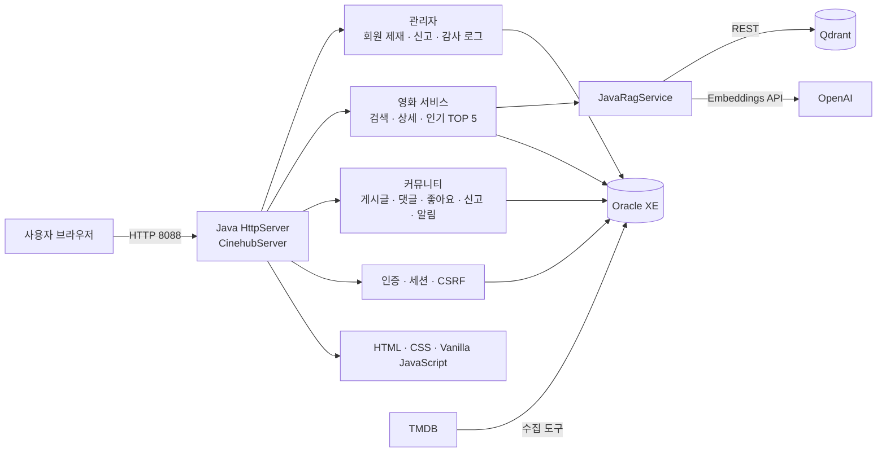

# CINEHUB 서비스 구조

## 계층

| 계층 | 역할 |
| --- | --- |
| Presentation | `webapp/static`의 CINEHUB 화면과 Vanilla JavaScript |
| HTTP API | `CinehubServer`의 라우팅, 세션, CSRF, 권한 검사 |
| Domain / DAO | 사용자·게시글·댓글·신고·관리자 기능과 Oracle JDBC 접근 |
| Data | Oracle XE 관계형 데이터, Qdrant 영화 임베딩 벡터 |
| External | TMDB 영화 메타데이터, OpenAI Embeddings |

## 영화 RAG 검색 흐름

1. 사용자가 자연어로 영화를 검색합니다.
2. Java 서버가 OpenAI Embeddings API로 질의 벡터를 생성합니다.
3. Qdrant에서 의미적으로 가까운 영화 ID를 조회합니다.
4. Oracle의 영화 제목·줄거리 키워드 검색과 함께 결과를 보강합니다.
5. Oracle에 저장된 영화 상세·포스터 경로를 CINEHUB 화면에 반환합니다.

`JavaRagService`가 OpenAI와 Qdrant REST API를 직접 호출하므로 RAG 검색 경로에 별도 Python 웹 서버는 필요하지 않습니다.
